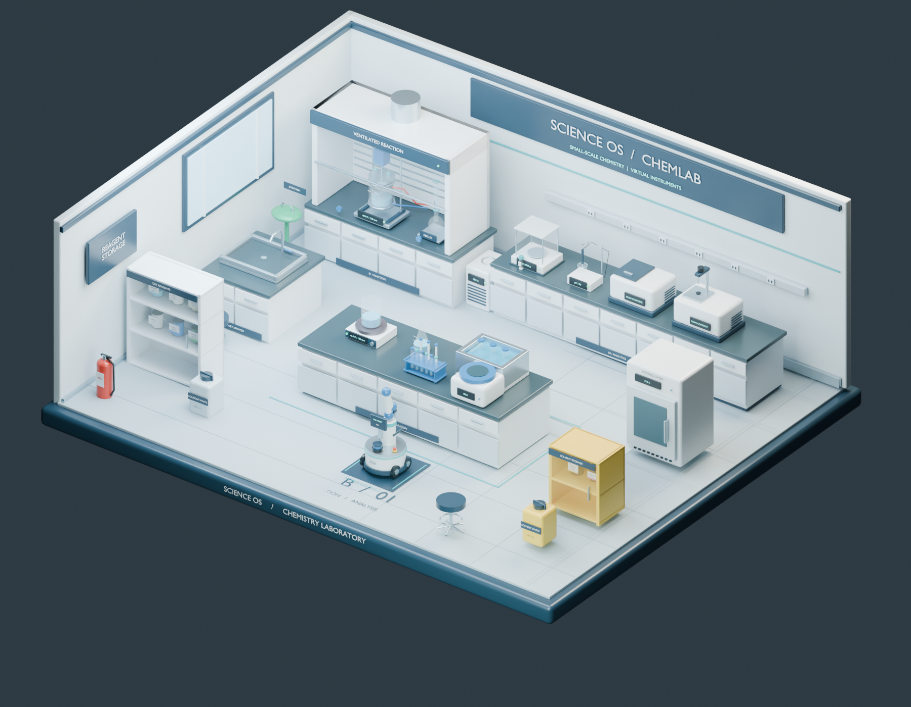

# Blender laboratory

An optional local 3D interface for ChemWorld, with a mobile manipulator, a sealed demonstration
sample, and generic environment contracts. The editable scene has 36 addressable assets.



## Where the workflow connects

```text
Student Lab / LLM Agent / classical Agent / Python workflow
                         |
                 ChemWorld reset / step
                         |
         public observation views -> BlenderObserver -> local HTTP -> Blender
                         |
             original returns -> trajectory logger -> exact replay / evaluator

Explicit carrier tasks -> scene Environment -> navigation / grasp / place -> Blender
Device adapters       -> timestamped observations -> read-only scene supervision
```

ChemWorld Core owns experimental actions, measurements, budgets, rewards, and replay. The observer
reads only `observation_view("tool_json")` and `observation_view("lab_report")`. Unknown measurements
stay `null`; the viewer never receives evaluator provenance or hidden world state. Delivery failure
sets `BlenderObserver.projection_error` and does not repeat a Core operation or change its return value.

The scene's **ChemLab** educational equipment simulator and **自动化** logistics are independent
demonstrations. Their inventory and synthetic measurements do not replace Core chemistry. The sealed
carrier is not yet bound to a Core aliquot ID. The example deliberately waits for its transport between
sampling and measurement; general Task Lab actions only update the public display.

UV–Vis, FTIR, and pH have matching instrument models. Other instruments, including final assay,
appear as public reports without pretending that an unrelated model is the correct instrument.

## Start from a source checkout

Install Blender separately; the scene and native bridge were checked with Blender 5.2.1 LTS. From the
repository root:

```powershell
uv sync --extra dev --python 3.12
uv run --no-sync python -m apps.blender_lab --blender "C:\path\to\blender.exe"
```

On other systems, pass the actual executable path. `BLENDER_BIN` or a `blender` executable on `PATH`
also works. The launcher starts a local service on **8877**, opens the scene, and connects it. Use
`--api-only` to run the service without Blender, or `--port` for a separate scene. Runtime state and
logs are ignored under `apps/blender_lab/runtime/<port>/`.

The Python observer ships in the `chemworld` package. The scene, launcher, and Task Lab app require
this source checkout; they are not bundled in the wheel.

In Blender's 3D view, press **N** to open the sidebar:

- **ChemWorld** shows the task, last operation, budget, and measured public values.
- **自动化** runs the five-step carrier transport, follows the robot, and exposes the virtual stop.
- **ChemLab** controls the original educational equipment demonstration.

Transport is driven by the service and takes roughly a minute. Watch its running/completed status;
the timeline play button controls the separate camera tour. Directly opening the `.blend` file does
not guarantee that its Python bridge has started; use the launcher above.

## Connect existing Task Lab workflows

Start Blender first, then opt in when starting Task Lab:

```powershell
$env:CHEMWORLD_BLENDER_URL = "http://127.0.0.1:8877"
uv run --no-sync python -m apps.task_lab.server --port 8876
```

For a POSIX shell, use `CHEMWORLD_BLENDER_URL=http://127.0.0.1:8877 uv run --no-sync python -m apps.task_lab.server`.
Student sessions, LLM runs, and classical runs use the same observer hook. Without the variable they
behave as before. General evaluation runners do not opt in from the process environment.

One active Core session owns each scene port. A second session receives a presentation conflict;
its Core experiment still runs normally. Closing/resetting the owner releases it. After an interrupted
process, inspect `GET /api/v1/chemworld/frame` and explicitly release the reported owner with
`POST /api/v1/chemworld/release`, body `{"session_id":"<active_session_id>"}`. The last frame remains
visible after release. Use separate ports for concurrent experiments.

For a custom workflow:

```python
import gymnasium as gym
import chemworld
from chemworld.interfaces.blender import BlenderClient, BlenderObserver

env = BlenderObserver(gym.make("ChemWorld", task_id="reaction-to-assay", seed=7),
                      client=BlenderClient())
try:
    observation, info = env.reset(seed=7)
    result = env.step({"operation": "add_reagent", "amount_mol": 0.01})
    print(env.projection_error)  # None if presentation delivery succeeded
finally:
    env.close()
```

## Run and replay the integrated example

```powershell
uv run --no-sync python examples/demo_blender_workflow.py --output runs/blender_lab/my-demo/trajectory.jsonl
uv run --no-sync chemworld verify --constitution --submission runs/blender_lab/my-demo/trajectory.jsonl
uv run --no-sync chemworld evaluate --submission runs/blender_lab/my-demo/trajectory.jsonl
```

The eight-step example adds materials, heats, samples, waits for the explicit carrier task, measures,
terminates, and performs a final assay. It logs the original Core transitions. A failed Core action,
presentation delivery, or carrier task stops the example and preserves the partial trajectory. An
existing output path is rejected. Use a new path for each run; `--skip-transport --pause 0` provides a
short presentation/replay check. Generated trajectories are development outputs, not research evidence.

## Contracts and future physical pairing

The local service's `GET /openapi.json` describes its routes. Main integration endpoints:

| Endpoint | Purpose |
| --- | --- |
| `GET/POST /api/v1/chemworld/frame` | Read/publish versioned public display frames |
| `POST /api/v1/chemworld/release` | Release scene ownership without erasing the last frame |
| `GET /api/v1/environment` and `/state` | Spatial definition, capabilities, and demo scene state |
| `POST /api/v1/environment/commands` and `/tasks` | Explicit virtual actions and sequential plans |
| `POST /api/v1/environment/bindings` and `/observations` | Declared asset pairing and normalized feedback |
| `GET /api/v1/environment/supervision` | Read-only comparison against demo scene values |

See [the environment contract](ENVIRONMENT.md) for identity, coordinates, units, command lifecycle,
sample custody, and feedback quality. The service listens locally, has no remote authentication, and
accepts caller-declared provenance. It is not a device identity authority.

Physical integration should proceed through asset identity, spatial/sensor calibration, read-only
observations, shadow execution, then validated bounded control. Actual sample identity and public
measurement contracts must also be mapped to Core. SiLA 2, OPC UA, and ROS 2 adapters are unimplemented
placeholders; there is no hardware dispatch. Geometry and planar navigation do not establish contact
physics, full-arm collision safety, or physical transfer validity.

## Development validation

The engineering question is whether this optional interface can display public Core state and run
explicit scene logistics while preserving Core transitions. Coverage includes an eight-action
`reaction-to-assay` workflow, seven observer/HTTP tests, and 20 scene/environment tests. Checks cover
unchanged Gym returns, masked observations, session ownership, ordering, transport failure, budget
accounting, inventory custody, command retries, stop/restart behavior, and observation supervision.
Pass requires committed example actions, completed transport, zero replay mismatch, and passing tests;
failures are kept in their original local logs. No agent-ranking or physical-transfer claim follows.

```powershell
uv run --no-sync pytest -v tests/test_blender_interface.py apps/blender_lab/test_lab.py apps/blender_lab/test_environment.py apps/blender_lab/test_environment_api.py
```

The editable `.blend` is included. `build_lab.py` can rebuild geometry and `prepare_scene.py` resets
it to a portable demonstration baseline; both overwrite the scene file, so keep your edited scene
under a different name. `render_tour.py` renders the camera tour from a loaded scene while the API is
running, with output under ignored `renders/`.

```powershell
& $env:BLENDER_BIN --background --factory-startup --python apps/blender_lab/build_lab.py
& $env:BLENDER_BIN --background apps/blender_lab/ChemLab.blend --python apps/blender_lab/prepare_scene.py
& $env:BLENDER_BIN --background apps/blender_lab/ChemLab.blend --python apps/blender_lab/render_tour.py
```
