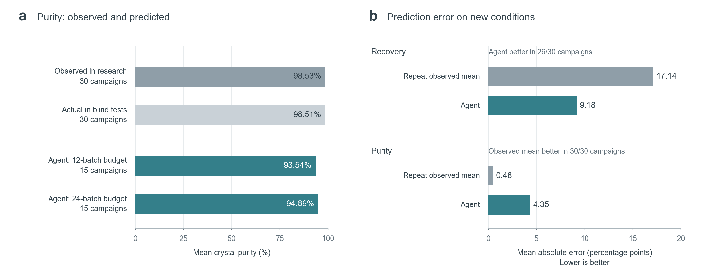

# Figure 6: direct comparison preview

This is a display revision of retained data, not a new experiment. The manuscript and PowerPoint bindings have not yet been changed.

## 为什么改成这样

原图的上半部比较纯度，下半部却要求读者解释模型减基线的误差差值；散点的偏移又没有科学含义。新版只保留两个直接问题：a，实验测到的纯度和模型预测是否一致？b，模型预测比重复此前均值更准吗？所有条形从零开始，直接标注数值，不用截断坐标夸大约四个百分点的纯度差异。

经验基线在每个研究会话内独立计算：取该会话已经公开的终检结果的均值，对所有新配方都预测这个值。例如此前平均纯度为98.5%，后续每道纯度题就预测98.5%。它不访问隐藏答案，也不增加实验。

## Caption draft

**Crystallization forecasts improve recovery prediction but underestimate stable purity.** **a,** Mean crystal purity measured during research and in withheld reference outcomes (30 campaigns each), compared with agent forecasts from the 12- and 24-batch campaigns (15 campaigns each). Each bar equally weights the corresponding campaign means. Across the original queries, 335 of 360 purity point forecasts lie below their withheld reference means. **b,** Mean absolute prediction error against the withheld references, averaged over all 30 campaigns, for recovery and purity. The observation-mean baseline predicts the mean of the same campaign's public final assays for every withheld recipe; it uses no additional experiments or withheld outcomes. Agent recovery error is lower in 26/30 campaigns; the observation-mean purity error is lower in 30/30. The campaigns comprise five reused worlds, three information arms and two budgets; they are not thirty independent worlds. The source-assay shortfall is retained. Bars are descriptive means, not confidence intervals. The tested purity stability and baseline advantage do not establish a mechanism or a general rule to copy observations.

## Budget details (all retained campaigns)

| Budget | Campaigns | Recovery: agent MAE (pp) | Recovery: baseline MAE (pp) | Purity: agent MAE (pp) | Purity: baseline MAE (pp) |
| --- | ---: | ---: | ---: | ---: | ---: |
| 12 | 15 | 10.4332 | 19.1962 | 5.0293 | 0.4746 |
| 24 | 15 | 7.9367 | 15.0745 | 3.6794 | 0.4885 |
| all | 30 | 9.1849 | 17.1354 | 4.3543 | 0.4816 |

All 30 campaign values, arm identities, source ranges, prediction ranges and the source-shortfall flag remain in [campaign-details.csv](campaign-details.csv). Aggregates are also available in [summary.json](summary.json). The figure does not display individual forecast intervals or infer sampling uncertainty.

Source: [retained baseline reanalysis](../../../workstreams/flagship_tasks/reports/work-ii-c-formal-20260920-v3-auto/BASELINE_REANALYSIS.json).

Rebuild: `uv run --no-sync python paper/tools/render_crystal_simple_preview.py`.
