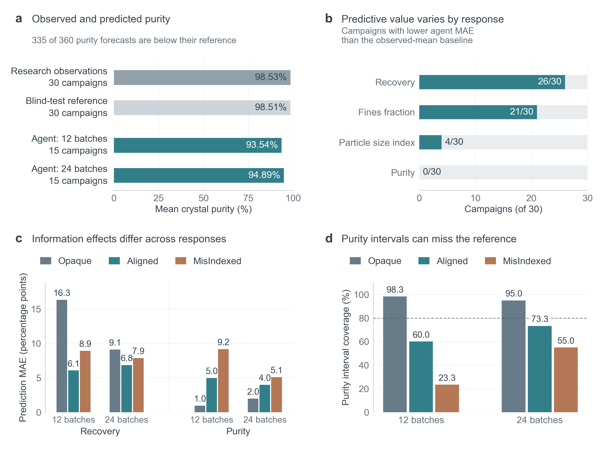

# Figure 6：从全文主线出发的四子图重构

当前状态：2026-09-23用户已批准并纳入中英文NCS正文的Figure 6。正式资产为[矢量图](../../../paper/figures/venue-results/figure06-crystal-generalization.pdf)，原预览与完整CSV仍保留于此。正文按a-d顺序重写，补充表E1/E2加入完整基线误差与区间宽度；旧PPT中的Figure 6不再用于正文。没有新增实验、模型调用或模拟器执行。

正式导出已放大常规字重的坐标、图例和数据标签，并嵌入TrueType字体；名义覆盖水平的说明放在图注中。英文稿33页，Figure 6在第9页、表E1/E2在第32页；中文稿37页，对应第10页和第36页。新版仍保留原四面板设计与全部数值。

## 判断

结晶结果值得占一张主图：摘要、引言和讨论都用它与EQ构成互补证据。EQ中真实响应离开了来源平台，而部分预测仍保持平台；结晶中纯度仍保持高水平，预测却向下偏离。缺少后者，全文容易被读成一个“外推不够积极”的故事，无法支撑“应根据条件判断什么应保持、什么应改变”的完整论点。

但是，前一版两子图只清楚展示了均值偏低与模型/均值基线的误差对比。它适合解释原图，却没有充分承担一张压轴主图的工作。四子图的增加应来自新的比较维度：预测的响应选择性、先验影响的方向分化、以及区间是否覆盖参考。

本图的完整问题是：**当实验反复呈现高纯度、盲测也保持高纯度时，agent如何预测；这种偏离是否涉及所有响应，如何随信息条件变化，以及它报告的不确定性是否覆盖真实结果？**

## 全文图件的分工

| 图 | 应回答的问题 | 与Figure 6的边界 |
| --- | --- | --- |
| Figure 1 | ChemWorld如何把规律、公开信息、自主实验与后测分开控制？ | 不在结果图重画整个执行流程 |
| Figure 2 | 一场自主研究究竟如何开展、改变条件并获得交付？ | 保留完整结晶研究路径，不在Figure 6再次放热处理流程和操作曲线 |
| Figure 3 | 操作成功是否伴随更好的预测？ | 说明二者可分离，尚未解释预测失败的具体形式 |
| Figure 4 | 增加研究资源是否改善泛化？ | 承担资源的总体比较；Figure 6中的12/24用于检验结晶细分模式是否持续 |
| Figure 5与Table 1 | 当真实响应离开已观测平台时，预测是否随之改变？ | 保留完整EQ证据，不在Figure 6再复制EQ柱图 |
| Figure 6 | 当某响应仍然稳定时，预测是否保留这种稳定性？其他响应、信息臂和区间表现如何？ | 提供与EQ相反的泛化偏离，并限定其发生范围 |

英文稿维持六张主图、中文稿维持七张主图；两稿的Figure 6均已使用这一四面板设计，其他图件编号仍遵循各自结构。

## 四个子图的逻辑

| 子图 | 具体内容 | 新增的信息与解释 |
| --- | --- | --- |
| a：观测与预测 | 来源纯度98.53%、盲测参考98.51%、12批预测93.54%、24批预测94.89%；335/360点预测低于参考 | 明确偏离的对象和方向。条形从零开始，不用截断坐标夸大差异 |
| b：响应选择性 | agent优于各自来源均值参考的campaign数：回收26/30、细粉21/30、粒径4/30、纯度0/30 | 同一组研究中的预测价值因响应而异。不能把纯度失败概括为整个体系完全不会预测 |
| c：信息条件 | 两预算下、三臂的回收与纯度MAE；每柱五个世界 | 信息条件与不同响应的表现方向不同。12批下Aligned/MisIndexed相对Opaque的“回收改善、纯度恶化”均在5/5世界成立；24批同向联合关系仅2/5和3/5，不能写成普遍规律 |
| d：区间表现 | 两预算下、三臂的纯度区间覆盖率，与名义80%对照 | 点预测偏离并不总被区间覆盖；同时展示Opaque的高覆盖与其他两臂随预算的部分缓解 |

四幅之间是“发现偏离—限定范围—比较信息条件—检查不确定性”的递进，不是四次重复“纯度预测差”。b的全响应计数让正文不再只挑回收/纯度两个端点；原补充图S5仍可保留粒径、细粉的逐campaign误差散点作为量级与异质性详情。

## 关键数值与边界

| 预算 | 先验臂 | 回收MAE（百分点） | 纯度MAE（百分点） | 纯度区间覆盖率 | 纯度区间平均宽度（百分点） |
| --- | --- | ---: | ---: | ---: | ---: |
| 12 | Opaque | 16.32 | 0.95 | 98.3% | 6.81 |
| 12 | Aligned | 6.06 | 4.97 | 60.0% | 12.94 |
| 12 | MisIndexed | 8.92 | 9.17 | 23.3% | 15.53 |
| 24 | Opaque | 9.11 | 1.97 | 95.0% | 8.59 |
| 24 | Aligned | 6.84 | 3.98 | 73.3% | 12.37 |
| 24 | MisIndexed | 7.86 | 5.08 | 55.0% | 12.31 |

- d不是“所有agent都过度自信”：Opaque覆盖率很高，也不能把超过80%直接当成完美校准。Aligned/MisIndexed的区间平均比Opaque更宽，故不能声称其问题只是“区间太窄”。
- 每个臂—预算覆盖率来自五个campaign、各十二道题（共60个目标）；它们不是60个独立世界。这里只作描述性比较，不检验其与80%的显著差异。
- 24批次是独立会话，不能写成同一agent追加12次实验后的自我修复。
- 所有30场均保留，其中一场仅有11次来源终检。12批次联合方向在排除该不足后，两种先验比较均仍为4/4。
- public mean仅使用该campaign公开终检均值，对所有新配方重复这个预测；无额外实验或隐藏答案。它是描述性经验参考，不代表强经典辨识方法。
- a报告平均水平，不能只凭这几个均值证明每种干预下都严格不变。已有逐世界留出纯度极差均值为2.442个百分点，应在正文保留，并让完整数据可查。
- 纯度均值整体偏低证明预测水平的偏离，不能单独证明模型夸大了每一道干预的效应。不要将“平均偏低”改写为“逐干预斜率错误”。
- 三臂同时改变取证与解释，当前比较不定位内部因果机制。不要画“错误信念导致错误预测”的因果箭头。

## 建议的正文论述

Figure 6应以“响应特异性的泛化偏离”组织段落：先写纯度观测/参考/预测的偏离，再写全部四项响应相对于经验参考的胜负，随后呈现先验条件下回收与纯度的方向分化，最后写区间覆盖的不一致。两预算的差异用于界定模式，而不是重新讲一遍Figure 4。

随后再把Figure 5和6合起来讨论：复制来源平台不足以应对EQ极稀条件；偏离来源水平也不自动产生更好的结晶纯度预测。两种现象共同说明需要检验经验关系的适用范围，但没有建立所有体系上的统一“修订校准”指标，也没有识别共同的内部原因。

单个MisIndexed会话“口头承认只测一种溶剂、十二个区间全部失配”的例子，以及复热问题的K1/Q/K2回顾，继续放补充材料。前者是回顾性极端案例，后者主要涉及细粉与热历史；把它们塞进这张主图会打断纯度/响应选择性的主线。

## English caption draft

**Crystallization forecasts show response-specific departures from experimental evidence.**
**a,** Mean crystal purity in public source observations and withheld reference outcomes (30 campaigns each), compared with agent forecasts from the 12- and 24-batch conditions (15 campaigns each). Bars equally weight campaign means; 335 of 360 original purity point forecasts are below their withheld references.
**b,** Number of campaigns in which agent mean absolute error (MAE) is lower than that of a predictor repeating the same campaign's public final-assay mean for every withheld recipe. The baseline uses no additional experiments or withheld outcomes. Grey remainders denote campaigns without an agent advantage; none are ties. These counts compare performance separately within each response and do not rank errors across response scales.
**c,** Recovery and purity MAE by information arm and research budget, with five worlds per bar. At 12 batches, Aligned and MisIndexed each combine lower recovery error with higher purity error than Opaque in all five matched worlds (all four both-conforming pairs). The joint direction occurs in two and three of five worlds, respectively, at 24 batches.
**d,** Coverage of original nominal 80% purity intervals, averaged over the five campaigns per arm and budget. The dashed line marks the nominal level; high coverage alone does not establish calibrated or sharp intervals. Across panels, five worlds recur across arms and independent budget sessions. The source-assay shortfall remains included. All bars are descriptive summaries, not confidence intervals or evidence for an internal causal mechanism.

## Files and verification

- [PNG](crystal-four-panel-story.png) / [SVG with editable text](crystal-four-panel-story.svg).
- [Exact summary](summary.json), [six arm-budget means including interval width](arm-budget-means.csv), [all 120 campaign-response rows](all-campaign-metrics.csv).
- Sources: [retained baseline reanalysis](../../../workstreams/flagship_tasks/reports/work-ii-c-formal-20260920-v3-auto/BASELINE_REANALYSIS.json), [integrated response table](../../../paper/figures/integrated-results/campaign_metrics.csv).
- Rebuild preview: `uv run --no-sync python paper/tools/render_crystal_story_preview.py`.
- Rebuild manuscript assets: add `--publish` to export PDF/PNG/SVG into `paper/figures/venue-results/`.

The renderer checks all 120 agent MAEs against the retained baseline reanalysis, all six five-world arm-budget groups, all response-win counts, the matched joint directions and the four-conforming-pair sensitivity. All failures and original denominator rules remain. The source table, source baseline report and old preview are unchanged.
