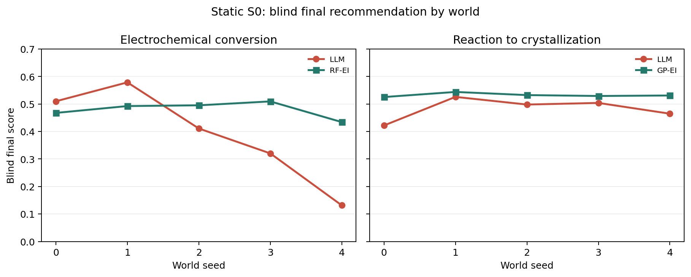
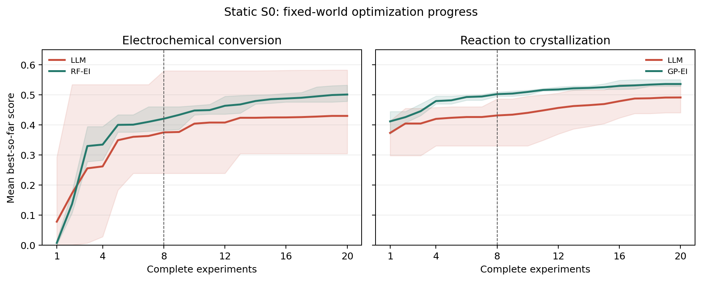

# ChemWorld: A Replayable Causal Environment for Experimental Intelligence

Status: working manuscript, 2026-07-27. Not submission-ready.

## Abstract

ChemWorld is a replayable physical-chemistry environment for evaluating how
agents choose, interpret, and revise experiments under partial observability,
finite budgets, and operational constraints. The environment separates an
executable causal substrate, a transactional interaction runtime, and
versioned task/evaluation contracts. Fifteen tasks are registered without
proxy-only physics on their required runtime paths. Two confirmatory tasks,
electrochemical conversion and reaction-to-crystallization, support both
static scientific optimization and controlled mechanism interventions.
Every registered task has an executable complete-experiment adapter; all 15
midpoint designs pass with no dead coordinates or unresolved formalization
blockers.

We evaluate `gpt-5.6-sol high` in a fixed world. For each
confirmatory task, the model receives 20 complete experiments in each of five
world seeds, then submits a distinct final method, structured mechanism
claims, and three held-out intervention predictions. Blind final means were
0.3902 (95% world-cluster CI [0.1732, 0.6072]) for electrochemical
conversion and 0.4829 ([0.4326, 0.5332]) for
reaction-to-crystallization. Paired differences from the descriptively
strongest classic families were -0.0896 ([-0.2896, 0.1104]) and -0.0495
([-0.0933, -0.0056]); the model exceeded the within-world classic mean in two
of five and zero of five worlds. Predictive directional accuracy was 64.4%
and 44.4%, while Declared structural-edge F1 was 0.274 and 0.242. None of ten
final syntheses improved the paired incumbent. The model often improves the
process but does not reliably convert evidence into a better final method or
a correct, transferable mechanism model.

Historical environment-level RC28 controls also establish budgeted
identifiability and online attainability on their frozen source: the
five-experiment controlled certificate reached 98.26% top-1 accuracy and the
frozen online reference policy reached 96.57% end-to-end success by eight
post-change experiments. These are environment attainability results, not
participant-agent results; their current source binding is stale and requires
recertification. All reported physical experiments are replay-verified.

## 1. Research Question

The primary question is not whether a language model can state chemical
knowledge. It is whether an agent can select a useful next experiment, use the
result, and submit a robust method when the governing world is fixed but its
parameters are hidden.

Controlled world changes were previously developed as a separate environment
identifiability question. They are retained as historical control evidence,
but are not part of the current participant roadmap. Real systems may drift
through batch variation, instrument calibration, aging, or fouling; those
processes require explicit drift models rather than an evaluator silently
replacing the governing mechanism mid-campaign.

## 2. System

ChemWorld has three normative layers:

1. a physical causal world substrate with typed state, executable kinetics and
   constitutive models, instruments, and controlled interventions;
2. an interaction runtime with validated operations, atomic transactions,
   costs, risks, and replayable trajectories; and
3. task/evaluation contracts defining public information, budgets, objectives,
   scoring, and world distributions.

The agent and its private memory sit outside these layers. The environment
does not expose hidden world parameters or private evaluator provenance.

## 3. Task Design

The release registers 15 tasks. The machine-readable design matrix is
`workstreams/flagship_tasks/reports/task-design-matrix-v1.json`. Every row
records the environment decision unit, complete-experiment adapter, control
schema, operation sequence, measurement slots, scoring contract, safety/cost
boundary, and evidence status.

The two confirmatory tasks expose named physical controls in static S0. The
electrochemical experiment has six controls and one electrolysis stage. The
reaction-to-crystallization experiment has ten controls and one fixed
reaction/quench/seed/cool/filter workflow. Internal unit vectors remain only
for classic optimizers. An unused fourth equilibrium coordinate was removed.
The three purification tasks use a 16-control reaction/workup design that
compiles to 22 operations spanning extraction, phase separation, washing,
drying, concentration, and transfer. Distillation uses 13 controls, with
independent evaporation and distillation temperature/time settings.

The matrix generator changes each coordinate from a low to a high intervention
and rejects action-invariant coordinates. It also executes every midpoint
recipe against the runtime, requiring committed transactions, a final assay,
and compliance with the operation budget. All 15 tasks pass. This is design
validation; only the two confirmatory tasks have formal model experiments in
the present study.

## 4. Static-S0 Protocol

The world remains fixed for the entire campaign. The model knows that the
horizon is 20 complete experiments. Each model call selects one complete
experiment; the executor performs the fixed operation sequence and returns
public processed measurements, uncertainty, cost, risk, and final-assay score.
After exploration, one additional call submits the final method. The final
method may be tested, interpolated, or extrapolated within bounds and is not
assumed to equal the last trial.

Three paired, held-out, one-factor predictive queries are frozen before the
model's final predictions and executed only afterward. The model receives no
feedback from these checks. Incumbent and submitted methods each receive three
paired blind validation replicates. Free-form mechanism prose is secondary;
structured Declared claims, held-out Predictive directions, and Actionable
blind performance are scored separately.

## 5. Static-S0 Results

The statistical unit is the world seed. The five algorithm seeds for each
classic family are averaged within world before comparison and are not treated
as 25 independent worlds. Intervals below are two-sided 95% Student-t
descriptive intervals over five world clusters. The best classic family is
selected descriptively from six candidates by aggregate blind mean; these
comparisons are not preregistered superiority tests.

| Task | LLM blind mean, 95% CI | Best classic mean | Paired LLM - classic, 95% CI | World wins | Predictive | Declared edge F1 |
| --- | ---: | ---: | ---: | ---: | ---: | ---: |
| Electrochemical conversion | 0.3902 [0.1732, 0.6072] | RF-EI 0.4798 | -0.0896 [-0.2896, 0.1104] | 2/5 | 29/45 (64.4%) | 0.274 |
| Reaction-to-crystallization | 0.4829 [0.4326, 0.5332] | GP-EI 0.5324 | -0.0495 [-0.0933, -0.0056] | 0/5 | 20/45 (44.4%) | 0.242 |

Unsupported-claim rates for Declared relations were 68.3% and 75.1%,
respectively.

All ten best exploration trials occurred after round 10. The five
crystallization best-trial indices were 15, 17, 18, 18, and 19 in zero-based
indexing; 110 of 150 classic-baseline crystallization cells also found their
best trial in rounds 11–20. The 20-experiment horizon is therefore not an
arbitrary long tail. Mean LLM best-so-far increased from 0.3749 at experiment
8 to 0.4297 at experiment 20 in electrochemistry and from 0.4311 to 0.4911 in
reaction-to-crystallization.

All ten model submissions were tested methods. Relative to the paired
incumbent, eight had zero blind gain and two electrochemical submissions had
small negative gains (-0.001563 and -0.005039); none had positive gain. The
final synthesis did not exploit its permission to interpolate or extrapolate
and did not improve the incumbent in this sample.

## 6. Environment Attainability

Historical RC28 Gate A is a separate mechanism-adaptation result on its frozen
source. A2 completed 4,896
receipts and reached 98.26% top-1 accuracy at its five-experiment primary
budget. A3 completed 2,016 receipts; by eight post-change experiments the
frozen reference policy reached 99.17% reference sufficiency, 99.35%
detection recall, 0.9990 AUROC, 2.80% conditional no-change false-positive
rate, 98.03% conditional attribution, and 96.57% end-to-end success.

This establishes that a compliant reference strategy can solve the controlled
diagnostic problem. Participant Gates B–E remain unexecuted. Static-S0 results
must not be cited as mechanism-change performance.

## 7. Audit and Resources

The electrochemical formal lineage contains 109 provider calls and 1,320,840
provider-reported tokens after the v0.4.1 final-synthesis amendment. The
crystallization formal matrix contains 105 calls, 113 attempts, and 1,269,110
tokens. Each current five-seed task summary contains 190 physical experiments:
100 exploration, 60 predictive, 15 incumbent-validation, and 15
recommendation-validation experiments. Every receipt replayed exactly.

Provider pricing was not independently verifiable, so monetary accounting is
reported as incomplete rather than imputed.

## 8. Limitations

ChemWorld is not a universal reaction predictor or industrial digital twin.
Its mechanisms and constitutive models are bounded benchmark worlds. Synthetic
HPLC, GC, UV-Vis, and final-assay observations are state-coupled measurement
models, not empirical spectra. Virtual risk and cost are benchmark quantities,
not laboratory safety or procurement guidance.

The static-S0 sample has five world seeds and one LLM run per world. It
characterizes those sampled worlds and does not estimate a universal model
effect. The strongest classic family was selected descriptively from the same
six-family calibration matrix, so its paired interval is not a preregistered
confirmatory test. GP and Safe-GP trajectories coincide because the current
safety limit does not bind. The explicit mechanism metrics show that
successful local optimization is not sufficient evidence of correct world
understanding.

The 15-task adapter audit is a deterministic executability check at one
midpoint world seed, not a performance experiment. Thirteen tasks therefore
have complete optimization designs but no formal model comparison in this
study.

Private-E/A, independent backend replication, real-data bridging, and physical
experiments remain open. Hidden changepoints and mechanism replacement are
deferred until a realistic drift model and separate research question are
specified. The repository therefore retains `publication_ready=false`.

## 9. Next Validation Priorities

The immediate roadmap remains within fixed-world scientific optimization:

1. replicate the frozen S0 protocol with an independent model and provider;
2. ablate final synthesis against best-observed submission, optional
   interpolation, and forced-new-proposal variants;
3. extend formal evaluation to one or two additional static task families
   after local optimizer attainability checks;
4. add untouched static world seeds to reduce cross-world uncertainty; and
5. build a static bridge to real data or a higher-fidelity simulator.

World-change experiments are not an active launch item. They should return
only as a separately motivated robustness benchmark tied to observable batch
variation, instrument drift, aging, or another explicit real process.
