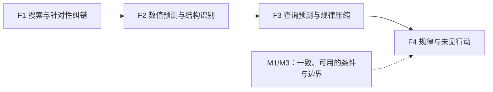

# Work II 完整故事：科学Agent的四层转化损失及其边界

更新：2026-09-05。本文件负责作者侧的完整论证，不管理实验执行。
[任务](../workstreams/flagship_tasks/WORK_II_TODOLIST.md)、
[实验矩阵](../workstreams/flagship_tasks/WORK_II_EXPERIMENT_MATRIX.md)、
[结果与失败索引](../workstreams/flagship_tasks/WORK_II_PAPER_RESULTS_ZH.md)、
[证据绑定](../configs/current.json)和[稿件入口](README.md)各有唯一职责。

## 1. 一句话主张

> 科学Agent从实验经验到可用知识的转化存在可测损失；终点进步、数值预测、结构识别、规律压缩和新行动不能互相替代。
> 当前证据展示了四处转化的不同表现，M1/M3进一步给出能够衔接的条件与解释边界。

“四层断裂”是本项目的研究主线，指可观测能力之间的分离和转换损失，不预设每个模型在每个世界
都会失败，也不表示四个内部故障已被同一实验因果识别。

| 转化位置 | 已有支持 | 解释强度 |
| --- | --- | --- |
| F1 实验搜索/进步→针对性纠错 | C2预测平均改善，注册selective-correction未获支持；A-P有条件性packet后响应 | 搜索进步不识别反馈学习；packet与额外turn尚未隔离 |
| F2 数值预测→结构识别 | B3可识别表面的预测改善与稀疏joint recovery；B2仅作欠识别诊断 | B3有界函数形式、5 worlds；DeepSeek的13/30 schema失败限制能力解释 |
| F3 查询预测→可执行规律 | C2双模型压缩损失，合法schema同域容量控制 | 保真损失可测；容量控制不证明新条件规律恢复 |
| F4 显式规律→未见行动 | DeepSeek纵向law/action差异；B3有界行动读出；M1/M3有成功与一致条件 | 不普遍化为law-use失败；新条件迁移和内部law使用未识别 |

当前已导出论文标题为 **When Does Experimental Knowledge Improve Scientific Decisions?**。
这是一篇关于科学Agent知识评价与干预的有界经验论文。核心增量是把经常混在一起的可观测量拆开，
用直接干预检验其中部分关系，并完整报告有效条件、负结果与强基线；没有提出已验证的普遍修复算法。

## 2. 两篇论文如何组成同一研究方向

Work I让“世界构造本身”成为可控实验变量：公开操作、私有规律、事务化生命周期、资源账本和
精确重放共同构成实验仪器。公开软件与证据冻结于v0.2.0；资格覆盖有限组件模式，不等于任意流程图
编译器或真实实验室数字孪生。

Work II用这套仪器研究：Agent获得证据后，形成了什么可表达知识，这些知识能支持什么决策。
材料信息三臂是依任务而异的信息价值背景；C2及后继块构成预测、规律、行为和知识效用的主要证据。

两篇之间是仪器与科学问题的关系。平台执行/replay通过只确认实验路径可追溯，不能代替Agent效果。
M1/M3的来源观测由固定设计取得，也不能被写成Agent自主取证的收益估计。

## 3. 已完成实验的研究推进

### 第一步：终点和预测改善不足以说明学到了什么

C2中两个配置各有135个scheduled campaigns、45个task–world clusters，完成121/126个。
平均预测误差下降，但注册selective-correction门槛均未通过。门槛受初始误差余量影响，
不通过不能解释为没有任何纠错能力。

提交的可执行规律又损失了一部分预测信息。DeepSeek/GPT可评价laws为135/129，
law MAE为0.2371/0.1753，compression loss为0.0686/0.0142。
较低的规律误差没有带来明显incumbent replay增益；incumbent复现也不是未见方案选择。

**推进的问题：显式规律到底能否代表Agent会怎样行动？**

### 第二步：提交规律与实际行为可以明显不同

原DeepSeek未见方案队列有45个scheduled cells、42个可用rankings。
规律隐含的Top-1为0/45，participant为11/45；可评价排名中仅12/42跟随law。

这说明提交artifact是行为的不完整代理。它不能直接定位内部belief、推理过程或因果中介，
也不能从上述选择成绩推出实验收益，因为原队列缺少同协议的无证据和简单基线控制。

后继四条件策略块保留每配置180个scheduled slots。Autonomy−none regret为−0.0913/+0.1102，
两个区间均跨零；donor和yoked failures进入主分母。这是包含可用性与交付失败的系统策略估计，
尚未隔离纯取证效应。

**推进的问题：固定信息后，替换规律或决策规则能否直接改善选择？**

### 第三步：M1直接干预限制了“普遍不会使用规律”的解释

M1固定12个公开观测/world、二次表示容量和8个隐藏候选/world，交叉替换：

| 可观察干预 | 两种条件 |
| --- | --- |
| 规律表示 | 来源模型生成的L / 同公开证据数值拟合的F |
| 决策规则 | fresh Agent选择A / 确定性maximizer X |

正式块包含10个worlds、40个嵌套来源状态，120/120 provider sessions、
160/160条件和200/200物理执行与replay；零失败或替换。
主对比F-X−L-X为 **−0.00538，95%区间[−0.01630,+0.00061]**，
未达到事前“区间上界小于−0.01”的实质收益标准。

F-A/F-X有40/40选择一致，L-A/L-X有39/40一致。拟合、nearest和随机期望regret为
0.00425/0.00354/0.11109；拟合没有展示检索优势。
七个world主差为零，较大差异集中在一个电化学world；两task均值−0.01087/+0.00010。

因此，历史law/action差异并非所有决策表面都会出现。历史协议与M1同时改变证据、函数类、
决策维度和接口，不能把差异归因于其中某一个因素，也不能声称接口简化已被验证为修复方法。
此外，L由无工具模型构建、F由数值求解器构建，表示与计算实现仍然捆绑。

**推进的问题：M1同时交付了原始证据和规律，一致选择是否真的需要这条规律？**

### 第四步：M3确认知识的独立效用，同时暴露强基线边界

M3复用全部10个M1世界、40个封存来源及既有公开观测，事前固定8个新候选/world。
四种fresh、无工具接收者获得相同任务和候选脚手架，仅信息不同：

| 条件 | 接收信息 | 平均regret | 近优 / Top-1 |
| --- | --- | ---: | --- |
| none | 任务与候选 | 0.14727 | 13/40；13/40 |
| raw | 加原始公开证据 | 0.01124 | 30/40；26/40 |
| L-only | 仅加模型规律，不含raw或来源对话 | 0.01004 | 23/40；20/40 |
| F-only | 仅加拟合规律，不含raw或来源对话 | 0.01459 | 24/40；20/40 |
| nearest控制 | 从公开观测检索 | 0 | 10/10；10/10 worlds |

160/160接收会话、80/80新隐藏物理执行和80/80 replay完成；零失败、重试和替换。
主对比L−none为 **−0.13723，95%区间[−0.15584,−0.12257]**，达到预设实质收益标准。
九个world负差、一个零差；电化学/结晶task均值为−0.25937/−0.01509，效应明显依任务而异。

这直接支持紧凑知识离开来源对话/raw后，仍能帮助接收者解决同世界的新候选决策。
但raw和F也改善none；L−raw的99%区间跨零，不证明优于或等价于raw。
nearest在10/10世界达到实测最优，当前结果没有建立规律相对检索的优势。

M3没有增加独立世界数；40个来源与160个接收者仍嵌套于原十个world。
换对话和换候选是context portability，尚不是新私有参数、新机制或新拓扑迁移。
L/maximizer一致40/40、F为39/40，也不识别接收者内部是否实际使用了规律。

## 4. 贯穿全篇的逻辑

箭头表示研究问题的推进，不表示已识别的Agent内部因果链。

| 测量层 | 当前回答 | 主要边界 |
| --- | --- | --- |
| 预测/规律保真 | 预测有平均改善，规律压缩损失存在 | selective repair未获支持；模型差异是描述性 |
| 规律/行为一致 | 历史协议差异明显，M1近乎全一致 | 跨协议差异未随机隔离，不能推出普遍law-use失败 |
| 独立知识效用 | M3规律单独优于任务脚手架 | 同世界新候选、任务差异大、未增加独立样本 |
| 方法/迁移贡献 | 尚无强基线优势或新机制迁移结果 | nearest已能解决M3候选集 |

## 5. 支持诊断应放在哪里

B2的单对观测存在精确linear/power alias，属于表达和可识别性诊断；B3才检验有界可识别函数形式。
B3各30 scheduled，joint recovery为0/30与5/30，DeepSeek的13个schema failures保留。
同域schema-capacity控制说明合法表示能容纳预测，不证明未见条件恢复。
完整排序与实际决策损失的错位属于评价诊断，不作为另一种Agent内部失败。

B3承担F2主证据；B2欠识别、schema容量细节和evaluator错位主要放补充材料。
A-P packet与额外turn捆绑；best-minus-first描述搜索；low reasoning不是thinking-off。
它们不共同构成一条已识别的内部能力因果链。

## 6. Spotlight空间与下一步

当前最可信的贡献是有界、可复现的知识评价与干预结果。M1负结果保留了理论边界，
M3正结果闭合了独立效用问题；单个正对比、更多模型或拟合器加argmax不足以形成方法突破。
预测误差与决策损失的区别已有成熟研究，包括
[Smart Predict, then Optimize](https://arxiv.org/abs/1710.08005)与
[Decision-Focused Learning](https://doi.org/10.1609/aaai.v33i01.33011658)。

诊断论文的增量应是四处转换损失的联合测量、可复核的差异和成功边界；超过nearest只约束方法
优势主张，不作为论文成立或结束实验的条件。M1/M3没有在相同协议下推翻历史差异，也没有识别
哪个接口或证据变化修复了差异。不得将一组单独实验包装为同一内部因果链。

投稿前只保留一个有针对性的补强块：在B3可识别科学表面，用最小科学输出和数值工具可用/不可用
条件复核F2，并记录同一会话的预测、结构、typed law和行动。第三模型若加入，也复核这一块；
它不能自动补齐完整纵向F4或所有四层的跨模型证据。设计和终止点见
[收束矩阵](../workstreams/flagship_tasks/WORK_II_EXPERIMENT_MATRIX.md)。

机制匹配、新条件迁移、独立框架全交叉及来源→接收交叉均移到后续研究。M2仅在需要取证因果
主张时推进，M4用于外部物理效度；这版论文均暂缓，不提供录用概率。

### 项目价值与“Agent共性”的边界

项目值得继续：Work I提供可控干预与过程复现的研究工具，Work II已经给出有界的经验结果。
目前最强的是仪器、四层转换的测量与已有差异证据，知识独立效用提供成功边界；可复用的内部机制
解释和方法收益仍待建立。
平台的长期价值还取决于其他研究者能否用它提出、执行和复现新问题，不能用本团队的实验数量代替外部采用。

应区分三种主张：

| 主张层级 | 当前依据 | 需要补什么 |
| --- | --- | --- |
| 评价原则：预测、提交知识与决策效用需要分别验证 | 不同可观测量之间没有自动保证；当前实验展示了若干分离与一致的条件 | 该原则有既有研究基础，不能单独充当新机制发现 |
| 条件性经验规律：在固定证据、接口与任务范围内出现某种效应 | GPT与DeepSeek的已测系统配置；各结果使用自己的覆盖和失败分母 | 预先提出条件性预测，在独立模型家族及工具设置中复核 |
| 总体现象：当前所有或大多数Agents有相同缺陷 | 现有模型不是Agent总体的随机样本；共用执行框架也可能产生共同行为 | 当前不能支持；增加到三四个模型仍不能估计总体发生率 |

[M1分模型结果](../workstreams/flagship_tasks/reports/work-ii-m1-replication-20260905.md)中，
GPT的四条件平均regret均为0.004253，拟合规律的Agent/maximizer在两个模型中都完全一致。
这限制了“普遍不会把规律用于选择”的解释；一致性本身也不识别内部是否使用规律。
[M3分模型结果](../workstreams/flagship_tasks/reports/work-ii-m3-portability-20260905.md)中，
DeepSeek的none/L regret为0.152699/0.011575，GPT为0.141840/0.008503。
两配置都有描述性知识收益，但不是所有历史失败都已跨模型复现，原law/action队列尤其不能写成双模型结论。

因此，建议保留的问题是：**实验知识在什么条件下成为可用的决策依据，这些条件能否跨Agent系统复现？**
“Agents有共同的知识部署风险”可以作为动机或待检验假说，不能作为实验必然得出的结论。
若新模型解决了旧问题，应报告其成功条件并检验相应干预；若只有特定框架或工具限制下失败，
则将解释收窄到该系统配置。共性应由可反驳的条件预测支撑，不能靠更换措辞获得。

最小有价值的补充是：在最后B3诊断块中预先选择第三个独立提供方的模型家族作为外部复核，
配合相同数值工具可用/不可用的控制；独立框架复核留作后续，不无限增加本轮条件。
第三模型不参与提示、任务或阈值调优，也不按其结果换模型。具体对照和分母由
[实验矩阵](../workstreams/flagship_tasks/WORK_II_EXPERIMENT_MATRIX.md)设计，尚未执行。
跨模型接收同一封存规律只能检验接收侧，来源模型与接收模型的泛化应分开；
同世界上增加模型与会话，也不增加独立世界数。

## 7. 稿件和资源如何呈现

最后实验收尾后，主文按“F1纠错 → F2结构识别 → F3规律压缩 → F4未见行动 → M1/M3成功边界”组织。
图1明确四处测量关系；B3作为F2核心证据进入主文候选，B2和evaluator错位留补充；
各图显示逐world差异、scheduled/available分母和失败，不把四层汇成一个分数或全红失败示意图。

当前八张共享图和PDF仍是上一发布段：匿名稿将M3图置于主文，M1及B2/B3图置于附录。
本文件的收束设计尚未写入规范稿或重建PDF；最终重排由W2-78一次完成。
[显示计划](prior_discovery_display_items.md)负责面板角色，[投稿清单](ICLR_2027_SUBMISSION_CHECKLIST.md)
负责页数与QA，避免在故事中维护另一组排版状态。

M1来源取证/规律生成与M3部署成本分别报告。M3新physics/replay约12.1分钟、provider45.4分钟；
输入1,716,721、输出255,544 tokens。L比raw输入tokens少27.6%，prompt bytes少58.0%，
两者是不同度量；区间跨零不证明压缩无损。接收者零测量不估计节省了多少实验，也不估计货币成本。

两个world的M0/M1 canary仅用于开发与成本校准；M1正式负结果、M3正结果、历史失败和所有
缺失分母分别保留。具体数值与完整来源以[结果索引](../workstreams/flagship_tasks/WORK_II_PAPER_RESULTS_ZH.md)
及其机器报告为准。
