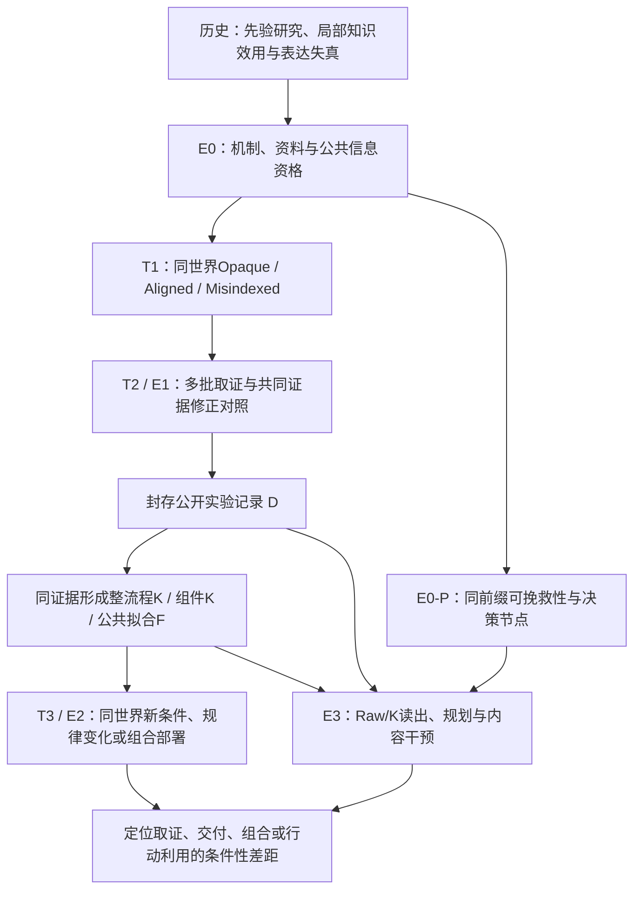

# Work II 完整实验矩阵：先验、实验修正与知识的决策价值

更新：2026-09-16。W2-107恢复先验三臂与Paper 1的世界干预范围；**设计文档，development模式，尚未冻结新正式实验**。

本文件是Paper 2后续实验设计的唯一入口。[TODO](WORK_II_TODOLIST.md)管理执行状态，
[结果索引](WORK_II_PAPER_RESULTS_ZH.md)管理既有结果，[当前绑定](../../configs/current.json)解析机器证据，
[作者故事](../../paper/prior_discovery_story_zh.md)管理读者论证。旧版本设计由Git历史保存。
本次只整合设计，不产生新数据、不改写旧分母，不代表当前导出稿已经采用新方案。

## 0. 全文导航与总矩阵

核心问题：**面对未知或与初始资料不一致的化学世界，Agent能否通过有成本的实验形成、修正并使用可靠知识？**

Opaque、Aligned、Misindexed/Misspecified恢复为核心控制轴。最近的P/C/D三个完整工艺是深入诊断实例，不限定ChemWorld的任务范围；组合迁移是知识效用的一种测试，不再独占论文主线。

| 故事 | 核心实验 | 应回答的问题 |
| --- | --- | --- |
| T1：先验引导与误导探索 | 同世界的Opaque/Aligned/Misindexed三臂，分实体、参数、结构层；覆盖有代表性的机制族 | 正确资料有何价值，错误资料是否改变取证、探索和停止？ |
| T2：实验能否修正错误模型 | 延续三臂的多批探索；预选子集中的共同诊断证据/普通证据/等轮次控制 | 是没有取得判别信息，还是面对信息仍未修正？结构化取证是否有针对性作用？ |
| T3：知识能否支持新决策 | 同来源的直接预测、Raw/K交付和公共规划；同世界新条件、受控世界变化及组合留出分别评价 | 知识保真度、独立交付价值和适用边界是什么？ |

T1—T3是科学故事；下表E0—E3是可复用的执行模块。三者共享匹配世界和证据链，但不预设三个内部断裂。
先验、来源程序、表示、世界变化、预算不做全因子穷举：先用三臂建立覆盖，再在与结果无关的预选机制组深入诊断。

已经建立的局部能力、待解释的失真和新复杂任务共同构成研究。允许Agent成功、知识交付无损、结构化程序无益；不以找到失败为停止目标。

| 块 | 问题与设计 | 主要比较/测量 | 证据地位与优先级 |
| --- | --- | --- | --- |
| H：历史能力与边界 | 保留M1/M3、C2/F3/F4及必要信息诊断 | 原注册对比、原分母、原局限 | 已有证据；不补跑、不并入新正式样本 |
| E0：任务与机制资格 | 广度机制库与P/C/D深度实例；三臂资料、单规律分叉、组合及公开可辨识性 | 可行性、资料/规律效应、策略错配代价、支持覆盖 | 必做；Paper 1能力可复用，新研究条件仍需资格 |
| E0-P：同前缀诊断 | 在同一决策节点核对剩余预算与有效替代 | 可挽救性、干预响应、不可逆损失位置 | 下一开发重点；历史失败节点只作案例，不估总体失败率 |
| E1：多批取证 | 三臂标准Agent；预选子集增加结构化Agent、固定/经典取证及共同证据 | 先验效应、错误修正、盲测预测及成本曲线 | T1/T2核心；不把程序改进取代先验研究 |
| E2：知识交付与首次部署 | 保留来源先验标记；同D生成知识，fresh接收者在各预定测试层行动 | Raw/K/T独立效用、先验残留与新条件决策；程序差单列 | T3核心；含历史流程与经典强基线 |
| E3-A：同证据信息诊断 | 相同D的Raw、整流程K、组件K、公共拟合F | 同读出器预测误差；Agent/公共规划器选择 | 必做的有限解释块；继承F3、M1、M3设计优势 |
| E3-B：知识内容干预 | 上游/下游关系各自置换或补充，配格式/非目标控制 | 过程测点、干预预测与交付变化 | 必做的预定子集；不按失败挑选正式诊断样本 |
| E3-C：预测到行动 | 固定节点先预测候选干预，再选择并执行 | 预测质量、选择损失、同信息替代策略 | 与E0-P/E2复用节点；改变提示的条件独立标记 |
| S：有限补充 | 目标反馈前封存方案、预算扩展 | 仅回答预先声明的新增问题 | 支持/可选；三臂已进入核心，不在此降级 |

## 1. 历史实验如何进入新研究

### 1.1 保留的发现、反例与设计资产

| 历史块 | 保留的实际结果 | 可采纳设计 | 在新版中的位置与禁止升级 |
| --- | --- | --- | --- |
| [M3信息分离](reports/work-ii-m3-portability-20260905.md) | 160/160接收会话；10个复用世界；L−none regret −0.13723，95%[−0.15584,−0.12257]；nearest 10/10最优 | fresh接收者、Raw/K隔离、同世界新候选、来源成本分开记账 | 主文简洁呈现局部知识效用，附录保留全表；不称机制迁移、优于检索或实验节省 |
| [M1因子干预](reports/work-ii-m1-replication-20260905.md) | 10世界、120会话、160条件；拟合替换主差−0.00538，95%[−0.01630,+0.00061]，未达实质收益；拟合规律A/X 40/40一致 | 同证据下改变规律来源与决策程序；报告无益与一致条件 | 与M3共同界定能力边界；原条件同时交付Raw，不能单独归因规律使用，不从阴性推出等价 |
| C2/F3预测与规律 | 两配置规律135/129份；平均law相对直接预测误差增量0.0686/0.0142；DeepSeek 84/135份误差更高 | 同查询比较直接预测与可执行关系；表达容量检查 | 保留为失真动机与支持结果；同域拟合不证明新点泛化，误差差不直接证明行动损失 |
| C2/F1先验与探索 | 两配置各135计划会话；预测平均改善；预定选择性纠错标准均未通过 | 匹配世界/先验、初始与过程检查点、失败分母 | 简洁说明取证与修正边界；不称没有学习或不能纠错，不把best−first当纯反馈收益 |
| 参数匹配证据 | 共同反证后数值预测收敛、错误方向可被纠正 | 同证据控制与前后测 | 条件性能力证据；额外响应轮次未独立控制，新设计不重复这个混淆 |
| F4及策略后继 | 原DeepSeek law Top-1 0/45、participant 11/45、follow-law 12/42；后继系统策略差区间跨零且含交付失败 | 独立执行完整方案、比较artifact与行为、来源失败传递 | 描述性支持；不称内部不相信规律、纯取证收益或普遍不会用知识 |
| B2/B3、最小接口 | 存在公开信息不足、精确alias、格式失败；低结构恢复不能归责可辨识任务上的能力 | 从开始公开完整测量合同；同信息参考；格式与科学评分分开 | Methods/相关附录；受缺陷污染部分退出科学主张，历史记录不删除 |
| [mapping披露](reports/work-ii-information-two-configurations-20260907.md) | 共享10新世界、120计划/112有效；两配置结构恢复均+70个百分点，行动方向不同 | 信息权限检查；结构与行动分开评估 | 评价前提与边界；不作为核心发现，不回填旧B3充分性；选失败补跑只作原敏感性 |
| [充分取证开发](reports/work-ii-astra-dense-evidence-20260914.md) | 四种有证据条件均选中网格最优，未达摘要损失阈值 | Raw/自然知识包/组件表示的配对读出 | 保留无损反例；不能只保留后来更难任务的失败 |
| [完整流程开发](reports/work-ii-full-process-iteration-20260915.md) | 142参考终检；当前8/40联合见证；Astra 3次尝试、2终检未达标、1服务中断 | 自由操作、真实资源、逐步轨迹、粒径/相/热历史 | 新任务的工程与可行性基础；不是系统性失效或跨批发现证据 |

M1与M3共享十个世界，不算二十个独立世界。旧配置、噪声、分母、正式/开发身份及失败保持原定义。
历史C2等来源见[结果索引](WORK_II_PAPER_RESULTS_ZH.md)；只读当前绑定的更正结果，保留受影响旧版的缺陷说明。

### 1.2 新旧连接原则

- M1/M3在主文保留明确位置：说明局部知识可以有用、某些条件下行动可以与规律一致。完整数值放附录。
- F3提供需要解释的保真度问题，新E3用同一数据链补齐干预预测与行动检验；不从旧F3直接推出新任务机制。
- C2/F4提供候选现象和设计经验，不能与M1/M3或新Astra轨迹拼成已识别的内部因果链。
- 旧成功与新失败的协议、模型、机制、预算不同。若要比较“复杂度导致断裂”，必须在新协议内设置匹配的学习/留出与反馈条件。
- 历史证据不自动启动新实验。旧truth错误、执行失败、模型接入、排序门槛诊断进入必要复现材料，不恢复为并列主线。

## 2. 科学对象、任务与共同合同

机制知识指对指定组件及合法干预的可检验关系，不要求唯一符号字符串，不等于内部信念，也不宣称真实化学普适规律。
科学发现链是：**初始资料 → 有成本取证 → 关系形成/修正 → 知识交付 → 新决策**。
一个成功批次只能测过程决策，不能替代完整发现链。

### 2.1 平台覆盖与深度实例

[Paper 1](../../paper/experimental_intelligence_v1_manuscript.md)的第3、5节及附录B/D给出组件、受控分叉与19项过程坐标。
15个参考任务不是能力边界，52个生成组合也不是全部实验空间。新研究按下表选取代表性机制，不按最近开发方便程度限定科学范围。

| 机制族/实验类型 | 底座可用控制 | T1/T2测量重点 | T3中的用途 |
| --- | --- | --- | --- |
| 电化学 | 电位、电流、时间、材料响应、电荷账 | 材料关联和局部窗口先验；动力学/传质响应辨别 | 新控制条件、隐藏材料响应分叉 |
| 反应与热过程 | 反应网络、温度/停留时间、热历史及约束 | 生成量、选择性与热风险假设；是否错误地延长反应 | 新条件决策与下游接口 |
| 平衡/相与有限预算表征 | 相状态、分配、仪器选择、样品消耗 | 性质与关系先验；诊断测量选择 | 相/分离关系变化及知识交付 |
| 连续流 | 流量、停留时间、温度、几何与压降模型 | 操作窗口与耦合关系；控制量混淆 | 新运行区间与跨条件控制 |
| 分离、结晶和蒸馏 | 选相、洗涤、热/晶体历史、切段和保存库存 | 不可逆选择、路径依赖与停止 | 多阶段深度诊断、组合留出 |

组件模型可用不等于所有仪器在所有任务公开，也不等于新三臂都已可辨识。
Paper 1的六个受控分叉对具体覆盖两类私有规律；其他机制的分叉须单独资格，不能泛称已验证任意组合。

以下P/C/D保留为已开发的深度实例；广度覆盖中的表征、连续流、电化学不必改造成同一种产品交付流程。

| 任务 | Agent自由决定 | 关键状态与后果 | 交付指标 |
| --- | --- | --- | --- |
| P：反应—萃取—纯化（核心） | 材料/催化剂与分次投料；分段加热/等待/淬灭；测量时机；萃取剂、相比例、混合/静置、选相、洗涤、干燥、浓缩、转移、终止 | 杂质影响分配；洗涤净收益不固定；选相、体积/夹带、取样与转移有损失；被丢弃相不能免费取回 | 全组分纯度、相对原投料的回收、实际合格交付量、材料/溶剂/过程费用 |
| C：反应—路径依赖结晶（核心） | 反应/取样、播种量与时机、多段冷却、等待、过滤前复热溶解与再冷却、继续/调整/弃批、过滤/终检 | 同终温不等于同晶体群；成核/生长、溶液组成与热历史耦合；淬灭后复热不自动重启反应；晶种来源单列 | 纯度、扣晶种产率、新增交付量、数目细粉比例及粒径、时间/能耗 |
| D：反应—分段蒸馏（过程复核） | 反应终点、蒸馏温度/回流/时长/独立切出比例、GC、分段收集与停止 | 釜底与保存库存持续变化；收集容器累计混合；高纯小切段可能回收不足，追加混合可能损坏已有馏分 | 合格馏分量、纯度、原投料回收、能耗与溶剂成本 |

这三类是兼容模式内的独立任务；不承诺任意串联反应—纯化—结晶—蒸馏。
原生有28种类型化操作，但不强制走满流程；任务复杂度由有后果的分支和反馈价值验收。
每个任务至少验证两处顺序/分支会改变交付，且测量能区分相关假设。

实现依据：[任务](../../src/chemworld/tasks.py)、[机制干预](../../src/chemworld/world/mechanism_family.py)、
[组合](../../src/chemworld/world/composition.py)、[相分离](../../src/chemworld/runtime/phase_separation_services.py)、
[结晶](../../src/chemworld/runtime/crystallization_services.py)、[蒸馏](../../src/chemworld/runtime/distillation_services.py)、
[资源](../../src/chemworld/campaign_resources.py)、[开发合同](../../src/chemworld/runtime/full_process_contract.py)。代码存在不等于研究资格通过。

### 2.2 公开信息与隐藏信息

| 对象 | 参与者可见 | 仅评价器可见 |
| --- | --- | --- |
| 世界 | 匿名组件身份、公共组件图/接口、机制假设类、材料与设备能力 | 当前实例真参数、真实方程选择、私有初始化 |
| 操作 | 合法范围/动态前提、设定值与公开实际温度/体积、相/容器身份、资源账 | 未测的真实组分、晶体完整群体及其他隐藏状态 |
| 测量 | 仪器映射、单位、噪声说明、采样影响、带噪结果、结果时间/对象和新旧标记 | 无噪声值、未购买观测、终检答案 |
| 评价 | 质量门槛、效用规则、资源限额、失败规则 | 盲测真值与其他条件的结果 |
| 知识交付 | 指定D或K、共同合同及目标任务 | 来源私有状态、来源未公开推理、其他部署结果 |

所有受评方法和公共拟合/规划器都遵守这一信息边界。真值参考仅作资格上界，不充当同信息强基线。
不再以补全observation mapping作为新主实验treatment。
三臂中指定的初始资料是明确声明的信息干预，可披露该层面的近似关系；不借Aligned泄露全部真参数或测试答案。

### 2.3 状态、测量和资源语义

液体采样只扣选定对象；其他保存接收器保持。保存馏分可零转移重选，正转移才混合。
粒径仪付费、带噪、非破坏，不能替代化学测量；结晶仍采用声明的代表性浆料采样与合成粒径标量。
晶体群跨操作连续；复热真实溶解；固液晶种来源守恒，扣除其对新增产量的贡献。来源示踪为相内均匀近似，不解析核壳。

所有方法支付新容器、重复前缀、样品、操作、时间和能耗。学习阶段跨批共享资源，重建环境不得刷新额度。
P原生单批调度仍需接入研究层共用账本；C/D的campaign入口也需接受新研究验证。
评价器分支可以重放前缀，但每分支承担相同既付成本，Agent不获得免费克隆或目标世界预实验。

当前开发卡：P/C/D动作上限90/72/72，单批1容器、12次非终检、1次终检；P/D过程12小时、C过程100小时。
Astra会话墙钟上限1800秒，一个provider进程、零重试。模拟物理小时不等于真实墙钟。
这些是W2-105卡，不是新多批研究已冻结预算；不同任务/卡不作等预算模型比较。

### 2.4 核心三臂与干预层面

| 先验臂 | 干预内容 | 解释边界 |
| --- | --- | --- |
| O：Opaque | 不提供指定层面的性质/规律提示；保留完整操作、仪器及评价合同 | 不等于清除模型预训练知识 |
| A：Aligned | 指定层面与世界一致的名义资料或近似模型 | 不等于全知、最优配方或全部真实规律 |
| M：Misindexed/Misspecified | 与A相近的字段、精度、措辞和置信度，但指定关联/关系错误 | Agent不收到臂标签或“这是错的”提示；证据可以推翻资料 |

实体层A-E使用材料代码—性质资料的固定错配，保留资料集合；参数层A-P改变局部窗口或参数关系；结构层A-S改变声明的形式/机制假设。
后两者称Misspecified更准确。三个层面分层报告，不合并成同一种结构恢复率。
同世界三臂固定真实物理、操作和仪器合同、预算、评分及预定噪声配对；仅初始资料不同，公共目录不随意改名。

T1重点对比A−O与M−O，并报告A−M。对同预算终端结果与取证行为估计资料分配效应；首次选择和过程测量为机制线索。
T2测初始到后续的预测/干预响应变化，记录错误方向的修正及正确关系保持，单列初始误差和改善空间。
原选择性纠错门槛保持历史身份；新实验不机械复用会受初始余量影响的唯一指标，也不从“不显著”推出无学习。

### 2.5 资料干预与真实规律分叉

| 真实世界 | 资料P0 | 资料P1 | Opaque |
| --- | --- | --- | --- |
| W0 | 与该世界一致 | 与该世界错配 | 隐去目标提示 |
| W1：只变指定私有规律 | 与该世界错配 | 与该世界一致 | 隐去目标提示 |

这是预定机制子集的候选交叉，不默认对所有任务可构造。资料应有明确适用范围；P0/P1在所选两世界中需通过关系与行动差异资格。
固定动作/噪声的分叉验证规律的物理效应；自由Agent轨迹检验行为响应，不能要求自由策略仍执行同一动作。
从初始状态创建两个实例即可；不假定运行中的反应器可热切换定律。观测模型干预若加入，单独控制，不与资料补全混称。
独立单位为世界对或共享机制组，两个世界和三臂保持配对，不把六个会话算六个独立机制复现。

## 3. E0：世界构造与前缀资格

### 3.1 广度覆盖、规律分叉与组合测试层

广度层按任务/机制族与先验层面登记独立世界或世界对，执行标准Agent的O/A/M匹配三臂。
使用Paper 1的过程坐标描述测量时机、资源部署、失败恢复和终止，但19项坐标不全部作为主检验，也不解释为统一越高越好。
E0分别检查资料内容实际作用、公众证据是否可区分相关机制、反证能否在预算内获得。旧A-E并未在所有任务建立强可辨识性，不能照搬其全部条件并宣称已合格。

T3分开登记：同世界新条件（承接M3）、单规律世界分叉（承接Paper 1）、机制组合留出。不得用改变噪声seed冒充改变真实规律。
以下四格只用于组合子集，不要求电化学、连续流或表征实验全部变成上下游四格。

每个独立组由两个反应组件R1/R2和两个下游组件B1/B2组成；B在任务内分别为P/C/D。

| 上游/下游 | B1 | B2 |
| --- | --- | --- |
| R1 | 学习 | 留出 |
| R2 | 留出 | 学习 |

对角线角色在组间平衡随机化；每个组件均在学习中出现，只有配对首次出现。
同一组件跨配对保持相同定律，通过真实组成、杂质、体积、温度与历史状态耦合，不能化成两个独立标量乘积。
标签无快/慢/优劣提示，世界生成和匿名化规则在模型结果之前固定。

每任务设普通抽样层与指定常规流程下的观测匹配层。后者只要求在该流程族和噪声容差下终点相近、干预响应有区别，不能称所有观测等价。
报告两层权重、构造尝试/失败率、机制类别与参数实例数。一个固定组件反复与别人配对时，分析保留共享依赖。

测试同时包含学习组合的新批次和留出组合的新批次。新候选坐标、独立噪声、机制组合是不同变化，分别标记。
预定支持域内测试为主，数值/接口支持域外测试单列；边际温度相近不能替代联合状态覆盖。

### 3.2 资格矩阵

| 检查 | 操作与参考 | 判定/失败去向 |
| --- | --- | --- |
| 运行与联合质量可达 | 固定有限参考覆盖，从初始状态执行完整流程，观测终检与取样前真值核对 | 至少有零失败事务、资源一致、精确重放通过的联合见证；无见证不等于全域无解，保留全部候选，不在原块内加试找成功 |
| 组件保持与接口闭合 | 配对组合检查局部规律、状态传播、标签及采样/资源语义 | 平台错误结束受影响块后修复；新资格从该块首单位重做 |
| 公开信息可恢复 | 同公开记录的系统辨识与预测；比较学习数据别名及干预覆盖 | 公开参考需达到预定误差/决策标准；失败不得归责Agent结构恢复 |
| 决策区分度 | 固定流程、最佳历史、nearest/固定反馈、公共规划与真值参考 | 检查错配代价、不同有效动作与改善余量；不要求模块化胜出 |
| 路径与测量价值 | 合法配对轨迹改变操作历史或观测时机，保持共同条件 | 至少两处有代价的分支；记录过程和终检，不以调用测量就声称因果利用 |
| 学习/测试支持 | 预先定义接口坐标及参考覆盖，再记录实际采得覆盖 | 支持外预定单列；不根据模型结果重划范围或删除世界 |
| 独立噪声稳健性 | 在预定新噪声重复上复测参考与后续评测 | 精确重放只检验一致性；一次固定噪声达标不估成功概率 |

资格标准的具体数值在独立开发校准后、正式执行前固定，见第9节。世界不按Agent失败、拟合质量或nearest表现事后筛选。
若不同机制始终共用一个好配方，保留这个事实；结束开发块后重新评估研究问题，不补难例到原分母中。

### 3.3 E0-P：同一决策前缀是否仍可挽救

先用现有轨迹提出案例假说，再在正式前选定独立机制组与按过程位置定义的节点。
正式节点按覆盖预选，包含顺利和不顺利状态，不只抽失败轨迹。

| 流程节点 | 固定比较方向（具体参数在块note中事前写明） | 必须排除的替代解释 |
| --- | --- | --- |
| 反应阶段/淬灭之前 | 当前反应终点与合法继续/改变控制；测量后选择 | 下游失败是否由早期目标产物不足决定 |
| P选相、洗涤之前 | 保存哪一相、是否洗涤、洗液/次数的有限替代 | 选相证据不足、损失已不可逆；不把整个多动作区间归因单步 |
| C异常出现、过滤之前 | 保持、慢冷、复热/播种/再冷却的合法替代 | 同时满足产率与细粉是否仍可达；剩余时间多不自动说明可修复 |
| D首次合格读数后、追加混合之前 | 保存已有馏分、继续切段而不混入、追加收集 | 高纯读数是否回收不足；保存容器和重新选择是否真实合法 |

对每节点记录已付资源、公开历史D_t、剩余预算、固定候选干预及终检。
有限搜索找到有效替代只证明该前缀局部可挽救；未找到不证明数学上的全域不可挽救。
特权参考可用于检查可行上界，但判断Agent凭证据能做什么必须另用公共参考。
若能证明当前目标产物上界低于门槛，应定位此前损失，不能把后期停止当作可避免失败。

## 4. 来源、知识表示与接收者的共同定义

### 4.1 来源策略

| 代码 | 来源 | 公平性要求 |
| --- | --- | --- |
| A | 标准自主Agent | 相同复用目标、组件身份、工具和预算；允许主动测量、拟合及自发模块假设 |
| S | 结构化判别实验Agent | 显式维护组件假设/不确定性，按判别或决策价值组织实验；额外计算记账 |
| G | 固定覆盖实验 | 预定合法过程及测量设计；不读目标答案，不按结果修订覆盖 |
| I | 公共信息系统辨识与序贯设计 | 同可见信息拟合/选择实验，配置在独立开发世界调好；完整成本入账 |

终点优化/BO若增加，明确它是否拥有相同最终复用目标；不以只优化源收率的弱策略支撑主要结论。

### 4.2 交付物与读出

| 代码 | 内容 | 用途 |
| --- | --- | --- |
| D / Raw | 来源完整合法公开记录，含动作、对象、读数时效与资源；保留失败 | 信息充分性与原始记录部署基线 |
| K_W | 同D生成的整流程预测/干预表示 | 主要知识条件；允许有表达能力的模型和数值工具 |
| K_C | 同D按组件及公共接口组织的关系与不确定性 | 受检验表示；不是只改变标题或排版 |
| F | 固定公共方法仅从同D拟合的可执行关系 | 表达参考与知识补充；不使用私有真参数 |
| T | 仅公共任务、组件身份与工具，没有来源实验知识 | 无来源知识基线；仍可在部署批内付费测量 |

K_W/K_C共用来源D、组件图、工具和编码预算，二者模型类不宣称完全等容量。Raw更长的上下文及计算成本如实报告。
拟合/编码看不到盲测Q答案、目标部署结果和其他条件输出。知识包在目标反馈前封存，独立重复不相互更新。
知识至少应可表达适用范围、预测/干预关系、接口状态与不确定性；科学内容不足可以失败，不能由评价器代补。

接收者A_r为fresh Agent；参考接收者X为固定公共拟合/规划程序，可仅使用当前条件的信息和合法观测。
X的程序、优化范围、随机性与算力在开发时固定；复杂闭环规划不冒称全局argmax。只有有限候选才称集合内最大化。

## 5. E1：三臂下的有成本取证与实验修正

### 5.1 广度三臂与共同证据

先在预定广度机制库执行标准Agent的O/A/M，各臂一个独立持久会话，在公共预算内连续实验。
记录初始预测和关系判断、固定成本检查点、终态知识、完整动作与资源；不只记录最优终点。
比较先验对取证与预测的影响，报告可被证据修正、未修正、错误修正和保持正确的全部情况。

在与结果无关的预选机制子集内，增加O/A/M × 诊断证据/普通证据/等轮次无新增证据控制。
每个证据条件的三臂收到相同公开记录；诊断与普通证据的采集预算事前匹配，证据不包含隐藏答案。
前测、后测的轮次和计算额度一致，避免旧packet与额外思考轮次混淆；评价查询不反馈给Agent。
自主证据与共同证据是不同策略比较，不能仅由后者成功唯一归因前者的内部失效。
选择性纠错需同时看错误关系修正与正确关系保持，并报告初始误差差异；不得事后只选初始表现相同者。

### 5.2 深度子集中的来源程序对照

下表A/S是来源程序代码，区别于第2.4节的先验臂A（Aligned）。每个比较都固定一个先验条件，或在事前选定的三臂子集内分别重复；不把两者混成一个因子。

每个来源只在两个学习组合取证，可决定在哪个组合开新批次，也可在批内反馈控制。
各来源共用物理资源向量和模型/拟合计算上限，实际消耗单列。预算按完整过程校准，不使用固定12步切批或预填72配方表。

| 条件 | 输入/输出 | 主要用途 |
| --- | --- | --- |
| A → D_A | 公共合同、学习组合、指定先验、共享预算 → 自主公开记录 | 主要程序基线 |
| S → D_S | 与A相同，加结构化实验组织程序 → 公开记录 | 取证程序支持对比 |
| G → D_G | 事前固定覆盖的过程记录 | 非自适应取证基线 |
| I → D_I | 公共辨识与序贯设计取得的记录 | 强经典取证基线及可恢复性参照 |

**取证程序对比**：相同先验和采集预算下，S相对A的盲测干预响应预测误差差，负值有利于S。
该对比解释T2中的取证问题，不取代O/A/M先验与共同证据核心实验。
主读出使用统一证据格式和预先指定的公共读出程序，以减少来源之后的编码差异；fresh Agent读出作为配对支持分析。
若公共读出本身未通过资格，不能据其失败声称D无信息。

Q包含事前确定的上游响应、下游响应、接口相关响应及干预方向，不向来源反馈评分。
各物理量按公开固定尺度归一化后按预定权重形成误差L_Q，原量纲误差同时给出。
学习组合的常规终点拟合、有限干预排序和过程结果用于支持，不以文字解释好坏评分。
Q的允许输出域和缺失/非法预测的失败损失在note中一并固定，采用公开计分域对应的保守上界，不能取事后样本最大值。
全部计划预测进入主分母，有效输出误差另列；来源无可用D或读出失败也不能从E1删去。

预算曲线建议检查点为0、1/4、1/2、3/4、1倍源预算；具体触发轴在note中固定。
多资源预算必须指定一个进度轴，其余保持上限；检查点使用已完成操作/批次，不中断合法事务、不回传真值。
“拟合相当”需等效界和区间；“更多实验已无收益”需预定斜率/实质变化界，不能从不显著推出。

## 6. E2：知识的独立效用与组合首次部署

### 6.1 必做核心2×2

A/S的每份D分别生成K_W和K_C。每个条件都在两个学习组合的新批次与两个留出组合的新批次部署。
各部署从相同初始任务资源出发，使用独立fresh接收者；同一批次内允许合法付费观测和调整。

| 来源/表示 | K_W整流程 | K_C组件 |
| --- | --- | --- |
| A标准取证 | A-W：主要基线 | A-C：表示简单效应 |
| S结构化取证 | S-W：来源简单效应 | S-C：完整受检验程序 |

**完整程序对比**：指定先验的留出组合上S-C减A-W的failure-aware终端效用差，正值有利于S-C。
这是整个程序效应，不是纯表示因果效应。固定D内W/C比较、固定表示内A/S比较及交互在E3支持分析报告。
所有来源，包括失败和不足的来源，保留计划槽位；不可生成知识包导致下游不可用时不静默删除。

知识条件不再附送Raw或来源对话，继承M3的信息隔离。接收者仍可见本次部署自己买到的新观测。
主终点名称为“无目标预实验的首次部署”，不称零目标观测迁移。
每份知识保留来源先验条件，接收者不额外获得来源初始资料；若知识包自身保留错误关系，作为待测内容，而不是评价器替它纠正。
T3的核心是Raw/K/T的独立决策价值与先验影响是否延续；W/C及来源程序是解释性对照，组合子集以外不强制全交叉。

### 6.2 必做基线与增量解释

| 基线 | 数据与动作能力 | 回答的问题 |
| --- | --- | --- |
| A-Raw、S-Raw | 对应同一来源D、fresh Agent、同部署工具/预算 | K相对原始记录保留了多少部署价值 |
| T | 公共任务，无来源知识；同样允许批内反馈 | 学习知识的增量价值 |
| A/S最佳历史流程复用 | 只用各自D选择最佳合法源流程，原样迁移到目标 | 是否只需记住好配方 |
| A/S固定历史反馈策略 | 依据对应D及公共状态选择流程/反馈；规则在目标结果前固定 | 是否只需检索与简单反馈；不以不可执行静态nearest充当强基线 |
| I完整经典路线 | D_I → 公共拟合/规划 → 完整部署 | 相对强系统辨识和控制方法的能力边界 |
| G来源读出/部署参照 | D_G采用预定公共拟合与规划，复用E1来源 | 非自适应实验是否已经足够 |

最佳历史流程和固定反馈策略分别报告，不能看测试分数后取两者较好者当作事前基线。
Raw/K都报告绝对表现；K优于T而未优于历史流程，只支持知识效用，不支持机制迁移必要性。
若某表示在所有条件都能迁移，保留成功范围；不扩大难度直到摘要失败。

### 6.3 学习与留出的匹配比较

对同一来源、表示、接收者和预算，比较学习组合新批次与留出组合新批次的效用差。
同时报告程序×组合角色交互：两程序在留出与学习上的差值之差。
使用同一协议内的比较说明组合变化，不能用旧M3成功和新单批失败代替该对照。
若学习组合表现本就低，留出失败不自动支持“只在迁移时断裂”；全体主效应和预定条件性分析分开报告。

支持分析可封存目标反馈前的合法完整方案，再由固定执行器评估不使用中途反馈的部署。
所有法定测量与终检仍执行/收费，只是不供策略调整；固定与反馈策略是不同估计对象，单列比较。

## 7. E3：同一数据链上的有限因果诊断

### 7.1 E3-A：同证据表达保真度与利用

预先选择覆盖任务、世界层、留出方向的机制组子集J，不按E1/E2结果选择。
在J内每份A/S来源D上生成K_W、K_C和公共拟合F，使用相同盲测Q；评价坐标不用于拟合。
G/I仅承担既定E1与E2参考，不自动扩成全部编码、接收者和内容干预的交叉。

| 诊断 | 固定什么 | 改变什么 | 指标与解释 |
| --- | --- | --- | --- |
| D→K预测保真度 | 同D、Q、读出程序g及预算 | Raw/K_W/K_C/F | 各自绝对误差、K−Raw误差差，继承F3 |
| 表示×接收者 | 同D、状态/候选、部署预算 | W/C/F × fresh Agent A_r/公共规划X | 预测与交付；区分关系质量与利用程序，继承M1 |
| 独立知识效用 | 同目标、接收者、预算 | T/Raw/K，不附送来源对话 | 知识是否独立帮助，继承M3；复用E2相同槽位 |
| 格式对照 | 内容关系和预算近似一致 | 保持内容的重序列化/sham | 排除纯格式或额外文字影响 |

可恢复信息差定义为B_g(K,D)=L_Q(g(K))−L_Q(g(D))。
正值只说明该读出程序、表达和预算下预测可恢复性降低，不是Shannon比特量或内部记忆删除。
公共解码/规划与fresh Agent两条路线同时报告；Raw/K都差不能证明D不存在信息。

F只能从同D估计，方法在开发组固定。若格式需要表达能力检查，拟合已知预测向量的同域容量结果与新Q泛化分列。
X下的真实效用用于检验关系本身是否可用；不同接收者的计算预算和算法假设明示，不冒称只改变认知心理变量。

### 7.2 E3-B：组件置换与公共关系补充

以J中的每份K_C为基准，所有预定方向都做；K_W的对应干预只在需要表示交互且事前增加时实施。

| 条件 | 唯一主要改动 | 用途 |
| --- | --- | --- |
| K原版 | 无 | 复用已有基准 |
| K-sham | 内容保持的重序列化 | 格式/上下文控制 |
| K-swap-R | 从预定配对来源置换上游关系内容，保留公共标签与其他内容 | 上游关系内容是否影响相应响应与后续交付 |
| K-swap-B | 同样置换下游关系 | 下游方向对照 |
| K-repair-R | 仅补充/替换固定公共参考从同D估计的上游关系 | 是否能修复已交付信息的缺口 |
| K-repair-B | 同样补充下游/接口关系 | 下游及组合关系方向 |
| K-control | 预算相近的非目标关系补充 | 排除通用提示或额外上下文收益 |

置换来源按组件和覆盖事先映射，不按供体质量挑选；供体无有效关系时保留不可用槽位。
置换有效关系可能有益也可能有害，不能要求任何替换都降低得分。
repair来源限D及共同公共假设类，不使用目标Q答案、目标部署结果、真参数或隐藏状态。
无法可靠估计时记录修复不适用/失败，不用私有答案补阳性对照。

测量预定上游/下游过程点、干预方向、首次部署和资源。上游影响允许传播到下游；无关过程量只按预定容差检查。
先用固定公共规划器评估内容自身作用，再在同子集与预算下由Agent部署；复用既有基准，新增真实分支独立计费。
内容干预改善支持其因果作用，不宣布原故障的唯一内部原因。

### 7.3 E3-C：从预测到行动的节点诊断

在第3.3节预定节点、相同D_t和剩余预算下，固定一组合法候选干预与预算内完成策略：

1. 公共参考预测各候选的响应/联合达标机会，随后评价器执行所有预定候选并隐藏答案。
2. fresh Agent先提交各候选的定量预测及不确定性，再选择；选择封存后执行，记录真实后果。
3. 独立行动条件不要求先显式预测，用于检验预测提示本身是否改变决策。条件配对但不共用目标反馈。
4. 需要比较Raw/K时，只改变历史表示；物理状态、公共任务、候选与剩余预算保持一致。

该有限候选诊断服务于解释自由行动主任务，不替代E2的完整自主流程。
“预测准确但行动差”需候选排序与效用差达到预定标准；仅数值MAE小不保证关键排序正确。
如果预测提示改善行为，记录为程序干预效应，不把被提示的表现当作原始轨迹中的潜在认知状态。
当前W2-105失败案例可定位问题，但正式失效比例只能来自预定J或全体组。

### 7.4 结果模式与结论边界

| 结果模式 | 允许的结论 | 下一步/收束 |
| --- | --- | --- |
| 同预算参考能取证，Agent的D在已资格公共读出下明显较差 | 该取证策略的任务信息不足 | 检查实验选择；不归责知识交付 |
| Raw可用、K差、公共关系补充选择性改善 | 被测知识交付丢失/未保留可用关系 | 同组报告预测、过程与交付的链式证据 |
| K在X有效，Agent部署差 | 该接收或规划程序的利用差距 | 节点预测/行动对照；不声称内部不相信规律 |
| 学习可用、留出差，接口关系补充改善且支持覆盖成立 | 对组合关系的表达/使用存在条件性不足 | 用独立机制组、普通层与其他过程验证边界 |
| 有早期产物不足或有限参考无法挽救 | 晚期失败可能受早期决策限制 | 向前定位；不凭剩余预算认定放弃错误 |
| Raw/K表现接近、全部有效 | 本协议下未发现预定交付损失 | 保留成功结果，不追加难例到原块 |
| 公共参考也差、支持域不成立或平台语义错误 | 不能据此识别Agent科学信息损失 | 标记任务/估计局限；修复后新块，不改旧结果 |

## 8. 指标、统计、信息与资源分母

### 8.1 质量与主效用

历史W2-105质量门槛保持：P/D纯度≥0.80、原投料回收≥0.10；C纯度≥0.80、扣晶种产率≥0.10、数目细粉≤0.50。
新研究以这些门槛为开发起点，正式值在看正式模型结果前固定；不能为让失败变成功而修改运行块。

为把“实际交付”置于中心，P/C/D深度E2拟采用以下公开主效用定义，在开发卡校准后冻结：

U = I_valid × I_quality × (m_new / M_ref) / (1 + C_phys / C_ref)。

- I_valid要求合法完整交付、必需终检和资源不超限；缺失、服务中断、无有效来源导致不可部署的计划槽位主效用为0，并单列原因。
- I_quality按评价器终检取样前真值联合判断，m_new为同一时点实际交付的目标产物，结晶扣除晶种来源。
- M_ref是任务公共资源卡对应的固定理论产物量尺度，方法间相同；不用各Agent自行选择的小投料量作效用分母。
- C_phys是去重的原生物理费用账，C_ref为事前固定公共费用尺度。已有能耗/时间费用不二次计入；旧native score单列。
- M_ref、C_ref及合法质量范围在开发资格中核对。物料/产率越界按平台问题处理，不靠裁剪隐藏错误。

这是一项新设计选择，不重算或覆盖旧M1/M3/C2或W2-105原主指标。
表征、连续流、电化学等广度任务按自身公开目标定义决策损失或交付效用，不强套晶体/馏分质量公式，也不跨任务直接平均原始分数。
同时报告带噪终检的公开达标率、真值达标率、二者联合标志及全部连续原指标。
参考资格要求真值与带噪终检共同达标；部署主效用用真值避免把幸运测量当作真实交付。
门槛导致零效用时仍展示纯度/产率/细粉距门槛的程度，不用总分掩盖失败类型。

有限候选上的regret只相对于该候选集最优；自由动作流程报告与固定参考的效用差，不称全域oracle regret。
E1主误差、实质差阈值、等效界、预算曲线标准、噪声重复数都需独立开发校准。

### 8.2 独立单位与主比较

独立单位为广度层的任务—机制世界组、受控分叉的世界对或组合层的机制四格组，按所属块分别登记。
组内先验臂、学习/留出、模型、来源、表示、接收者、噪声及诊断节点保持配对依赖。
共享固定组件跨组时提高聚类层级；动作、会话和噪声重复不是独立机制复现。

正式主对比按T1先验效应、T2实验修正、T3知识决策价值登记并控制多重比较；各自具体主终点与科学阈值在开发后一次固定。
取证程序、表示、接收者、E3内容及基线/交互作为预定支持比较，不用它们的显著结果替换三臂研究中心。
按任务和世界层报告组级差值、原始均值、区间和失败。小组数时注明区间近似性，开发一次/条件不估稳定成功率。
核心全计划分析保留所有预定组；来源成功条件分析另列，不以其替代端到端主分析。
报告“学习可用且留出失败”的联合事件比例时，以全部预定组/条件为分母；只在学习成功者中报告的条件比例另列且不作总体因果效应。

“系统性断裂”至少需要：预定组分布内的可重复差距、实质行动代价、信息/支持资格，以及相应受控解释或修复。
如只出现差距，结论停在条件性现象。若只在观测匹配层出现，结论限于该层；不外推所有科学Agent。

### 8.3 成本与数量核算

物理成本分源取证、首次部署、评价器探针/分支；模型成本分实验设计、拟合/编码、预测读出、部署。
共享D只记一次采集成本，重复分支实际重新执行并收费。缓存token作为输入子集报告，缺失usage不是零。
物理成本、模型token/墙钟分别呈现；未知货币费用不估造，也不合并成未经校准的“总成本”。

广度层若有N_b个独立世界，每次噪声/会话重复为r_b，则O/A/M来源共3N_b r_b个计划campaign；世界分叉按成对单位另列，不混入独立世界数。
共同证据子集若有J_b个世界、三类证据条件，则计划9J_b r_b个会话，不与全部表示/规划条件交叉。

下面仅核算**固定先验条件下的完整组合程序子矩阵**。设N为该子集的独立组合组数，r为独立评测噪声重复，J为预选诊断组数：

| 必做设计 | 计划数量表达式（未含额外模型复核） |
| --- | --- |
| E1四种来源 | 4N个来源campaign；其中A/S为2N个Agent来源campaign；每campaign可有多批/多次调用 |
| A/S两种知识表示 | 4N份K，来源失败也保留对应计划位；同知识供学习/留出复用 |
| E2核心2×2 | 4条件 × 4目标组合 × N × r = 16Nr次部署，其中8Nr为留出 |
| A/S-Raw | 2来源 × 4组合 × N × r = 8Nr次部署 |
| T公共任务基线 | 4Nr次部署，不按来源重复制造伪样本 |
| A/S最佳历史及固定反馈 | 2来源 × 2规则 × 4组合 × N × r = 16Nr次参考部署 |
| I、G公共规划路线 | 2路线 × 4组合 × N × r = 8Nr次参考部署 |
| E3及同前缀分支 | 按J、来源、读出器、节点、预定候选/内容条件列表计数，扣除已复用基准；执行前note列精确分母 |

以上为评测部署数，**不是provider调用数**。一种来源/接收会话可以有多轮响应与操作；确定性基线无provider。
该完整子矩阵的E2路线为52Nr次部署，其中含公共参考；不同目标条件不共享反馈。
52Nr不是全篇总量，也不自动乘三臂；只在预定深度子集执行。全篇由广度三臂、共同证据和选定深度模块分别列账、去重共享基准。

## 9. 开发到正式的执行顺序与待定项

### 9.1 下一阶段顺序

| 顺序 | 范围与产物 | 进入下一步的依据 |
| --- | --- | --- |
| D0 | 现有完整流程的同前缀可挽救性、早期损失、候选干预预测接口；补共用跨批资源 | 科学问题可测、真实替代可执行；失败案例保留 |
| D1 | 广度机制库的O/A/M资料与公众可辨识性；预定单规律世界对及深度组合子集、公共参考 | E0资格按层面报告全部候选，不限定三个工艺、不按Agent失败选取 |
| D2 | 三臂自主取证及共同证据开发；预选子集的A/S取证→W/C编码→Raw/K/T部署与I/G基线链 | 先验、修正和知识价值的完整链跑通；控制总因子数量 |
| D3 | 预定诊断子集的公共拟合、节点预测、内容置换/补充；独立开发组估方差 | 确定数值预算、组数、指标尺度和实质阈值；不按预期方向选择 |
| F | 函数与矩阵稳定后一次冻结，执行E1/E2与预定E3、核心复核 | 固定覆盖/分析，保留失败，完成机器可读总结 |
| W | 用实际结果重写稿件、主图及附录，集中验收并导出 | 不把规划写成结果，不沿旧F1—F4堆积全文 |

当前用户约束：开发仅GPT-6 Astra / medium，每个事前条件一次，允许条件内多轮工具/模型响应，不因科学失败补跑。
一个主系统完成新矩阵。正式其他模型家族的核心复核是后续独立范围，当前不启动；需各自产生来源和部署才叫端到端复核。
只共享Astra的D/K给其他模型属于接收端复核，不能等同独立科学发现链。

### 9.2 尚未冻结但必须落实的数值

| 项目 | 由什么校准/固定 | 未落实时不得声称什么 |
| --- | --- | --- |
| 广度机制库N_b、世界对与组合子集N、先验层面及权重 | 预定生成覆盖、构造率、独立开发组效应精度 | 已完成系统性复现或代表性模型调查 |
| 源批次/物理预算、各阶段计算限额 | 公开参考完成判别和完整链实际成本 | 等资源比较或取证预算已经充分 |
| 质量门槛、M_ref/C_ref、E1尺度与权重 | 原生任务与开发可达性，所有方法统一 | 已冻结正式效用或跨任务相同难度 |
| Q、节点、支持域、实质/等效/修复阈值 | 决策错配代价、噪声与参考精度 | 信息损失、饱和或学习/测试等效 |
| 噪声r、诊断J及内容/供体映射 | 覆盖与精度/成本，独立于Agent结果 | 用单次读出差归因稳定机制 |
| 复核系统与范围 | 当前新任务工程资格、预算与明确授权范围 | 多家族普遍结论或已启动新模型 |

此表是待完成的科学校准，不是增设审批或全仓审计。完整设计结构已经确定，尚未校准的数字不伪装成正式预注册。

### 9.3 停止、失败与冻结规则

每个数据块执行前只写一份简短note，固定问题、单位/覆盖、测量、分母、通过/失败及停止规则、输出。
预定单位终态即结束；原始失败不覆盖。科学阴性不触发换世界、追加样本或替换模型。
平台修复允许另起受影响资格块并从首单位重做，旧块标记历史/受影响；不在运行中改合同。

区分：科学质量失败、取证不足、知识不可用、合法性/资源失败、provider失败、平台语义缺陷。
provider中断进入系统完成率和failure-aware效用，但不单列为科学推理失败；缺失终检不代填，缺失费用不记零。
独立任务是否继续按note规定；不得挑成功来源补齐下游分母。

开发只跑聚焦功能/科学检查，不要求干净全仓、全树hash或重复发布证书。
功能与矩阵稳定、正式证据生产获授权时才一次release-freeze：最小执行面、固定分析与覆盖、一次集成验收。
原始provider数据和ignored运行目录不入Git。长任务每分钟内输出进度/完成数/吞吐/ETA或具体活性计数。

## 10. 有限补充、论文呈现与完成标准

### 10.1 可采纳但不扩成主矩阵的设计

| 设计 | 采用条件 | 控制要求 |
| --- | --- | --- |
| 先验×来源程序×表示的更高阶交互 | 仅当独立开发支持明确问题和预算时预先增加 | 三臂本身已是核心；不把全部次级因子全交叉 |
| 目标反馈前封存完整方案 | 区分带入知识与本批新取证作用 | 合法必需测量照做/收费，策略不使用中途反馈；与闭环分开估计 |
| 额外预算点/来源策略 | 独立开发显示能回答新的预定问题 | 新块前写明范围，不因不显著延长到显著 |

不恢复独立预测蒸馏大矩阵、长期机制变化与修复、任意跨模式串联、全模型全因子交叉或接口修复主线。
不把自然知识包不丢失视为失败的实验，也不按Agent失败筛机制。

### 10.2 文章论证与显示计划

正文顺序：先验与真实世界可能不一致→受控世界及三臂方法→T1先验对探索的作用→T2实验修正条件→T3知识的决策价值→针对性诊断与成功边界。
M1/M3作为局部能力证据和T3设计基础；复杂组合是深度测试，不能取代三臂与其他机制族。
F3作为表达失真的动机/支持证据，C2/F4保留必要现象；B2/B3、mapping和工程恢复放方法及相关附录。
旧结果主文摘要与新正式主结果身份明确，不合并统计；所有有效阴性与反例保留。

建议四张新主图：
1. 真实世界×初始资料的控制、机制覆盖及O/A/M探索差异。
2. 三臂随实验成本的预测/关系修正；共同证据与取证程序对照。
3. Raw/K/T的新决策价值，区分同世界、单规律分叉和组合留出，并展示强基线及M1/M3历史边界。
4. 预选深度实例的同前缀、表达×接收者与关系补充，解释信息和行动的差距。

M1/M3以简洁历史能力面板或结果表保留，不另铺旧四层失败图。图中不预画必然失效红箭头。
内部任务ID、hash、run目录留在证据记录，不进入读者主线。

本研究完成需要：完整链在合法预算内执行；全部预定组与失败可读；主比较和支持分析依规则报告；
对信息不足、表达、执行与平台错误作可支持的区分；正文与实际证据一致。
若经典方法已解决而Agent无增量，报告能力边界；若K/Raw都能迁移，报告可用范围。
Spotlight潜力来自有解释力的实际证据，不能由实验数量、复杂操作或期待的阴性结果保证。
