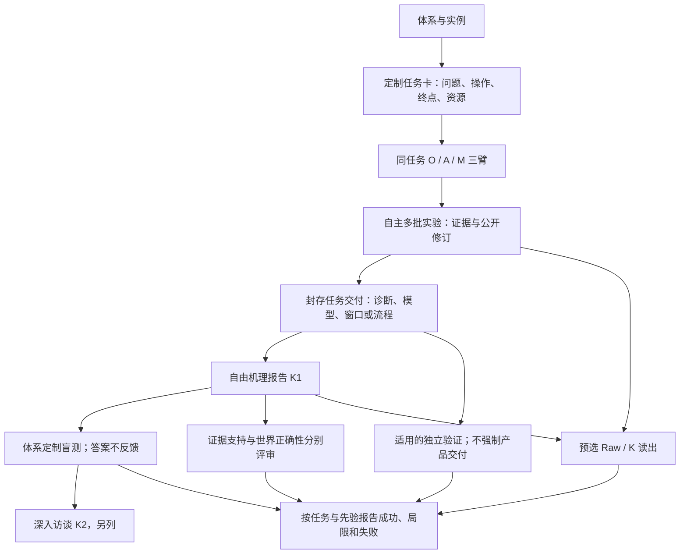

# Work II 完整实验矩阵：先验、自由机理发现与知识的预测及决策价值

更新：2026-09-18，W2-123。**当前设计，development模式；新来源实验预算统一为每会话12次完整实验，测量额度12次（终检另计）；EC试跑已完成，核心71/72次终检及18/18项后测，原失败保留。本轮经验、待修实现及逐体系推进见第9.6节；该节是后续设计，不表示新协议已实现或实验已启动。新正式Participant样本量尚未冻结。**

本文件是Paper 2实验设计的唯一入口。[TODO](WORK_II_TODOLIST.md)管理执行，
[结果索引](WORK_II_PAPER_RESULTS_ZH.md)保存既有结果，[current](../../configs/current.json)解析既有机器证据，
[作者故事](../../paper/prior_discovery_story_zh.md)组织读者论证。W2-118修复五体系定制资料/观测接口并完成独立验证：当前主响应5/5、局部资料反证5/5、任务筛查4/5；FL窗口未建立，完整自主链尚未验证。历史失败与当前版本分母分开保留，零模型调用，无论文导出；判定见第9.4节。

Experiment 1的七体系/35 Worlds/21格资格化与执行语义以
[最小执行规范v1.0.1](EXPERIMENT_1_MINIMUM_EXECUTION_SPEC_V1_0_1.md)及[当前权威导航](experiment_1/AUTHORITY.md)界定；本矩阵保留更广的Work II论文问题、九个体系的定制任务、后测与知识价值设计，
不改写已经冻结或完成的Experiment 1资格块。其历史World、locus、Arm、gate、预算和状态词仍按对应版本解释；
新EC双目标设计见第2.4.1节，不能用历史八批预算覆盖本次十二批设计。[W2-122单世界试跑](WORK_II_EC_SOL_DUAL_GOAL_TRIAL_NOTE.md)采用GPT-5.6 Sol / medium；原18来源/216批计划按用户指令收束为E层两目标三臂6场核心，额外保留2场P层探索，10场未启动。实际95/96终检、96次中途测量、24项K1/Q/K2后测；核心优化Aligned少一批，后测单独补齐，原失败不改。见[结果](reports/work-ii-ec-sol-20260918/REPORT.md)及[逐批评估、设计局限和耗时](reports/work-ii-ec-sol-20260918/ANALYSIS.md)。已有资格状态从[Experiment 1入口](experiment_1/README.md)读取，历史冻结块不追溯改预算。

## 0. 当前研究问题与总矩阵

> 面对未知或与初始资料不一致的化学世界，Agent怎样为具体科学任务选择实验、修订解释，并形成能支持预测和决策的知识？

**只设Opaque / Aligned / Misindexed三个先验臂。每个体系按自身科学问题定制任务，同一自主来源追加自由机理报告、适用的盲测与分析。**
不为每个体系套用相同的两份任务。W2-121明确EC同时设置“机理探索”和“体系内优化”两个独立来源目标；其他体系仍按自身特点定制。三臂、自由报告及封存次序保留。历史任务的目标、结果和分母不追溯改写。

当前覆盖九个体系的定制任务：电化学机理探索与有效转化优化、反应/热过程辨识、水相平衡表征、有限预算表征、相间分配发现、连续流运行窗口、反应—纯化、反应—结晶、反应—蒸馏。EC两张卡加其余八张基础卡，共十张已选任务卡；先验层另计。
这是科学委托的分类，不宣称九种相互独立的底层物理机制；共享反应网络/组件的实例在统计中保留依赖。原先合并的“平衡/相/表征”拆开，避免不同对象共用一个模糊终点。

每张任务卡只有一个主要委托；EC使用两张配对任务卡，不把两个目标混在同一来源中。产率、回收、粒径、预测误差、诊断质量或运行可行性分别按任务定义；共同的是三臂控制和研究后评价的原则，而非相同数字分数。
EC目标配对已由用户选定；反应辨识/受约束合成、结晶交付/路径辨识仍为可选问题，不将双目标自动铺满所有体系。

| 故事 | 核心问题 | 证据 |
| --- | --- | --- |
| T1：先验影响取证 | 正确/错误资料如何改变针对该任务的实验选择、测量和资源？ | 同任务、同世界O/A/M配对 |
| T2：证据推动修订 | 是否取得公开反证，随后是否修改解释、预测和行动？ | 同一来源的过程记录与封存终态；预选共同证据支持 |
| T3：形成并使用知识 | 任务相关的解释是否有据且正确，能否预测新干预或帮助新决策？ | K1、LLM分维评价、按体系设计的盲测及预选Raw/K读出 |
| 目标作用（EC已选；其他体系按需） | 在同体系内，改变科学委托是否改变取证和知识？ | 同世界、同先验、同资源的独立目标会话；不能从跨体系成绩推断 |

| 块 | 当前设计 | 覆盖与地位 |
| --- | --- | --- |
| H | 旧M1/M3、C2/F3/F4及开发结果 | 保留原身份与局限，不并入新来源 |
| E0 / E0-J | 逐任务检查运行、可辨识性、终点/约束与评审有效性 | 全任务基础；无产品的任务不做产品质量资格 |
| E1-P | 九个体系基础任务各自的O/A/M自主研究 | 与已选EC的E1-G共同构成当前来源；任务卡可因科学资格失败而标为待开发，不换成简单任务冒充 |
| E1-G | 同世界的另一明确委托 | EC机理探索已纳入，与EC优化独立运行；RX/C等仍为可选目标对照 |
| E-K / E-Q | 同源自由报告K1、原Agent盲测、最后深入访谈K2 | 全部来源；题型、相关关系及主要终点按任务定制 |
| E2-V | 验证已封存的任务交付 | 有流程/策略者独立复测；表征/辨识者按独立查询核验，不强造配方 |
| E2-T | 预选T/Raw/K/Raw+K接收者预测或决策 | 明确任务及信息条件；不把四路全交叉默认为必跑 |
| E1-R / E1-X | 共同证据、真实规律分叉 | 针对具体反事实问题的支持，不是第四先验臂 |
| E3 | 同D再推断、内容干预、预测—行动及前缀诊断 | 仅适用子集；报告、推断、行动失效分开 |
| 方法参考 | 按体系选择固定实验设计、辨识、约束优化或流程策略 | 结构假设/适用域公开；不存在未经实现的万能经典基线 |

所有任务先说明主要委托、硬约束、终态交付和后测类型。来源结束先封存任务交付，再封存K1和预测，最后访谈；K2不能覆盖K1。文字、方程、图和代码均可，代码不是报告准入要求。
公共操作/观测合同和基本科学研究规范完整提供，候选机制引导与仅靠提示的结构化研究不另设默认臂。没有取得的信息不称“报告丢失”；次要能力不足也不自动等于主任务失败。

## 1. 历史实验如何进入新研究

### 1.1 保留的发现、反例与设计资产

| 历史块 | 保留的实际结果 | 可采纳设计 | 在新版中的位置与禁止升级 |
| --- | --- | --- | --- |
| [M3信息分离](reports/work-ii-m3-portability-20260905.md) | 160/160接收会话；10个复用世界；L−none regret −0.13723，95%[−0.15584,−0.12257]；nearest 10/10最优 | fresh接收者、Raw/K隔离、同世界新候选、来源成本分开记账 | 固定二次响应面的局部交付效用；不作为自主机理推断证据，不称机制迁移、优于检索或实验节省 |
| [M1因子干预](reports/work-ii-m1-replication-20260905.md) | 10世界、120会话、160条件；拟合替换主差−0.00538，95%[−0.01630,+0.00061]，未达实质收益；拟合规律A/X 40/40一致 | 同证据下改变规律来源与决策程序；报告无益与一致条件 | 固定二次类的数值建模/决策对照；原条件同时交付Raw，不证明自主机理推断或独立规律使用，不从阴性推出等价 |
| C2/F3预测与规律 | 两配置规律135/129份；平均law相对直接预测误差增量0.0686/0.0142；DeepSeek 84/135份误差更高 | 同查询比较直接预测与可执行关系；表达容量检查 | 保留为失真动机与支持结果；同域拟合不证明新点泛化，误差差不直接证明行动损失 |
| C2/F1先验与探索 | 两配置各135计划会话；预测平均改善；预定选择性纠错标准均未通过 | 匹配世界/先验、初始与过程检查点、失败分母 | 简洁说明取证与修正边界；不称没有学习或不能纠错，不把best−first当纯反馈收益 |
| 参数匹配证据 | 共同反证后数值预测收敛、错误方向可被纠正 | 同证据控制与前后测 | 条件性能力证据；额外响应轮次未独立控制，新设计不重复这个混淆 |
| F4及策略后继 | 原DeepSeek law Top-1 0/45、participant 11/45、follow-law 12/42；后继系统策略差区间跨零且含交付失败 | 独立执行完整方案、比较artifact与行为、来源失败传递 | 描述性支持；不称内部不相信规律、纯取证收益或普遍不会用知识 |
| B2/B3、最小接口 | 存在公开信息不足、精确alias、格式失败；低结构恢复不能归责可辨识任务上的能力 | 从开始公开完整测量合同；同信息参考；格式与科学评分分开 | Methods/相关附录；受缺陷污染部分退出科学主张，历史记录不删除 |
| [mapping披露](reports/work-ii-information-two-configurations-20260907.md) | 共享10新世界、120计划/112有效；两配置结构恢复均+70个百分点，行动方向不同 | 信息权限检查；结构与行动分开评估 | 评价前提与边界；不作为核心发现，不回填旧B3充分性；选失败补跑只作原敏感性 |
| [充分取证开发](reports/work-ii-astra-dense-evidence-20260914.md) | 四种有证据条件均选中网格最优，未达摘要损失阈值 | Raw/自然知识包/组件表示的配对读出 | 保留无损反例；不能只保留后来更难任务的失败 |
| [完整流程开发](reports/work-ii-full-process-iteration-20260915.md) | 142参考终检；当前8/40联合见证；Astra 3次尝试、2终检未达标、1服务中断 | 自由操作、真实资源、逐步轨迹、粒径/相/热历史 | 新任务的工程与可行性基础；不是系统性失效或跨批发现证据 |

M1与M3共享十个世界，不算二十个独立世界。旧配置、噪声、分母、正式/开发身份及失败保持原定义。
历史C2等来源见[结果索引](WORK_II_PAPER_RESULTS_ZH.md)；只读当前绑定的更正结果，保留受影响旧版的缺陷说明。

### 1.2 新旧连接原则

- M1/M3保留历史结果及有限对照价值；若主文引用，明确其固定二次响应面范围，完整数值放附录。它们不承担自主机理推断主张，也不约束新Agent的模型形式。
- F3提供需要解释的保真度问题，新E3用同一数据链补齐干预预测与行动检验；不从旧F3直接推出新任务机制。
- C2/F4提供候选现象和设计经验，不能与M1/M3或新Astra轨迹拼成已识别的内部因果链。
- 旧成功与新失败的协议、模型、机制、预算不同。若要比较“复杂度导致断裂”，必须在新协议内设置匹配的学习/留出与反馈条件。
- 历史证据不自动启动新实验。旧truth错误、执行失败、模型接入、排序门槛诊断进入必要复现材料，不恢复为并列主线。

## 2. 科学对象、任务与共同合同

机制知识是对过程、依赖、适用条件及干预后果的可检验解释。经验模型也可以提交，但预测成功不自动算机理辨识。
不要求唯一符号字符串、真实化学普适性或复刻模拟器源码；科学背景本身也是明确登记的已知条件。

### 2.0 公开科学背景与自由机理交付

| 层次 | 内容 | 当前定位 |
| --- | --- | --- |
| 实验室说明 | 操作、单位、测量映射、噪声、采样影响、合法范围、资源、设定与实际状态区别 | 所有方法完整公开；不作为先验缺失处理 |
| B0：公共科学背景 | 世界的建模尺度、确实成立的基本约束、通用理论和可用计算工具 | 全部三臂/目标的共同基础；同任务族固定，不暗示实例答案 |
| 候选机制/模型工具 | 如果公共背景提供候选或计算库，明确其范围并允许组合、改写和拒绝 | 不另设默认B1臂；只有独立明确问题才新增信息干预 |
| 实例先验 | 指定材料关联、局部关系或结构假设；可能与世界一致或错配 | E1的O/A/M轴；与共同科学背景分开 |
| 真实机制与测试答案 | 当前实例采用的规律、参数、隐藏状态与未公开结果 | 仅评价器可见 |

不把“自主”定义为没有科学背景。若声明候选库完整，结论称“给定机制空间内辨识”；若给出正确结构只隐藏系数，称参数辨识。
候选资料不能根据当前实例的隐藏答案临时裁剪，也不能把未实现的现实化学效应写成世界事实。
Aligned可以在指定层提供结构信息，但不能再把该结构本身计为从零发现；初始已知与实验新增认识分别记录。

K_src由发现Agent直接交付；当前主分析使用深入访谈前封存的K1，访谈后的K2另列。建议涵盖下列科学内容，允许自由组织：

- 认为发生了什么过程、哪些变量重要、关系与适用范围是什么；必要时给方程、图或代码。
- 哪些实验支持或反对这些判断；哪些认识在研究中发生了变化。
- 哪些竞争解释仍无法区分，哪些部分只是猜测或经验近似。
- 可以检验或推翻解释的新预测，以及模型可能失效的条件。

这些是内容要求，不是正确机制的预填槽位。允许“证据不足”；不索取私有思维链，不强迫4500字符、六系数或组件分解。
持久笔记、编程、拟合和数值求解可用；科学表达不因未提交代码而无效。若提交代码，另检验可运行性与预测，缺代码记“不适用”。
保存实际收到的公开数据、公开理由和报告版本；宿主保存的隐藏状态、未读取附件和未发给Agent的完整谱图不能计为其证据。
各阶段主分析报告在对应评价查询公开前封存；访谈后的K2另列，不冒充未看查询的K1。评审意见、真值和其他条件结果不反馈给来源Agent。

### 2.1 平台覆盖与深度实例

[Paper 1](../../paper/experimental_intelligence_v1_manuscript.md)的第3、5节及附录B/D给出组件、受控分叉与19项过程坐标。
15个参考任务不是能力边界，52个生成组合也不是全部实验空间。新研究按下表选取代表性机制，不按最近开发方便程度限定科学范围。

| 机制族/实验类型 | 底座可用控制 | T1/T2测量重点 | T3中的用途 |
| --- | --- | --- | --- |
| 电化学 | 电位、电流、时间、材料响应、电荷账 | 材料关联和局部窗口先验；动力学/传质响应辨别 | 新控制条件、隐藏材料响应分叉 |
| 反应与热过程 | 反应网络、温度/停留时间、热历史及约束 | 生成量、选择性与热风险假设；是否错误地延长反应 | 新条件决策与下游接口 |
| 平衡/相与有限预算表征 | 相状态、分配、仪器选择、样品消耗 | 性质与关系先验；诊断测量选择 | 相/分离关系变化及知识交付 |
| 连续流 | 固定几何下的流量、派生停留时间、温度与压降响应 | 操作窗口与耦合关系；设定量与实际量辨别 | 新运行区间与跨条件控制；改设备须另定合同 |
| 分离、结晶和蒸馏 | 选相、洗涤、热/晶体历史、切段和保存库存 | 不可逆选择、路径依赖与停止 | 多阶段深度诊断、组合留出 |

组件模型可用不等于所有仪器在所有任务公开，也不等于新三臂都已可辨识。
Paper 1的六个受控分叉对具体覆盖两类私有规律；其他机制的分叉须单独资格，不能泛称已验证任意组合。

以下P/C/D保留为已开发的深度实例；广度覆盖中的表征、连续流、电化学不必改造成同一种产品交付流程。

| 任务 | Agent自由决定 | 关键状态与后果 | 交付指标 |
| --- | --- | --- | --- |
| P：反应—萃取—纯化（核心） | 材料/催化剂与分次投料；分段加热/等待/淬灭；测量时机；萃取剂、相比例、混合/静置、选相、洗涤、干燥、浓缩、转移、终止 | 杂质影响分配；洗涤净收益不固定；选相、体积/夹带、取样与转移有损失；被丢弃相不能免费取回 | 全组分纯度、相对原投料的回收、实际合格交付量、材料/溶剂/过程费用 |
| C：反应—路径依赖结晶（核心） | 反应/取样、播种量与时机、多段冷却、等待、过滤前复热溶解与再冷却、继续/调整/弃批、过滤/终检 | 同终温不等于同晶体群；成核/生长、溶液组成与热历史耦合；淬灭后复热不自动重启反应；晶种来源单列 | 纯度、扣晶种产率、新增交付量、数目细粉比例及粒径、时间/能耗 |
| D：反应—分段蒸馏（过程复核） | 反应终点、蒸馏温度/回流/时长/独立切出比例、GC、分段收集与停止 | 釜底与保存库存持续变化；收集容器累计混合；高纯小切段可能回收不足，追加混合可能损坏已有馏分 | 合格馏分量、纯度、原投料回收、能耗与溶剂成本 |

这三类是兼容模式内的独立任务；不承诺任意串联反应—纯化—结晶—蒸馏。
原生有28种类型化操作，但不强制走满流程；任务复杂度由有后果的分支和反馈价值验收。
P/C/D每个深度流程至少验证两处顺序/分支会改变交付，且测量能区分相关假设；不把该产品流程要求套在EQ/BC等表征任务上。

实现依据：[任务](../../src/chemworld/tasks.py)、[机制干预](../../src/chemworld/world/mechanism_family.py)、
[组合](../../src/chemworld/world/composition.py)、[相分离](../../src/chemworld/runtime/phase_separation_services.py)、
[结晶](../../src/chemworld/runtime/crystallization_services.py)、[蒸馏](../../src/chemworld/runtime/distillation_services.py)、
[资源](../../src/chemworld/campaign_resources.py)、[开发合同](../../src/chemworld/runtime/full_process_contract.py)。代码存在不等于研究资格通过。

具体科学委托、先验和后测统一见第2.4—2.8节的定制任务，不再保留与其竞争的旧七类任务表。资格证据按相关关系及任务复用或补齐，不要求Agent辨识整个模拟器。
P/C/D保留多阶段反馈和有后果的分支；其他任务围绕各自多批科学问题组织，不强加无关下游流程。复杂度来自取证与决策后果，不以动作数充数。

### 2.2 信息边界

| 对象 | 参与者可见 | 仅评价器可见 |
| --- | --- | --- |
| 世界与背景 | 公开身份/设备、共同科学背景、该臂指定的实例先验 | 当前实例真实机制、参数、未测状态、私有初始化 |
| 操作与测量 | 合法前提、公开实际状态、带噪测量、时效和资源；可购买原始附件 | 未购买观测、隐藏过程变量、其他分支结果 |
| 评价 | 任务目标、评价维度、测试类型、资源及失败规则 | 具体盲测坐标/干预与答案；最终报告封存后才发预测问题 |
| 知识交付 | 指定D/K及相同公共背景、目标信息 | 来源私有状态、其他接收者结果、LLM评审答案 |
| LLM评审 | 按证据/真值两种上下文分配记录 | 评审材料与输出不进入任何受评会话 |

公共基线遵守同样信息边界。真值参考只作资格或特权上界，不混入同信息比较，不用真值修补后的知识冒充公共改进。
仪器映射从开始公开；observation mapping不再是主发现。若报告保留了先验内容，保留其原样，不能由评价器暗中纠正。

### 2.3 状态、测量和资源语义

液体采样只扣选定对象；其他保存接收器保持。保存馏分可零转移重选，正转移才混合。
粒径仪付费、带噪、非破坏，不能替代化学测量；结晶仍采用声明的代表性浆料采样与合成粒径标量。
晶体群跨操作连续；复热真实溶解；固液晶种来源守恒，扣除其对新增产量的贡献。来源示踪为相内均匀近似，不解析核壳。

所有方法支付新容器、重复前缀、样品、操作、时间和能耗。学习阶段跨批共享资源，重建环境不得刷新额度。
P原生单批调度仍需接入研究层共用账本；C/D的campaign入口也需接受新研究验证。
评价器分支可以重放前缀，但每分支承担相同既付成本，Agent不获得免费克隆或目标世界预实验。

当前开发卡：P/C/D动作上限90/72/72，单批1容器、12次非终检、1次终检；P/D过程12小时、C过程100小时。
Astra会话墙钟上限1800秒，一个provider进程、零重试。模拟物理小时不等于真实墙钟。
这些是W2-105卡，不是新多批研究已冻结预算；不同任务/卡不作等预算模型比较。

### 2.4 体系、任务与三臂的关系

体系是可操作的化学过程；世界是具体的隐藏规律/参数实例；任务是委托Agent解决的问题。同一体系可以只适合一个任务，也可以支持多个任务，不能从体系数量自动乘以二。
每张已选任务卡都执行O/A/M三臂；同一“任务—世界—先验—重复”是一条独立研究会话。D/K/预测/交付供多项分析复用，只计一次来源，共享世界/组件的会话不当作独立世界。

下表是体系与任务清单。EC一行包含两个独立委托，其余行各一个主要委托，均追加任务相关的机理讲述和预测。EC/RX/EQ/BC/PA/FL/P/C/D是本设计的简写，不是新注册runtime任务ID。

| 卡 | 体系与主委托 | 来源结束的任务交付 | 主要评价 | 是否默认第二任务 |
| --- | --- | --- | --- | --- |
| EC | 两个独立委托：探索体系机理；在电荷/能耗及选择性约束下优化转化 | 探索提交自由机理与预测；优化提交材料/控制方案并追加机理后测 | 探索评价解释、证据与盲测；优化评价推荐方案独立表现，知识后测另报 | 是；用户已指定，详见第2.4.1节 |
| RX | 反应—热过程：解释目标生成、竞争转化与实际热历史 | 任务范围内的动力学解释、证据、未决关系与预测 | 干预/时间轨迹预测，关键关系正确性和证据支持 | 否；受约束合成仅作可选目标对照 |
| EQ | 有界水相平衡：辨识浓度/稀释下的酸解离与沉淀响应 | 可辨识的有效关系或参数范围、等价解释及不确定性 | 留出平衡响应误差、区间覆盖与宽度、过度断言 | 否；没有产率目标，也不要求产品流程 |
| BC | 有限预算表征：以有限仪器/样品辨别反应行为并量化未知 | 基于有限观测的诊断/模型、证据及未决问题 | 固定预算下的盲测预测/诊断，校准与有效完成率；成本另报 | 否；测量安排本身已是任务，不再复制“测量优化版” |
| PA | 相间分配：建立可预测两相物料去向的关系 | 分配解释、适用条件与未见条件的相选择建议 | 两相含量/分配预测与条件排序，质量守恒和证据支持 | 否；完整产品回收另由P研究，不默认再建萃取优化来源 |
| FL | 连续流：识别满足反应表现、热/压力及设备约束的运行窗口 | 有据的可行区域、边界/未知区域和推荐操作点 | 留出条件的可行/不可行判别及响应预测，推荐点独立可行性 | 否；当前不把名义处理体积直接设为生产率奖励 |
| P | 反应—萃取—纯化：在纯度与资源约束下交付尽可能多的目标产物 | 完整反应、选相、洗涤、转移和终止流程 | 独立复测的合格回收量/相对原投料回收；纯度及资源约束 | 否；物料去向解释属于同源后测 |
| C | 反应—结晶：在纯度与粒径要求下交付新增晶体 | 上游反应、播种、热路径、过滤及反馈流程 | 扣晶种后的合格新增晶体量/产率，细粉与纯度约束 | 否；路径辨识仅作可选目标对照 |
| D | 反应—蒸馏：选择切段、保存与停止策略以回收合格馏分 | 上游反应、切段、回流、容器保存/合并和停止流程 | 独立复测的合格馏分回收量，纯度、能耗与溶剂约束 | 否；馏分演化解释属于同源后测 |

主要评价可以有并列科学维度，执行前固定主比较和各自阈值；不临时加权为“科学智能总分”。带质量要求的任务公开约束优先级，再优化约束内的产出；失败时同时展示各连续原指标，不能只剩一个零。
探索型任务限定问题域，不要求发现整个模拟器。工程型任务允许低产/失败探索以改善最终方案；若没有要求最大化探索批次累计产量，就不能按累计产量事后判错。

### 2.4.1 EC已选设计：双目标、十二次实验、充足测量

W2-121按用户明确纠正落实下列设计；这是新研究任务的设计决定，不追溯修改旧资格合同或结果。

| 项目 | EC当前决定 |
| --- | --- |
| 机理探索目标 | 自主设计实验，解释材料/介质、电位、电流上限和时长如何影响体系响应，形成可检验的规律、适用范围与不确定性。不给固定候选答案或方程形式，不以探索批次产率最大化为目标。 |
| 体系内优化目标 | 自主实验寻找在公开选择性、电荷、能耗和资源约束内表现更好的转化方案。以最终封存推荐的独立表现评价，不按探索批次累计产量惩罚有信息价值的试验。 |
| 配对方式 | 同世界、同先验层、同一臂的两个目标使用相同初态、公共背景、工具和资源；独立会话，不共享实验结果。每个选定层分别展开O/A/M，不混装三层先验；近期只安排E层六场，P/S不自动扩展。 |
| 完整实验数 | 每个来源会话安排12次完整实验；不是两个目标合用12次，也不是12次工具调用。独立重复批次占用一个实验位；同批中途测量或分段操作不另占完整实验位。失败和未完成位如实保留。 |
| 测量与操作 | 12次非终检仪器测量可跨批自由分配，另有12次终检；允许在过程任意合法时点测量、反馈调整和分段电解，不规定每批恰好一次UV-vis。测量是有上限的可分配资源，不宣称无限测量；本轮不另增加测量预算对照。真实采样损耗、时间和资源照实记录，操作/物料/过程时间包应支持十二批任务，不另设未经说明的主瓶颈。 |
| 研究方式 | Agent自行选择实验、重复、拟合和修订。保存工具轨迹与实际可见观测；不新增逐批填写固定竞争假设表或支持/反驳标签的要求。 |
| 共同后测 | 结束后先封存任务交付和自由报告K1，再做新条件盲测预测，最后深入追问。哪些认识或初始资料得到支持、受到反驳、仍未验证，是后测问题及事后分析维度；不作为限制自主探索或要求Agent通过的资格门。 |

机理探索的认知交付可以与K1为同一份报告；优化方案在后测前锁定。优化组也解释机理，探索组也做预测，但主要目标从开场分别明确，不事后合成一个“机理＋产率”总分。
后台仍核对环境和评分可用、三臂公平及信息隔离；评估者按实际证据和噪声核对Agent的事后说法，自述“已反驳”不自动等于客观反驳。分析口径不变成给Agent的正确答案清单或新增开跑门禁。
W2-122已接入并执行十二批自由研究与12次非终检测量、K1/Q/K2：六场核心中五场完成十二批，优化Aligned因144000 s过程时间上限少一批。第9.6节规定下一版如何修正预算与后测；这些修订尚未进入新运行块。旧资格按原覆盖保留，只验证新接口实际涉及的功能与资源，不重复全局审计。

### 2.5 每个体系的实验自由度、先验与后测

#### 2.5.1 科学问题和合法实验

| 卡 | 具体要研究的关系 | Agent可自主选择的实验 | 主要研究难点 |
| --- | --- | --- | --- |
| EC | 材料/介质、电位与电流上限如何共同影响方向、选择性、传质/欧姆损失 | 合法材料/介质切换、电位—电流上限—时长对照；任务已开放的pH指数、UV及终检 | 高控制输入未必提高有效转化；有效质子活度指数不冒称真实非水pH；限制因素可混淆 |
| RX | 目标生成与竞争转化、温度依赖、操作历史与终止时机 | 温度/时间轨迹、分次加料、催化条件、取样、等待和淬灭；仅用该卡允许的操作 | 终点相近可有不同过程；设定温度不等于实际温度；证据可只支持有效机制 |
| EQ | 浓度/稀释对解离比例、归一化pH和沉淀信号的影响 | 调整合法投料与体积，改变实际可控条件，选择pH/UV/终检并重复测量 | 现有有界弱酸/沉淀切片不等于通用多组分水相化学；多个参数可共同解释观测 |
| BC | 在当前反应体系中哪些变化可由有限数据区分，哪些不能 | 选择干预、测量时间、已开放仪器、重复/新增点与停止 | 高成本仪器与重复测量有机会成本；停止早不自动高效，自报信心不代表正确 |
| PA | 介质、相比例、组成和操作条件如何改变两相物料分配 | 添加相/萃取剂，混合、静置、分相及合法选相观测 | 浓度与总量不同；夹带、相体积和采样损失可伪装成分配变化 |
| FL | 固定设备下流量、实际停留时间和热边界怎样改变出口组成与约束 | 设置合法流量、温度和运行时长，读取实际停留时间及出口观测 | 当前设备固定18 mL、内径4 mm，停留时间由tau=V/Q推导；请求字段不等于独立可控的实际停留时间 |
| P | 上游组成怎样改变萃取、洗涤与最终回收 | 完整反应、淬灭、选相、洗涤、干燥/浓缩、转移和反馈；保留失败批次 | 高纯小样不等于高合格交付；错误弃相/转移可不可逆 |
| C | 组成、晶种与热历史如何决定溶解、成核/生长和最终晶体群 | 反应、播种、分段冷却、等待、复热/再冷却、粒径/化学观测与过滤 | 同终温不等于同粒径；晶种不可冒充新产物；复杂路径受时间/能耗限制 |
| D | 釜内组成、回流、切段和追加混合如何改变纯度与回收 | 反应终止、分段蒸馏、GC、独立保存容器、合并/不合并、继续/停止 | 瞬时高纯与累计合格回收不同；追加混合可损坏已合格库存 |

表中列举的是研究者用于设计资格的科学问题，不是提供给Agent的标准机制答案。真正可用的操作、仪器和公开观测由每张任务卡明确；不能把Paper 1的全库能力免费塞入每个任务。

#### 2.5.2 三臂先验按任务定制

每次来源只使用预先登记的一层先验内容。EC对选定层展开两个目标与O/A/M，近期选E层；P/S是待选扩展，其他体系也不默认三层全交叉。O删除该层实例提示，A给正确或限定域内准确资料，M给结构、语气、精度匹配的错误关系；共同仪器合同、合法范围和计费始终正确且一致。

| 卡 | 建议干预的实例资料 | A/M可控差别及边界 |
| --- | --- | --- |
| EC | 实体：材料属性关联；参数：局部响应趋势；结构：高电流下的效率/传质关系 | 对实际选定层采用正确或有限准确资料与错配/误设资料；近期仅E层双目标，公开标签/设备接口不变 |
| RX | 指定反应窗口内的时间/温度响应或竞争转化假设 | 正确趋势与错配趋势；结构层仅在真实候选结构及可辨识性已验证时使用 |
| EQ | 有效酸性/解离关系的范围或浓度响应资料 | 正确范围/关系与错误范围/关系；观测归一化公式不得作为错误先验 |
| BC | 所研究反应族在指定条件下的局部规律提示 | 正确关系与错配关系；仪器性能和公共数据映射不造假 |
| PA | 某介质对指定产物的分配倾向 | 正确与错误的关联/排序；相命名和取样对象必须正确 |
| FL | 指定配置下的反应速率或温度响应资料 | 正确与错误的动力学提示；不谎报设备尺寸或流量—停留时间的接口关系 |
| P | 某组成/介质下的分配或洗涤净收益 | 正确与错误的局部建议；不把整个最优流程直接送给A |
| C | 指定条件下播种/冷却历史与细粉或晶体产出的关系 | 正确与错误的路径响应；晶种记账和粒径测量合同不变 |
| D | 指定混合物的挥发/切段质量趋势 | 正确与错误的条件关系；收集容器和混合语义不变 |

Misindexed是三臂沿用名称；非实体错配时准确标注参数/关系误设。Aligned已经给出的内容不计为从零发现，另测其验证、修订及新干预推断。A/M对称性和错误资料可被公开实验反驳都须E0资格。

#### 2.5.3 盲测与方法参考按体系定制

| 卡 | 原Agent/预选接收者的盲测 | 同任务参考候选 | 必须单列的边界 |
| --- | --- | --- | --- |
| EC | 新材料—控制组合的目标量、效率与方向/排序；近域和外推分开 | 合法空间覆盖；约束BO或公共电化学模型辨识 | 材料未见与控制未见不同；已知真实结构的拟合只作结构已知参考 |
| RX | 新温度/加料/终止路径的组分轨迹与竞争解释判别 | 预定时间/温度设计；带明示结构假设的动力学辨识 | 预测准确不自动识别唯一反应网络 |
| EQ | 新浓度/体积条件的pH、解离与沉淀；参数区间仅对可辨识项评价 | 公共平衡理论拟合与测量设计 | 原生equilibrium_confidence是环境派生量，不能代替Agent不确定性或新任务得分 |
| BC | 预定干预上的数值/方向预测与有资格的诊断标签，区间及弃答 | 等预算固定设计＋同读出；明确假设的序贯测量设计 | “不确定”有合法位置，但全部弃答不能拿到满分；成本与知识分开 |
| PA | 新相比例/介质/组成的两相含量及相选择 | 同D的守恒/分配拟合、固定覆盖 | 总量与浓度、夹带与平衡分开；不能只预测一个有利相 |
| FL | 新配置下出口响应、可行性及边界；推荐点独立运行 | 设备语义一致的空间覆盖及代理可行域估计 | 同时报告误判可行与错失可行；全部判不可行不是合格窗口发现 |
| P | 新上游组成、相比例或洗涤路径的物料去向及交付 | 最佳历史合法流程、公共物料衡算/流程规划 | 条件新颖与机制组合新颖分开；来源失败不能从部署分母删除 |
| C | 同终温异历史、不同播种、过程粒径及完整交付；预选组合迁移 | 历史流程、公开模型/路径优化 | 终点产率准确不能替代粒径/路径解释；代码可选 |
| D | 切段组成轨迹、追加混合反事实、停止排序与回收 | 历史切段、固定反馈、公开分馏模型 | 未知新真实规律无证据时只测失配敏感性，不判应当预测成功 |

这些方法是待实现/资格的候选，不宣称已有跨九任务的强经典基线。公共方法若使用更强结构假设、私有真值或额外预算，必须标明，不将其优势单独归因Agent取证。

#### 2.5.4 运行能力与待开发接口

设计依据为[参考任务注册](../../src/chemworld/tasks.py)、[连续流运行](../../src/chemworld/runtime/flow_services.py)、[观测服务](../../src/chemworld/runtime/observation_services.py)及第2.1节的过程实现。此轮只读代码，不重跑或重新认证已有实验。

- EC、EQ、PA、FL、BC等已有对应任务/过程入口；但旧任务的native score不是新任务主终点，新三臂资料、查询与评价仍需逐卡开发。
- RX借用反应—热过程与机理研究入口，重新说明主要委托；不能沿用旧“优化并写解释”的含混评分。新结构候选不能只写在提示里，必须在世界中确实可生成并可辨别。
- P/C/D已有完整过程开发基础；多批共享资源、自由报告和新任务评价仍需接入，既有可达见证不等于全部新世界合格。
- EQ目前是弱酸电荷平衡与顺序沉淀hook的有界切片。不能承诺通用酸碱滴定、多酸体系或任意物种分析；不能强求从有限观测唯一恢复全部隐藏常数。
- FL当前runtime已固定18 mL、内径4 mm设备，以tau=V/Q推导实际停留时间；旧V=Qτ随控制量改变设备的设计属于历史。名义throughput_mL仍不自动等于实际可交付产品量。固定设备窗口任务需核对合法流量、实际停留时间、出口物料与约束；生产率优化若另立任务，须有真实进料/出口产品与资源账。当前0/15资格主要是科学效应、可辨识性和后果不足，不再归因旧几何混杂。

### 2.6 任务内优先级、资源与可选目标对照

每张卡在开场说明主要委托、硬约束、次要评价、后测类型和停止条件。表征/辨识不强制交付配方；工程任务的知识后测不得事后变成未声明的主要回报。所有任务允许自由机理形式，不要求预定候选答案。
预算分B_collect（实验、测量、样品损失、重复、时间/能耗及来源计算）、B_report（终态报告/预测计算）、B_eval（评价器验证/部署）。三臂同卡上限一致；跨体系按自身实验成本校准，不靠相同动作数假装等难度。
后测不买新物理证据，评价结果不倒流来源。实际费用分列；主比较固定总预算，只有事先定义成本目标的任务才优化费用。机理评分和产出不默认50:50，预算不强制前后对半。

| 目标对照及地位 | 配对的一侧 | 另一委托 | 同世界比较什么 |
| --- | --- | --- | --- |
| EC目标对照（已选） | EC：体系内优化 | 在同样的十二次实验和充足测量资源下探索机理 | 实验选择、解释与预测、先验修正；两目标各自的主要表现分开报告 |
| RX目标对照 | RX：反应/热过程辨识 | 在公开热/安全及资源约束内形成可靠的目标产物合成方案 | 辨识与干预预测、可行合成表现、取证差异；不把历史reaction-safety场景直接冒充同世界 |
| C目标对照 | C：合格晶体交付 | 在相同范围辨识组成/播种/历史对晶体群的作用 | 路径知识与预测、合格新增晶体交付、取样/重复/停止取舍 |

EC双目标为当前设计；RX/C两项仍是支持实验候选，不是各体系必须再乘二。完全相同的原任务来源才可复用，每个配对世界、先验层新增另一委托的O/A/M三个来源。
两委托须在同世界各自有意义、公开信息充分且参考可达；保持物理、初态、资料、工具与预算上限一致，独立会话、不共享实验结果，执行顺序随机化或平衡。若必须改设备/允许动作才成立，应称不同任务包比较，不能解释成单独目标效应。
相同后测只在配对任务的共同研究范围内匹配。比较允许冲突、协同或无差异；低产不等于有信息，覆盖大不等于辨识强。观察到一方知识好、另一方产出好只支持所测条件下的取舍，不证明不可避免的Pareto边界。
不做配对时，可以描述各任务怎样取证，不能把EQ与C的差别解释为目标造成的因果效应。只在发现后应用知识，也不能估计应用目标对此前探索的影响。

### 2.7 任务卡的共同合同

| 必填项 | 每张卡在执行前具体确定 |
| --- | --- |
| 科学委托 | 对象、范围、主要目标、允许保留的不确定性及非目标 |
| 世界与先验 | 独立实例/组件关系、指定干预层、O/A/M资料及公开反证资格 |
| 操作与观测 | 实际允许动作、仪器、观测映射、噪声、样品/状态/时间语义 |
| 资源 | 多批总账、各类额度、来源计算、后测额度及停止条件 |
| 交付与成功 | 模型/诊断/窗口/流程中的适用产物，主终点、硬约束和失败/弃答规则 |
| 检验 | 关键可辨识关系、查询域/类型、真值核验、适用的复测与方法参考 |
| 来源与分析 | 世界数、重复、共享依赖、预选支持条件、全部失败及输出位置 |

EC每来源十二次完整实验及双目标已确定；其余执行额度、查询量、实际world覆盖和正式样本量在对应块落实，不能用旧任务卡的动作数或原生score阈值填满空白后称已冻结。开发允许改设计；每个已启动数据块仍固定覆盖和停止规则，旧失败不覆盖。

### 2.8 任务与支持模块的适用矩阵

全部主卡都含O/A/M、K1、原Agent任务相关盲测、分维机理评审和统一核心访谈。下表列推荐支持位置，不把所有可用方法变成必跑条件；具体单位在对应块开始前选定，不能按低分事后补齐。

| 卡 | 任务交付核验 | 首选知识价值检验 | 适合的深度支持 | 不默认开展 |
| --- | --- | --- | --- | --- |
| EC | 优化方案独立复测；机理探索以解释和盲测核验 | Raw/K对新控制组合的预测；预选新条件操作 | 已选双目标比较；可选共同证据或真实材料响应分叉 | 任意串联分离流程、额外固定候选机制臂 |
| RX | 干预/轨迹盲测，与E-Q共用 | Raw/K对新路径预测 | 共同判别证据、同D再推断；可选受约束合成目标对照 | 默认产品交付或固定二次响应面 |
| EQ | 平衡响应/可辨识区间核验 | Raw/K的响应和不确定性读出 | 诊断/普通证据及等轮次控制；参数不可辨识核查 | 产率、完整流程、通用水相化学推断 |
| BC | 预定预测/诊断及预算核验 | 自主D与固定覆盖D采用同一fresh读出 | 事前预算点/测量分配对照，校准分析 | 测量优化作为重复来源、按自报信心计成功 |
| PA | 两相响应与相选择查询 | Raw/K对新相比例或介质的预测 | 公开分配关系与真实分配规律分叉 | 默认再开完整萃取产率任务 |
| FL | 窗口判别＋推荐操作点独立复测 | Raw/K对新配置可行性的读出 | 错判边界、配置/状态混淆与同D推断 | 未核对物料账的吞吐优化、免费改设备 |
| P | 完整流程独立复测 | 预选Raw/K新组成部署，配历史流程 | 选相/洗涤前缀、内容修补；可选组件组合 | 全流程所有节点穷举 |
| C | 晶体质量与新增量独立复测 | Raw/K新热路径/组成部署 | 过滤前可挽救性、路径关系修补；可选目标配对/组合 | 每个来源同时增加所有支持条件 |
| D | 切段策略独立复测 | Raw/K新组成/切段部署 | 合并前的预测—行动与停止/保存前缀 | 将全部产物流量相加却忽略质量与容器混合 |

## 3. E0：世界构造与前缀资格

### 3.1 广度覆盖、规律分叉与组合测试层

广度层按任务/机制族与先验层面登记独立世界或世界对，执行标准Agent的O/A/M匹配三臂。
使用Paper 1的过程坐标描述测量时机、资源部署、失败恢复和终止，但19项坐标不全部作为主检验，也不解释为统一越高越好。
E0分别检查资料内容实际作用、公众证据是否可区分相关机制、反证能否在预算内获得。旧A-E并未在所有任务建立强可辨识性，不能照搬其全部条件并宣称已合格。

T3分开登记：同世界新条件（承接M3）、单规律世界分叉（承接Paper 1）、机制组合留出。不得用改变噪声seed冒充改变真实规律。
以下四格只用于组合子集，不要求电化学、连续流或表征实验全部变成上下游四格。

每个独立组由两个反应组件r1/r2和两个下游组件d1/d2组成；下游在任务内分别为P/C/D。这里的组件编号不表示任务目标或先验臂。

| 上游/下游 | d1 | d2 |
| --- | --- | --- |
| r1 | 学习 | 留出 |
| r2 | 留出 | 学习 |

对角线角色在组间平衡随机化；每个组件均在学习中出现，只有配对首次出现。
同一组件跨配对保持相同定律，通过真实组成、杂质、体积、温度与历史状态耦合，不能化成两个独立标量乘积。
标签无快/慢/优劣提示，世界生成和匿名化规则在模型结果之前固定。

组合子集各任务设普通抽样层与指定常规流程下的观测匹配层。后者只要求在该流程族和噪声容差下终点相近、干预响应有区别，不能称所有观测等价。
报告两层权重、构造尝试/失败率、机制类别与参数实例数。一个固定组件反复与别人配对时，分析保留共享依赖。

测试同时包含学习组合的新批次和留出组合的新批次。新候选坐标、独立噪声、机制组合是不同变化，分别标记。
预定支持域内测试为主，数值/接口支持域外测试单列；边际温度相近不能替代联合状态覆盖。

### 3.2 资格矩阵

| 检查 | 操作与参考 | 判定/失败去向 |
| --- | --- | --- |
| 运行与任务目标可达 | 按卡执行完整研究/流程；表征检查可辨识与预测，窗口检查合法可行点，产品任务检查联合质量 | 至少有相应任务的合法、资源一致、精确重放参考；无见证不等于全域无解，不为无产品任务强加产率门槛 |
| 组件保持与接口闭合 | 配对组合检查局部规律、状态传播、标签及采样/资源语义 | 平台错误结束受影响块后修复；新资格从该块首单位重做 |
| 公开信息可恢复 | 同公开记录的系统辨识与预测；比较学习数据别名及干预覆盖 | 公开参考需达到预定误差/决策标准；失败不得归责Agent结构恢复 |
| 决策区分度 | 固定流程、最佳历史、nearest/固定反馈、公共规划与真值参考 | 检查错配代价、不同有效动作与改善余量；不要求模块化胜出 |
| 路径与测量价值 | 按卡改变观测时机、仪器、干预或操作历史 | P/C/D至少两处有后果分支；表征检查测量的辨别价值，不强造流程，不以调用测量就声称因果利用 |
| 学习/测试支持 | 预先定义接口坐标及参考覆盖，再记录实际采得覆盖 | 支持外预定单列；不根据模型结果重划范围或删除世界 |
| 独立噪声稳健性 | 在预定新噪声重复上复测参考与后续评测 | 精确重放只检验一致性；一次固定噪声达标不估成功概率 |

资格标准的具体数值在独立开发校准后、正式执行前固定，见第9节。世界不按Agent失败、拟合质量或nearest表现事后筛选。
若不同机制始终共用一个好配方，保留这个事实；结束开发块后重新评估研究问题，不补难例到原分母中。

### 3.3 E0-P：同一决策前缀是否仍可挽救

先用现有轨迹提出案例假说，再在正式前选定独立机制组与按过程位置定义的节点。
正式节点按覆盖预选，包含顺利和不顺利状态，不只抽失败轨迹。

| 流程节点 | 固定比较方向（具体参数在块note中事前写明） | 必须排除的替代解释 |
| --- | --- | --- |
| 反应阶段/淬灭之前 | 当前反应终点与合法继续/改变控制；测量后选择 | 下游失败是否由早期目标产物不足决定 |
| P选相、洗涤之前 | 保存哪一相、是否洗涤、洗液/次数的有限替代 | 选相证据不足、损失已不可逆；不把整个多动作区间归因单步 |
| C异常出现、过滤之前 | 保持、慢冷、复热/播种/再冷却的合法替代 | 同时满足产率与细粉是否仍可达；剩余时间多不自动说明可修复 |
| D首次合格读数后、追加混合之前 | 保存已有馏分、继续切段而不混入、追加收集 | 高纯读数是否回收不足；保存容器和重新选择是否真实合法 |

对每节点记录已付资源、公开历史D_t、剩余预算、固定候选干预及终检。
有限搜索找到有效替代只证明该前缀局部可挽救；未找到不证明数学上的全域不可挽救。
特权参考可用于检查可行上界，但判断Agent凭证据能做什么必须另用公共参考。
若能证明当前目标产物上界低于门槛，应定位此前损失，不能把后期停止当作可避免失败。

### 3.4 E0-J：LLM评审资格

在独立开发世界上先准备经人工核对的锚定报告：正确解释、因果方向颠倒、关键条件遗漏、等价改写、流畅但无关、虚构证据、合理保留多种解释。
增加内容相同但长度/措辞不同的成对版本，核对是否偏爱冗长或特定格式；关键错误从已核对解释作明确变更，不能由另一个未经核查的LLM直接当真值。
校准集与独立验证集分开；评分维度和提示在正式候选报告出现前固定，不按其得分反复调整。

每份评审输出原文定位、主张、判定、证据/真值定位、简短理由及不确定性；不要求私有思维链。
检查错误接受率、等价解释误拒率、不可辨识处理、证据引用准确率，以及与人工判断的一致性；所有比例给出明确分母。
正式人工复核覆盖随机样本和预先规定的争议类；若争议过采样，分别报告抽样层，不能把该子集当总体误差率。
评审模型固定、会话隔离、隐藏受评模型身份/臂标签并随机化顺序；候选报告只作待评文本，不能改变评审指令。
当前开发仍只使用GPT-6 Astra / medium，发现、接收和评审是不同上下文的角色，不因此宣称评审独立于模型家族偏好。
关键误判无法控制时保留自由报告与模拟器验证，语义评分暂作描述性材料；不能靠增加评审投票数宣称评审有效。

## 4. 来源、交付物与接收者

### 4.1 来源程序

| 代码 | 程序 | 当前范围 |
| --- | --- | --- |
| Std | 三臂内的标准自主研究，任务目标明确 | 唯一默认Agent来源程序；基本科学研究规范统一提供 |
| Grid | 在看到本实例结果前固定的合理实验覆盖 | 预选方法参考；与自主D使用相同fresh读出比较证据效用 |
| SysID | 明确定义模型类、估计方法、候选动作与选择准则的序贯辨识 | 仅在适用任务资格后加入；目前不是已实现的通用强基线 |

不再默认运行候选机制引导或“提醒列竞争假设”的Struct条件。若将来研究新算法，应定义真实程序及预算，而非从基线抽走基本研究要求。
Grid不等于盲目网格；可设计完整路径/取样，但不可依据实例私有真值挑选实验。经典方法的科学假设明示，给定真实结构的版本只能作已知结构参照。
比较取证时对D_Std/D_Grid使用相同背景、fresh推断程序及预算；不同推断器的端到端差异不能只归因实验选择。
EC/P/C等适用任务的约束BO可以作优化基线，但终点优化本身不构成机理辨识。经典方法无需由LLM虚构一段机理报告以凑齐形式。

### 4.2 交付物

| 代码 | 接收内容 | 解释 |
| --- | --- | --- |
| D / Raw | 实际可见实验记录、动作/对象、观测时效和资源，保留失败 | 原始证据基线；不是模拟器全状态或私有思维链 |
| K / K_src | 同一发现Agent封存的自由机理报告与其主动提交附件 | 主要知识产物；不由另一个Agent替写，不自动附送Raw |
| Raw+K | 同一来源的完整公开证据与原报告 | 检查报告在已有证据上提供帮助、冗余还是误导 |
| T | 相同公共背景、配对指定的实例先验和问题，无来源D/K | 无新增来源证据/报告基线；部署时仍可进行合法付费测量 |
| K_reinfer | 新会话从同D重新推断的报告 | E3支持，区分原发现者产物与事后重建 |
| K_W / K_C | 同D事后整理为整流程/组件组织的报告 | 可选表示诊断；附加科学结构须两边一致披露 |
| F | 公共方法从同D拟合的预测器/控制模型 | 强参考；明确结构假设，不用私有真值 |

预选保真度读出给各条件相同公共背景B0、来源实例先验P及查询；T在这里是“仅背景和该先验、无D/K”的基线，O的P为空。Raw/K比较不能让一方独占初始资料。
若研究不额外附送P的独立知识交付，另列条件与解释；跨先验终态差异仍是整个研究过程的总作用，不当作同D推断效应。
Raw较长的成本是真实比较对象，主条件不人为等字符截断。通过工具检索完整D及附件，记录实际读取与计算预算；压缩/限长另作显式干预。
K若保留大量原始表格，可以如实评价，不追溯强迫删掉；报告长度、数据保留程度和读取成本。此时知识效用不自动等于压缩收益。

原Agent继续预测能利用D、K和自身上下文，评价其整体研究能力。fresh接收者仅见指定交付物，其表现包含阅读与再推断。
自由文本不能直接交给数值优化器执行；程序路线只评价自带可执行模型或明确登记的转换程序，后者的假设、错误和额外成本单列。

## 5. 自主取证、机理形成与独立预测

### 5.1 E1-P / E1-G：三臂与明确任务目标

| 臂 | 初始资料 | 保持不变 |
| --- | --- | --- |
| O：Opaque | 隐去指定层面的实例提示，保留实验室说明和共同科学背景 | 同世界、公开身份、操作/仪器、预算、评分、预定噪声配对 |
| A：Aligned | 指定层面的资料与世界一致，可为近似关系而非完整真值 | 同上 |
| M：Misindexed / Misspecified | 与A结构、精度、语气和置信度匹配，但指定关联或关系错误 | 同上；不向Agent披露臂标签或“这是错误资料” |

实体层为材料代码与性质资料错配；参数层为局部窗口或参数关系错误；结构层为过程/依赖假设错误。分层报告，不全称为实体错索引。
只在已验证该层可辨识、反证可在预算内获得的任务组合上测试。层面覆盖按E0确定，不强迫九张任务卡×三层全部存在。
每个任务—世界—先验层的三臂分别采用独立持久campaign，允许多批、批内反馈、测量、重复与修订。E1-P执行第2.4节的基础任务；E1-G包含已选EC机理探索及其他预选委托。EC两个目标各有十二次实验的独立来源；每个来源直接进入E-K/E-Q，不为后测再采一遍实验。

初始、固定成本检查点与终态保存自由报告及预测。进度建议0、1/4、1/2、3/4、1倍预算，具体公开计费轴在块note中固定；不打断合法事务。
检查点查询与最终查询分开，均不回传答案；最终主查询在K封存后才公开，避免重复可见查询成为唯一探索目标。
所有臂相同报告要求与计算上限；记录检查点本身成本，不把受提示的研究行为解释成未提示时的自然行为。

主比较在同目标内做A−O、M−O，A−M为支持；报告实验覆盖、测量选择、资源、终端预测/指定任务表现及机理评分。E1-G只在合法配对世界比较同先验下的委托变化及交互；不把工程型任务的次要知识不足直接称为主任务失败。
T2纵向分析同时报告错误关系修订、原本正确关系保持、错误引入和不确定性变化，考虑初始误差与改善空间。
已取得证据、公开判断改变、预测改变和行动改变分别标记；公开理由不能当内部信念，空的“怀疑字段列表”不能单独判定未纠错。
首次“取得反证”仅在公开观测按预定噪声标准足以反驳该资料时判定；其余记未定，不能用隐藏真值替代当时可见证据。

### 5.2 E1-R / E1-X：先验研究的支持对照

| 块 | 条件 | 要回答的反事实问题 |
| --- | --- | --- |
| E1-R | O/A/M × 同一诊断证据、普通证据、等轮次无新增证据，共9条件/世界—目标单位 | 当证据被固定时，资料与判别证据是否影响修订？ |
| E1-X | W0/W1 × P0/P1/无目标提示，共6条件/世界对—目标单位 | 同一资料在真实规律变化后，Agent是否依据实验改变关系和行为？ |

E1-R按预选世界—任务单位实施，不默认再与所有任务全交叉；三臂在每个证据条件中收到相同记录，诊断/普通证据采集成本匹配，推理轮次与预算一致，前后测不反馈答案。
无新增证据组保留初始公开信息和相同反思机会。所有来源与费用另计，不从自主实验失败中事后挑样本。
轨迹已经能描述取得证据与修订行为；E1-R只支持给定证据的干预效应，不能证明自主来源失败的唯一内部原因。

E1-X的W1只改变指定私有规律；P0在W0正确、在W1错配，P1相反，Opaque为共同参照。
资料适用域、规律差异和行动后果需资格。两个世界从初始状态独立创建，不假定在运行中的反应器热切换定律。
固定动作验证物理差异，自由策略检验行为，不要求自由Agent继续执行同样动作。独立单位为世界对。

### 5.3 E-K：同一来源的终态报告、预测与深入访谈

这是一条统一三臂来源的后测链，不是新的独立发现实验。所有目标从开始知道报告/预测的存在，科学表达形式相同，主要评价优先级按任务卡区分。

| 时点 | 要求 | 记录和边界 |
| --- | --- | --- |
| 来源过程 | 保存自主产生的操作、公开理由、工具输出和自愿研究笔记；不强制中途机制快照或逐批填表 | 未记录的当时判断标未知，不能由K2倒填；来源前预测或固定检查点仅在独立预选诊断块加入 |
| 来源结束 | 封存D及该任务的交付：诊断/模型、运行窗口或流程/策略 | 工程推荐在后测前锁定供独立复测；无产品任务不强造配方，其认知交付可与K1同一文件，不重复计报告 |
| 第一轮：K1 | 自由说明机理、关键实验依据、资料支持/反驳/未验证、适用范围和不确定性 | 中性提问，不暗示资料必错；固定报告计算预算，无新物理证据 |
| 第二轮：E-Q | 统一盲测新条件、干预、过程/历史、排序与不确定性 | 先封存预测再验证，答案不反馈；代码仅在主动提交时执行 |
| 第三轮：聚焦访谈K2 | 三个核心问题：最关键的未验证/可能错误判断，一次判别实验，遗漏证据及最不可靠预测；引用K1，不重复全文 | 不泄露真值、不强迫凑解释；K2是受提示反思，不能覆盖K1/Q；扩展访谈只作预选诊断 |
| 独立评价/应用 | 来源推荐复测、LLM评分、预选新部署或Raw/K读出 | 各自资源和分母独立，结果不能倒流来源或覆盖K1/预测 |

K1统一问题：你认为系统怎样工作？哪些实验支持关键关系？哪些认识来自资料、哪些来自实验、哪些仍是猜测？初始资料哪些得到支持、受到反驳或尚未验证？适用边界是什么？
任何任务都可如实说明没有研究某些关系；按任务相关知识维度记录不足，不将任务外关系事后加入主要成败标准。正确但无实验支持、诚实未识别与确定错误分别评价。
深入访谈对所有条件使用相同核心问题；依据报告追加的特定追问只作诊断，不与统一主测试分数混合。
统一追问：若再允许一次实验，你会怎样减少当前最关键的不确定性、预期哪些结果会改变判断、为何此前未做？工程任务可追加怎样改善其指定交付，表征任务追问怎样验证诊断；只有目标配对子集要求分别为两种委托提建议。提案不免费执行，不替换来源交付，也不强迫所有任务回答高产问题。
实验过程保留实际公开的目的、预期与修订，不要求Agent额外生成固定检查点，不索取私有思维链或逐动作长解释。事后访谈只能补充解释，不能倒填当时动机。下一版K1强调关键关系、证据和边界，取消“充分展开、不必压缩”的冗长要求，但不设置强制字数上限或预定机制模板；精简仅去重复，不删除复杂规律所需表达。
若比较K0/K1对同一盲测的预测，用各自封存产物交给独立接收者；不能让已经学习的原Agent模拟回到初始状态。

### 5.4 E-Q：统一来源后的独立预测

每个三臂来源的K1先封存，再揭示预定问题；预测参考可由隔离评价器事先生成，结果始终不送回受评会话，也不用于修改本块查询。封存预测后才能与参考对照，不给报告事后改写机会。原Agent预测为统一后测，fresh读出在预选子集实施，不默认所有来源×全部接收者全交叉。
问题类型和输出要求提前公开，具体条件/答案隐藏。任务相关指标可为数值、方向、排序、时间变化或区间；不统一压成六个终点数值。

| 路线 | 收到什么 | 可支持的解释 |
| --- | --- | --- |
| Original | 原Agent继续会话，可用自己的D/K/研究上下文 | 原Agent研究后的整体预测能力，不能独归因报告 |
| T-read | fresh会话，共同背景、配对指定的实例先验P和查询 | 无新增来源证据/报告预测基线 |
| Raw-read | fresh会话，T-read的信息加D | 由证据重新推断的能力 |
| K-read | fresh会话，T-read的信息加原报告及其提交附件 | 报告经接收者解释后的预测价值 |
| Raw+K-read | fresh会话，T-read的信息加D、K | 报告在已有证据上的增量帮助或误导 |
| Code（条件适用） | 封存程序直接执行 | 自带程序的性能；无代码不构成自由报告失败 |

四个fresh条件相同工具、推理上限、公共背景和实例先验P，互不共享答案；不能访问实验室取得新目标证据，但可对已有材料编程计算。若研究不额外附送P的交付，四条件统一调整并另列解释。
Original与K-read之差同时涉及来源上下文、报告和角色变化，不能独自证明压缩丢失；主要保真度比较在同一fresh程序的Raw与K之间进行。
题目自身不透露待判断的机制答案；非数值答案先封存，再按事前语义标签核对。模糊或多解答案保留弃判，不由评审替其补一个预测。

| 测试层 | 设计 | 是否核心/边界 |
| --- | --- | --- |
| Q1：同世界新条件 | 新控制条件/运行窗口，训练附近与预定外推分别报告 | 全任务核心；新噪声与新条件分开 |
| Q2：判别干预 | 候选机制给出不同结果的合法干预，预测方向、排序或幅度 | 可辨识任务核心；不能只测最终效用 |
| Q3：过程/历史 | 中间状态、时间变化、操作顺序或同终态不同历史的响应 | 有相应过程语义的任务核心；其他任务标不适用 |
| Q4：机制组合 | 组件已见、配对未见，同时评价已见配对的新批次 | 预选组合子集；共同组件关系和支持域须资格 |
| Q5：真实规律分叉 | 指定公共条件相同但私有规律改变 | 独立支持块；不能要求原规律无信息预测任意新规律 |

Q5若研究适应，明确变化提示及相同付费诊断预算，分别评价更新前与更新后；若不提供可辨识信息，只报告失配敏感性/不可辨识，不判科学推理失败。
原Agent与四个读出条件使用相同题目，按世界内配对。查询、指标和噪声重复不是独立世界；有效预测误差与全计划完成率分别报告。

### 5.5 自由机理报告的LLM评价矩阵

各任务的三臂共用机理评价原则，相关关系和适用范围按卡固定；按该来源实际公开资料与世界真值评审。过程报告只用当时证据，K1与受访谈影响的K2分开；不能用未来实验倒推早期应知。

| 评价 | 评审输入 | 判定与依据 |
| --- | --- | --- |
| J-E：证据支持 | 当时公共背景、实际收到的先验P与D、原报告；无私有真值 | 主张是否有支持、引用是否存在、是否过度断言；区分实验依据与提供的先验 |
| J-W：世界正确性 | 独立上下文中的原报告、经验证的评价者真值说明及适用域 | 过程/关系/条件是否正确，接受等价机制与适当简化；真值说明不止一段标准答案 |
| J-C：一致性与可检验性 | 报告文字/方程/图/附件、已公开证据及封存预测 | 矛盾、缺失条件、可证伪预测；数值/代数能直接检验时用工具核对 |
| J-U：不确定性与辨识边界 | J-E的信息；再与E0可辨识范围单列比较 | 证据不足时是否保留备选，是否将合理不确定性误罚为失败 |

J-E先完成并封存；J-W使用独立上下文，不能把私有答案带回证据判断。J-C/J-U是评分维度，不必各启动一个新模型或建立多代理系统。
评审机理内容时不看受评模型身份、先验臂/目标标签、其他接收者成绩或后续成败；保留内容本身透露的信息，不能伪称完全盲。先按相同维度评分，再按具体任务卡的主次目标解释任务成功。
评审抽取带原文定位的主张后再判定，不主动发明缺失机理。错误、证据不足、未提及、含糊、不可辨识和接口缺失分开。

主报告为维度向量：机理正确性、任务关键关系覆盖、证据支持、内部一致性、边界/不确定性、可检验性。
关键关系清单和权重由任务资格事前确定，只计目标问题相关且可辨识的关系，不要求列出模拟器全部细节。
同一语义主张去重，避免重复术语增加得分；同时报告正确关系覆盖与无依据/错误断言，避免仅输出一句保守常识获得满分。
每个维度给分母、未决项和评审置信；最终可聚合的数值尺度在E0-J校准，不先随意加权成“科学发现总分”。

正确但缺证据可能是先验猜中；有依据且保留等价解释可能是合格发现；预测准但机理错可能是经验代理有效。
这三种情形分别报告。判别干预与模拟器预测验证给语义评分提供独立效度，LLM高分不替代物理结果。

## 6. E2：知识交付与新决策

### 6.1 任务交付验证与预选部署矩阵

E2-V按任务交付类型验证：EC/FL/P/C/D的方案/点位/策略从预定初态独立复测，评价各自的可行性、质量与资源；RX/EQ/BC/PA的认知交付通过适用的独立查询/判别核验，可与E-Q复用且只计一次。复测后不允许另选推荐，表征任务不要求生产交付。
E2-T另在三臂的预选可部署来源实施下表知识交付；同目标、初态和预算配对，三臂完整保留，不按成功报告选来源。部署会话不接收E-Q问题/答案、深入访谈或评审意见。

| 条件 | 来源信息 | 部署权限 |
| --- | --- | --- |
| T-act | 共同背景、该配对指定的初始先验及目标，无D/K | 同工具、物理及推理上限；本批可付费测量 |
| Raw-act | T + D | 同上 |
| K-act | T + K_src及其主动提交附件 | 同上；不附送来源对话 |
| Raw+K-act | T + D + K_src | 同上 |

主要比较K−T、K−Raw；Raw+K−Raw为支持。同信息比较四条件匹配B0/P，若纯交付去掉P则另列。核心测试同世界新条件，组合留出配已见组合的新批次；按来源目标分别报告，避免用来源目标差异冒充表示作用。
这称“无目标预实验的首次部署”，不称零目标观测：批内反馈合法、收费、记录。
来源报告失败的计划K槽位保留，在端到端完成率/效用中计失败；不暗中换成T或删除世界。源成功条件分析另列。

### 6.2 强基线

| 基线 | 内容 | 解释 |
| --- | --- | --- |
| 最佳历史流程 | 从同D按来源结果选定合法流程，原样用于目标 | 是否只需记住已测好配方 |
| 历史检索/固定反馈 | 同D与公共状态选择流程，目标评价前固定规则 | 是否只需检索与简单调整 |
| 公共拟合/规划F | 由同D和相同公共背景建模、选择合法动作 | 同信息算法参照；明确模型类和计算成本 |
| SysID端到端 | 自行取证、拟合、规划和部署 | 经典完整路线，来源费用独立计 |

不能看目标成绩再挑最佳历史/反馈策略作为事前基线。自由流程只报告相对这些参考的差值，有限候选选择才称集合内regret。
K胜T但不胜历史复用，只支持知识有用；不能声称机理推断是必要的或优于检索。
数值规划器不能无损执行任意自然语言；若加翻译器，作为独立程序并登记额外成本与翻译错误，不与直接K-read混同。

### 6.3 组合与闭环边界

组合组采用第3.1节的2×2，学习/留出角色在组间平衡。各条件既测已见配对的新批次，也测新配对，不用旧M3成功代替新协议对照。
报告总体差与学习/留出交互；若已见组合也差，不能说只在组合时断裂。高维状态支持与组件保持需事前检验。
可选比较目标反馈前封存方案与闭环部署，两者法定测量均执行/收费；不把目标反馈帮助归为来源知识效应。

## 7. E3：有限过程分析与因果诊断

### 7.1 首先读取原轨迹

逐节点记录：当时看到什么、提出什么可观察判断、下一步做什么、结果是什么。按全部预定样本归类，并保留不可判断。
证据取得、报告更新、预测更新、行动更新和资源耗尽可以直接核对，不必先增加共同证据实验才能描述。
判断“得到反证仍未改”需公开证据足够且已送达；知道评价器真值却没有公开判别信息，不算该类失败。
“未采到反证”不证明有意回避；“文字改变”不证明数值模型改变；“选择已测最佳”不证明依据规律规划了新条件。

### 7.2 预选诊断矩阵

| 块 | 固定与改变 | 支持的结论/边界 |
| --- | --- | --- |
| D1：同D再推断 | 同D/B0、报告要求与计算额度，新会话生成K_reinfer；配原会话等轮次重审 | 观察再推断能否补出原报告遗漏；不能唯一归因内部记忆损失 |
| D2：表示组织 | 同D及相同科学背景，K_W/K_C；只有组织方式变化，框架含信息则两边均披露 | 表示组织的效应；事后报告不冒充K_src |
| D3：内容修补/置换 | 原K、内容保持sham、目标关系修补、非目标等预算补充；必要时预定供体置换 | 关系内容能否选择性改变预测/行动；新增推理与信息来源明示 |
| D4：预测—行动 | 同前缀、历史、资源；先预测有限候选再选/执行，配不要求先预测的行动条件 | 排序是否正确、选择是否使用它；预测提示本身可能改变行为 |
| D5：前缀可挽救性 | 第3.3节的预定合法分支与公共参考 | 局部存在有效替代或早期已发生损失；有限失败搜索不证明全域无解 |
| D6：预算/知识长度 | 预定额外预算点或报告长度干预，内容与权限明示 | 条件性成本曲线；不把自然报告自动称压缩，不因阴性无限追加 |

D1/D3/D4/D5优先用于预先登记的诊断子集；D2/D6按明确问题选用，不恢复旧全部来源×表示×规划器的必跑笛卡尔积。
正式诊断子集按机制和节点覆盖选择，包含成功与失败可能性，不能由最终低分挑出。所有预定槽位、缺报告与不可适用原因保留。
repair只用原D与该条件已有公共背景；参考无法可靠估计时记录不可修补。真值修补若用于特权上界，必须单列且不能宣称公共可实现改进。
内容编辑保留原文，注明改动位置；sham控制格式/额外上下文，非目标补充控制一般信息增益，置换供体不按成功程度挑选。

在同读出程序g下定义B_g(K,D)=L_Q(g(B,K))−L_Q(g(B,D))，B为共同公开背景。
正值表示该读出器/预算下K保留的可用预测价值较低，不是Shannon信息量或已经定位模型内部的信息删除。
Raw/K均差不能证明D没信息；K有用但Agent行动差需结合候选排序、资源和替代策略，不从一句理由推断内部不相信规律。

### 7.3 允许的结论

| 结果组合 | 可支持的判断 |
| --- | --- |
| 预算内公共参考可取得判别信息，Agent未取得 | 该取证程序的覆盖/选择不足；不自动归责表达 |
| 取得足够公开反证，报告仍坚持被反驳主张 | 该公开报告的修订失败；不等同内部信念不可改变 |
| 报告内容正确，fresh预测差 | 报告到该接收者预测的利用问题；先排除报告实际欠定 |
| Raw优于K，公共关系修补选择性改善 | 被测报告没有保留或清楚传达有用关系；不是唯一内部原因 |
| 预测排序正确但选择较差，存在合法更好动作 | 决策程序差距；数值MAE小本身不够 |
| 后期没有有效替代而早期丢失物料 | 物理损失/可达性限制，与知识损失分开 |
| K/Raw均有效、无实质差 | 本条件下知识交付有效，未发现预定损失 |
| 公开不可辨识、评审不可靠或平台错误 | 对应结论受限，不能包装成Agent科学失效 |

上述过程诊断需结合具体任务目标。工程型任务未取得任务外判别信息可以是合理取舍；表征任务的合理不可辨识也不等于研究失败。没有采集到某类证据属于知识形成边界，不能称已获得信息在报告中丢失；报告遗漏了实际取得且与后测相关的关系，才进入保真度诊断。

## 8. 指标、统计与计划数量

### 8.1 主要终点

| 对象 | 指标 | 主分母 |
| --- | --- | --- |
| 先验与纠错 | 世界内A−O/M−O；判别证据取得、错误修订与正确保持、成本曲线 | 全部预定世界/世界对及臂，初始状态分层报告 |
| 机理质量 | J-E/J-W/J-C/J-U维度、任务关键关系覆盖、错误/无依据断言 | 全部计划报告的交付率；有效报告的科学质量另列 |
| 预测 | 原量纲/固定尺度误差、方向与排序、区间覆盖/宽度及弃答 | 全部计划问题和来源；题目/噪声不作独立机制样本 |
| 任务主交付 | 按卡分别评价认知诊断、运行窗口、有效转化、合格回收/晶体/馏分；认知主量与E-Q复用时不重算 | 各任务全部计划来源；只有适用任务包含流程复测位，缺失/不可执行单列 |
| 决策 | 任务效用、质量联合达标、有限候选regret或与合法参考差值 | 全部预定部署，包括来源缺失导致不可部署 |
| 资源 | 物理、模型、计算、墙钟；实际读取与工具失败 | 来源、报告/评审、读出、部署、评价器分支分别计账 |

不把代码缺失当报告失败，不给不可辨识机制硬判错误。服务失败进入完成率，不伪造低机理正确率；全计划任务成功比例与成功交付条件下质量并列。
数值预测缺失的损失/弃答规则根据公开计分域事前固定，不能用事后最大误差决定。区间置信水平明确后再计覆盖，不把自报信心当校准概率。
语义正确性、证据支持、预测和行动各自报告，不在开发前随意加权成统一“智能总分”。

历史W2-105质量门槛保持：P/D纯度≥0.80、原投料回收≥0.10；C纯度≥0.80、扣晶种产率≥0.10、数目细粉≤0.50。
新研究以这些门槛为开发起点，正式值在看正式模型结果前固定；不能为让失败变成功而修改运行块。

EC/FL/P/C/D按第2.4—2.5节各自主终点评价，RX/EQ/BC/PA不套产品公式。下式仅用于P/C/D等物料交付任务的次要资源效率指标，或任务卡明确委托成本效用优化时使用；不能代替各任务主目标：

U = I_valid × I_quality × (m_new / M_ref) / (1 + C_phys / C_ref)。

- I_valid要求合法完整交付、必需终检和资源不超限；缺失、服务中断、无有效来源导致不可部署的计划槽位在该交付效用中计0，并单列原因。
- I_quality按评价器终检取样前真值联合判断，m_new为同一时点实际交付的目标产物，结晶扣除晶种来源。
- M_ref是任务公共资源卡对应的固定理论产物量尺度，方法间相同；不用各Agent自行选择的小投料量作效用分母。
- C_phys是去重的原生物理费用账，C_ref为事前固定公共费用尺度。已有能耗/时间费用不二次计入；旧native score单列。
- M_ref、C_ref及合法质量范围在开发资格中核对。物料/产率越界按平台问题处理，不靠裁剪隐藏错误。

这是一项新设计选择，不重算或覆盖旧M1/M3/C2或W2-105原主指标。
表征、连续流、电化学等广度任务按自身公开目标定义决策损失或交付效用，不强套晶体/馏分质量公式，也不跨任务直接平均原始分数。
对上述产品交付任务，同时报告带噪终检的公开达标率、真值达标率、二者联合标志及全部连续原指标。
产品参考资格要求真值与带噪终检共同达标；部署交付效用用真值避免把幸运测量当作真实交付。
门槛导致零效用时仍展示纯度/产率/细粉距门槛的程度，不用总分掩盖失败类型。

有限候选上的regret只相对于该候选集最优；自由动作流程报告与固定参考的效用差，不称全域oracle regret。
各卡主误差/诊断/可行性/交付标准、实质差与等效界、预算曲线及适用复测次数均需独立开发校准。原生score、equilibrium_confidence或名义处理体积不自动成为新研究主终点。

### 8.2 独立单位与统计

统一三臂链按独立任务—机制世界或世界对聚类，组合子集按机制组；同世界的目标、先验、报告和预测保持配对，共享组件时提高聚类层级。
臂、报告版本、读出条件、查询、噪声、judge重复和部署重复都保留组内依赖，不增加独立世界数。
正式主比较在每张任务卡内登记先验效应、该任务主终点及共同知识维度；预选同世界目标效应/交互和交付、诊断另列并控制多重比较。多个分析共用来源不增加独立样本；跨任务可作预定等权汇总，但不将不同物理量原始分数平均。
报告世界级配对差、置信区间、原量纲结果及失败。开发每条件一次只用于可行性和现象判断，不估稳定失败率。
“更多实验无收益”“两条件相当”需事前实质阈值/等效界，不能从不显著推出。不同任务原始分数不直接混合平均。
系统性现象需在预定机制分布中复现；若声称有决策后果或因果解释，还需相应成本/行动或受控证据。单案例只作说明。

### 8.3 按实际任务—世界集合计数

令C_main为基础任务实际登记的“任务—世界—先验层”单位集合，C_goal为目标对照新增的委托—世界—先验层单位，包含已选EC机理探索；不包含已经在主任务中运行的那一侧。各单位c重复r_c次，来源总数为：

S = 3 × Σ[c∈C_main∪C_goal] r_c。

若统一重复r次，则S=3r(M+G)，M与G分别为两集合的大小。M是任务—世界单位数，不是独立世界数；没有通用“体系数×2”。W2-114的3(N+J)r只适合其特定两目标子集示例，已不作为当前通用公式。
旧版每卡一世界、一先验层、每条件一次的九卡基准为27来源；W2-121后它不再是当前全量。EC按实际世界数W、先验层数L、每条件重复r计为6WLr来源、72WLr个计划完整实验位。两张主卡若共享同一个物理世界，它们仍是不同委托会话，但统计只算一个世界簇。

| 块 | 计划量 | 分母及复用规则 |
| --- | --- | --- |
| E1-P | 3 × Σ[c∈C_main] r_c | 每张实际任务卡各三臂，不自动第二目标 |
| E1-G | 3 × Σ[c∈C_goal] r_c | 只计新增委托，主侧复用，不按主结果挑失败再加配对 |
| E-K / 原Agent E-Q | 各S个计划终态块 | 不新增来源；查询题数按任务为q_t，题目不是独立世界 |
| 报告评审 | 若每来源统一c个节点、j次重复，J-E/J-W各Scj份；否则逐来源求和 | K2若评另外计；认知主交付与K1同文件不重复计报告 |
| E2-V行动复测 | 仅预定适用来源集合A上的Σ[i∈A] d_i个执行 | 来源失败/缺方案保留计划位；表征/辨识不强造复测 |
| E2-V认知核验 | 对应任务的独立查询/诊断项 | 与E-Q同项实际复用时不重复计调用或样本 |
| fresh预测 | 预选来源i的读出条件数k_i × 重复u_i，逐来源求和 | 可四路，也可仅Raw/K；匹配背景/先验及同题目 |
| E2-T新部署 | 预选来源i的k_i × 目标数m_i × 噪声重复d_i，逐来源求和 | 仅适用任务；不与来源推荐复测混计 |
| E1-R | 预选世界—任务单位J_R × 9条件 × r | 共同证据另计，完整三臂，不自动与全部任务交叉 |
| E1-X | 预选世界对—任务单位J_X × 6条件 × r | 若父世界来源完全相同并实际复用，显式扣除 |
| 方法/E3支持 | 按事前具体任务、来源、节点和条件清单逐项计 | 不默认九卡×所有方法，也不以多诊断冒充新增世界 |

来源提前停止时保留缺失检查点与适用的下游计划位，实际调用和原因另报。复用T基准、查询或验证结果按真实费用去重，不能重复算独立样本。
任务不适用某项后测应在执行前注明N/A；已经计划但失败/缺失不能改记N/A。组合来源包含多个学习世界时单独登记共享组件层级。
B_collect、B_report、B_eval分别记账，缓存token为输入子集，缺usage不记零，未知价格不编造货币总量。

### 8.4 首轮排期的数量汇总

**W2-121的EC计数优先于下方旧排期基准。** 每条件一次时，一世界一先验层为6场研究/72个实验位；一世界三层为18场/216位；现有五世界三层全覆盖为90场/1080位。后测、独立复测、资格和重放另计；90场是覆盖全部现有单元的算术，不是本轮立即执行或正式样本量的授权。
下方27来源、162/234模型块及关联ETA保留为W2-116九卡单目标基准，不能作为本次EC双目标设计的当前总量。全programme按第8.3节实际集合重新求和；本次只确定EC设计，不自动扩展其他体系。

以下是用于数量/ETA的明确预算场景，不是已启动或已冻结的实验块。统一假设：九卡各一个合格实例、每个条件一次、仅GPT-6 Astra / medium、单executor/单provider并发；K1评审一次，J-E与J-W各一个独立上下文，访谈K2暂不再次评分；适用的最终方案复测一次。单次噪声执行只检查可行性，不估计可靠成功率。

“模型工作块”指一个来源研究、一次终态报告/预测/访谈、一次独立评审或接收者任务；每块可含多轮HTTP响应和工具调用。它不是独立世界，也不必是新会话。来源初始/过程检查点计入来源工作块的成本；下表仅将终态后测单列。

| 核心链内容 | 数量 | 计数解释 |
| --- | --- | --- |
| 三臂自主来源 | 9卡 × 3臂 = 27 | 27个来源campaign，包含自主多批实验与检查点 |
| 终态机理报告K1 | 27 | 来源续接；认知主交付可共用此报告 |
| 原Agent盲测预测 | 27 | 每块含该卡整组查询，不是一题一个来源 |
| 深入访谈/K2 | 27 | 预测之后，无新物理证据 |
| J-E证据评审 | 27 | 独立上下文，可同时记录J-C/J-U维度 |
| J-W世界正确性评审 | 27 | 与J-E隔离；没有额外K2或多judge投票 |
| 模型工作块合计 | 162 | 27来源＋81终态续接＋54评审；共81个独立上下文，而非162个独立实验 |
| 来源方案/操作点验证 | 5卡EC/FL/P/C/D × 3臂 = 15个物理执行位 | RX/EQ/BC/PA用认知盲测，不强造配方；不另加12个物理验证 |

15个验证位只有在封存方案可由确定性执行器运行时才不增加模型工作块。若为自然语言闭环策略、必须由LLM解释执行，每个验证位另计一个执行工作块并标明执行器；因此核心模型量是162＋v，0≤v≤15。不能默认免费、无损地执行任意报告，也不能让执行者重新优化后替换来源推荐。

为让首轮能检查报告价值，建议在核心之上采用以下有限扩展；这是排期建议，不把先前所有可选模块变为必跑：

| 建议扩展内容 | 预选覆盖 | 增量 |
| --- | --- | --- |
| 四路fresh预测 | RX/EQ/C各一实例的全部三臂；T/Raw/K/Raw+K | 3 × 3 × 4 = 36个模型工作块，无新目标物理观测 |
| 四路新条件部署 | P/C/D各一实例的全部三臂；每来源一个预定目标、一个噪声执行 | 36个模型工作块＋36个物理执行位；批内工具/物理已计在该部署内 |
| 最佳历史合法流程参考 | 同P/C/D九个来源，各一个同目标执行位 | 9个物理参考位，按公开来源D事前选取；不从目标真值挑最优 |
| 核心＋建议扩展 | 仍只有27个自主来源 | 234＋v个模型工作块，153＋v个独立上下文；60个来源后物理执行位 |

60=15来源验证＋36新部署＋9历史参考，不含来源内部批次、盲测真值生成、资格参考及重放。完全相同的合法基线若实际复用，记录槽位映射并去重实际费用，不把复用解释成独立样本。

| 其余可选块 | 计划增量口径 | 当前是否进入162/234 |
| --- | --- | --- |
| RX与C目标配对 | 各一同世界新增委托：＋6来源；连同K1/Q/访谈/两路judge共＋36模型块；新增RX合成＋3验证位，C辨识无产品复测 | 否；加入后来源33、核心198或扩展270，尚另加适用验证执行器 |
| E1-R共同证据 | 每个世界—任务9个固定证据条件；每条件的前后测、资料/证据轮次及评审量按该块note另算 | 否；9条件不能直接冒充9次HTTP调用或9个自主来源 |
| E1-X真实规律分叉 | 每世界对—任务最多6个来源；完整终态链最多36模型块；仅完全相同父来源才可扣除实际复用 | 否；先明确世界对及可复用映射 |
| Grid/SysID等参考 | 按实际方法—任务—世界清单计参考campaign、数据读出及物理批次 | 仅上表9个历史流程已计；其余未定，不能记0后称全programme完备 |
| E3内容/节点/再推断 | 预选来源数 × 实际干预条件 × 接收者/分支；计入新增编码、等轮次对照与物理执行 | 否；未固定节点、条件和分母前不给虚构总数 |
| 资格与评审校准 | 各任务参考覆盖、真实路径验证、锚定/独立验证报告、人工复核 | 未计；尚需确定覆盖，不能漏入“全部实验只需162/234” |
| 正式多世界/多模型 | 用第8.3节实际集合与重复重新计算，含独立发现和评审/部署 | 未定；首轮单例不能替代正式样本设计 |

因此，当前可复算的是“27个来源的核心链”和“有限知识价值扩展”；全programme总模型量=所选场景＋资格/校准＋其余选定支持＋需要的验证执行器。全物理量=来源实际批次总和＋所选场景15或60个来源后执行位＋去重查询真值＋资格/方法/E3执行；重放另计。来源批次数由固定资源下的自主策略决定，启动前只能给上限，不能等同27。

## 9. 开发、正式执行与停止规则

### 9.1 建议开发顺序

| 顺序 | 工作 | 完成依据 |
| --- | --- | --- |
| 开发1 | 体系定制任务卡、共同三臂来源与自由报告/预测接口 | EC双目标、每场十二次实验与充足测量；其他体系按需，交付类型与先验、观测权限匹配 |
| 开发2 | 按卡E0：可辨识性、可行性、资源、终点和约束 | 表征不强加产率；FL先核对设备语义；P/C/D验证实际物料交付 |
| 开发3 | E0-J评审校准、九卡查询与任务参考 | 分清证据/真值、原Agent/fresh读出；不把native score直接当新终点 |
| 开发4 | 按块note运行主任务各O/A/M | 每条件一次、全部失败保留；每卡来源只采集一次，后测续接 |
| 开发5 | 事前选定目标配对、共同证据、规律分叉与有限诊断 | 每项有明确问题、适用任务和单列计数 |
| 冻结 | 独立开发确定任务—世界集合、资源、查询/复测及阈值 | 一次冻结授权范围，不因正式结果加任务或样本 |
| 写作 | 按实际取证—修订—知识链组织三故事 | 按任务解释成功/边界；允许未出现断裂 |

九体系的定制任务是设计覆盖，不宣称均已获得新协议资格或已经运行。当前先落实EC双目标，其余体系逐一核对；不要求等待整个programme就绪才检查EC。
旧九卡单目标的27来源不再代表当前全量；EC已选双目标，按世界与先验层独立计数，见第8.3—8.4节。是否加入RX/C目标配对在对应块启动前决定，其他体系不自动乘二。
近期开发模型沿用用户最新选择GPT-5.6 Sol / medium，每条件一次，允许多批/多轮；早期Astra结果保留原模型身份。服务与科学失败保留，不因阴性补跑。W2-122已完成EC自主来源与后测；其他体系的新十二批完整链尚未因此自动验证。近期具体顺序和数量见第9.6节，稿件未据此重新导出。
正式跨家族复核另定；读同D/K只算接收端复核，不能冒称独立发现链。

### 9.2 执行前必须固定的数值

| 项目 | 确定依据 |
| --- | --- |
| 各定制任务/先验层、C_main/C_goal、世界簇/组件组及重复 | 各任务科学资格、独立机制覆盖、开发方差与估计精度；配对子集不按正式成绩选择 |
| 多批资源、测量/操作/时间、上下文/检索/数值计算/推理上限 | 合法参考取得判别信息和完成任务所需成本；不机械沿用旧卡 |
| Q数量与类型、参考尺度、外推/支持范围、噪声重复 | 机制区分度、任务代价与测量噪声；按族确定，不固定所有任务同题型 |
| 真值关系清单、评审尺度、校准阈值、人工复核抽样 | 独立锚定与验证；候选报告出现前固定 |
| 质量、效用尺度、实质改善/等效界及失败损失 | 独立开发资格；不能根据正式成绩降低标准 |
| E3节点、修补关系、sham/非目标对照与供体 | 科学问题与覆盖事前确定，不按正式失败选择 |

### 9.3 科学与执行纪律

每个新数据块只需一份简短note，固定问题、单位/覆盖、测量、分母、判定、停止与输出。开发不要求干净全仓或重复全局审计。
预定单位终态即结束；科学阴性、成功或“未发现损失”均不触发换世界/加样本到显著。代码和设计开发后，受影响资格块可从首单位重做，旧失败不覆盖。
科学失败、服务中断、格式/资源失败、评审未决和平台错误分别记账。失败来源对应下游计划位保留，不能只挑成功来源计算端到端效用。
正式冻结只在函数与矩阵稳定且正式生产获授权后进行一次；运行中不改问题、覆盖或阈值。原始provider数据、凭据和ignored运行目录不入Git。
长命令每分钟内报告阶段、完成/总数、吞吐/ETA或具体活性计数。只跑本次所需功能检查，不重复全仓hash、证书或发布审计。

### 9.4 最小gate、当前状态与科学判定

本表合并第3/9节已有要求，不增加独立readiness、证书或清单生成器。W2-118各数字保留为历史筛查；当前EC完整链以W2-122为准，七体系资格以[Experiment 1入口](experiment_1/README.md)及其机器总账、当前challenge决定为准，汇总见第9.6节。旧八批资格、单批smoke和新十二批自由研究的覆盖须明确区分。

| Gate | 保护的边界与通过规则 | 当前状态 | 失败/未通过影响与下一步 |
| --- | --- | --- | --- |
| G-D：数据块设计明确（科学） | 该块任务/世界/三臂资料、资源、查询、主要终点、失败/弃答与停止规则写入一份简短note；开发数值一旦开块即固定 | W2-117/118及PA修复复测均事前固定；正式来源的具体世界/预算/查询及阈值仍待定 | 只阻止该未定义块启动；W2-94补齐任务与执行输入，不要求全programme先冻结 |
| G-S：任务科学资格（科学） | 同公开信息参考验证可辨识性、预算内反证；按卡检查诊断、窗口或物料交付可达性；A/M操作权限相同 | 七体系当前105单元为53开发通过/22失败/30准备阻塞；7个先验层通过challenge可进入独立confirmation但尚未执行。EQ/BC仅有较早定制筛查。逐卡状态见第9.6节，不把旧0/9 FL窗口筛查当当前全部问题 | 复用已覆盖的物理/先验证据，补十二批资源、实际输入、后测和定制终点；FL先解决稳健可辨识性/任务后果，P/D按缺失资产和校准分别处理 |
| G-R：真实执行链（运行） | 当前输入→多批资源→持久轨迹→任务交付/K1/Q/K2隔离→评分/失败汇总贯通；精确重放与账本成立，无真值回流 | EC W2-122已执行8来源、95终检、24后测，来源重放及修正建议复测均8/8；失败来源后测通过独立续接补齐，主runner分支仍待整合修复。其他任务新链待验证 | W2-124修复运行边界，再逐卡验证；不因EC接入成功宣称九卡齐备 |
| G-J：语义评审有效（评价科学） | 人工核对锚定例、独立验证集、证据/真值隔离；错误接受、等价误拒、引用等达到事前数值规则 | 方案存在，锚定覆盖与阈值/校准未完成 | 阻止将LLM分数作为可靠科学终点；不阻止已满足G-D/S/R的取证与客观预测。暂存报告，语义结论待定 |
| G-F：正式冻结（发布） | 新矩阵/运行面稳定且正式生产获授权后，一次清洁源提交、最小执行面绑定和正式检查 | 尚未进入；当前development不需要 | 只阻止正式证据生产，不要求开发清洁全仓或重建旧证书；在W2-95正式边界处理 |
| G-C：终态与证据结案（科学/运行） | 全部计划位成功/科学失败/服务失败/未执行有明确终态；分母、usage缺失、资源、replay和汇总可核对 | W2-118两块累计23/28条件完成、75/89终检、474/572动作；2接入失败/3上游缺失保留，零provider/块内重试；W2-117另列 | 两块已结案；不替代后续来源和正式块的结案。W2-95按真实输出处理 |

开发来源启动依赖本块G-D/G-S/G-R；G-J约束语义评分，G-F只在正式生产边界，G-C在结案。工程探针可在注明尚缺科学资格的开发note下先执行，但不能偷换成已合格主比较。无需等待不相关任务或全部可选对照通过。

W2-117按[固定说明](WORK_II_NEW_SYSTEM_GATE_NOTE.md)执行，见[结果与逐卡诊断](reports/work-ii-new-system-gates-20260916.md)。这些体系此前有平台/历史试验，此处“未跑”指当前定制programme未完成资格。基础运行30/30批终检；基础筛查的体系级合取（运行、资源、重放、预定公开响应）0/5。这个0%仅针对本次选点/终检规则，不表示五个体系均无可辨识规律，更不是Agent失败率。

| 卡 | W2-117历史筛查 | 当时指出的问题 |
| --- | --- | --- |
| RX | 温度对比弱，但时间使yield约0.967→0.644；首次测量已近完全转化 | 更早观测、催化/投料与实际热历史；新实例先验接入 |
| EQ | 稀释差未过阈值；pKa世界差4/4同点可测 | 有效参数/等价解释与留出预测资格；独立先验设计 |
| BC | 两批测量时均已接近转化饱和 | 先验证有限预算内的竞争解释可分时段，避免只测饱和终点 |
| PA | 三臂旧入口可构造；终检对比弱、选相前后通道变化大 | 明确新两相观测/分母及守恒；本轮原生默认合同不替代旧显式S0合同资格 |
| FL | 四点转化低，示例可行点0/4 | 可行见证、边界覆盖及出口/热/压力信息；配置相关先验接入 |

W2-118按[修复块说明](WORK_II_GATE_REPAIR_NOTE.md)及[PA独立复测说明](WORK_II_PA_GATE_REPAIR_NOTE.md)执行，见[完整汇总](reports/work-ii-gate-repair-summary-20260916.md)。首次块18/23条件完成；PA评估器在动作前读取错误属性，修复后独立重做受影响5条件/14批并全部完成。当前状态合并原RX/EQ/BC/FL与新PA，共23/23条件、75/75批、23/23资源及精确重放通过；累计尝试仍为23/28条件、75/89批，不能覆盖历史失败。

五卡三臂入口共15/15实际送达，公开主响应5/5、局部错误档案反证5/5、世界分叉3/3。RX/BC早期—后期变化可测；EQ浓度对比可测；PA固定初始库存分母下14批两相核算全部通过。FL最高转化约0.318、risk约0.377，预定窗口内可行点0/9，任务筛查合取仅4/5。下一步先独立论证安全约束下可达前沿及任务规格，不修改本轮阈值制造通过。

W2-118资料为指定操作条件的一条可修订带噪档案估计，A来自同条件标定，M来自错配条件；当时只验证信息接口和反证可达性。它不取代后续正式实体/参数/结构先验设计，不约束Agent机制表达；已提示条件不得作为Q盲测。EC后续K1/Q/K2和真实provider链已由W2-122开发运行，其他任务仍需核对。W2-117与118选点/合同不同，不将通过率变化当成统计性能力提升。

当前判断：W2-122试跑已结案；可以继续实现修复和逐卡设计，本次W2-123没有启动新实验。下一版新块先完成第9.6节的已知问题修复和简短note，不新增证书或审计生成器，也不要求Agent事前按固定机制表打支持/反驳标签。Experiment 1正式confirmation/release按自身冻结协议独立处理，不把其全部发布条件变成普通开发的前置门槛。
旧证书、全仓源树hash、工作区清洁和测试总数不列开发gate。科学阴性、Agent质量未达标、Raw/K没有差距均是实验结果，不是触发补跑的gate失败。平台缺陷按仓库规则修复并重做受影响资格块；仅解释/统计错误则保留原始执行并重新分析；单次试跑不自动重试provider失败。

| 科学结论 | 需要的证据和判定 | 不作为启动门槛的部分 |
| --- | --- | --- |
| 先验改变探索/表现 | 同任务世界内A−O/M−O，过程与主要终点分别报告；正式实质差/统计规则事前固定 | 不要求必须出现错误先验损害，方向可相反或无差异 |
| 取得反证但未修订 | 实际送达公开证据按噪声规则足以反驳，随后封存报告/预测仍保留错误 | 隐藏真值不替代当时证据；无反证不直接判修订失败 |
| 报告信息保留不足 | 同背景/先验、同fresh程序的Raw优于K；任务相关差距与必要内容诊断分开 | Original与K差不能单独定位压缩损失；自然报告不自动是压缩 |
| 知识影响行动 | 合法任务部署中K/Raw/历史参考的预定差值；有限动作有更好可行替代时再定位利用问题 | 机理正确不保证产出高，物料不可逆损失与知识问题分开 |
| 系统性失效 | 在预定多世界/机制分布复现，并支持所声称的代价与解释 | 每条件一次的首轮只能发现现象，不能宣称稳定失败率或正式系统性结论 |

### 9.5 ETA：实测依据、排期假设与未定项

本节旧排期表为W2-116单目标历史基准，不覆盖EC双目标十二批新设计，也不定义当前待跑队列。EC W2-122已实测：六场核心来源21.70分钟、后测39.07分钟，逐场整链合计61.62分钟；两场补充另19.37分钟。其他体系、精简后测和新协议尚无同条件实测，不因修订自动加倍；近期排期见第9.6节。

耗时来自[current](../../configs/current.json)绑定的已完成报告；本节汇总不另运行实验。以下秒数均为真实墙钟，不是模拟器中的化学过程小时。

| 历史证据 | 实测耗时 | 对新排期的限制 |
| --- | --- | --- |
| [W2-118修复及PA独立复测](reports/work-ii-gate-repair-summary-20260916.json) | 两块约3.44分钟，累计28计划campaign/23完成、89计划批/75完成、474动作，含精确重放 | 零provider、不含开发/测试；只更新固定参考模拟开销，不能据此缩短自主研究或语义评价ETA |
| [W2-117五体系参考gate](reports/work-ii-new-system-gates-20260916.json) | 8个多批campaign/30批，含15入口检查及精确重放，共约2.06分钟；每campaign执行6.94—19.89秒、重放0.39—1.09秒 | 本轮零模型，只校准这些固定原生参考的模拟开销；不能替代新Astra来源或完整科学资格耗时 |
| [W2-100状态解析](reports/work-ii-astra-state-resolved-pilot-20260914.json) | 4编码中位50.85秒；12读出中位122.59秒、范围30.33—158.06秒 | 旧限定任务/接口，不能当自主多批研究时长 |
| [W2-101充分证据](reports/work-ii-astra-dense-evidence-20260914.json) | 2编码中位58.96秒；5读出中位96.89秒、范围37.33—137.22秒 | 用于估计短报告/读出数量级，新自由报告/评审尚无同协议实测 |
| [W2-103单批流程](reports/work-ii-astra-full-process-20260914.json) | 2个完成Agent流程152.16—177.30秒；1服务失败18.52秒单列 | 单批，且完成不代表质量达标；失败耗时不用于估计完整流程 |
| [W2-105流程迭代](reports/work-ii-full-process-iteration-20260915.json) | 2个完成Agent流程179.75—236.30秒，1服务失败107.78秒；参考P 8条中位12.69秒、D 8条中位8.17秒、C 24条中位39.85秒/最长841.20秒 | 结晶路径可能显著增加计算时间；汇总与子报告不重复算样本 |

下表是W2-116作出时的容量假设，保留历史解释，不作为当前执行ETA；当时尚无新自由多批来源的整链实测。它采用单executor、单provider串行且无自动补跑，不是统计置信区间、运行预算或硬timeout；已有单批runner的1800秒限制不能直接套到新研究会话。

| 排期部分 | 采用的估算假设 | 串行时间 |
| --- | --- | --- |
| EC/RX/EQ/BC/PA/FL来源 | 18个campaign，每个12—30分钟，含来源计算、物理和检查点 | 3.6—9小时 |
| P/C/D来源 | 9个campaign，每个25—60分钟，含多批与较慢路径 | 3.75—9小时 |
| K1/预测/访谈 | 81工作块，每个1—4分钟 | 1.35—5.4小时 |
| 两路评审 | 54工作块，每个1—4分钟 | 0.9—3.6小时 |
| 验证/真值/重放/机器汇总余量 | 暂留1—4小时，包含适用的确定性验证；查询数未定，低置信估计 | 1—4小时 |
| 扩展fresh预测 | 36块，每个1—4分钟 | 0.6—2.4小时 |
| 扩展新部署 | 36块，每个4—20分钟，含物理与工具 | 2.4—12小时 |

核心上述前五项合计10.6—31小时，加25%调度/耗时波动余量为13.25—38.75小时，排期取约14—40小时。建议扩展总计13.6—45.4小时，加25%为17—56.75小时，排期取约18—60小时。扩展9个历史参考暂含在机器验证余量内，实际慢结晶路径或大量查询超出时按实测上调。
这两档从所选任务gate满足、运行面已就绪时开始计时，不包含新接口实现、资格采集、评审校准、其他可选块或人工复核。若15个来源验证位全需LLM执行，再预留约2—7小时及15模型工作块；其中物理部分与已有余量重复的成本在实测时去重。25%是排期余量，不是重复实验或改结果的授权；持续服务故障没有有限完成时间保证。

| 从当前状态到首轮结果 | 当前工作量预留 | 说明 |
| --- | --- | --- |
| 接入九卡、定查询/终点/资源，完成所选卡G-D/S/R及评审锚定/校准 | 2—5个工作日 | 工程判断，尚非实测；遇到新物理/可辨识性缺陷需重新估算，不为赶ETA降低科学标准 |
| 已就绪核心链 | 约14—40机器小时，需模型执行验证则另加 | 27来源、162＋v工作块；每条件一次 |
| 已就绪核心＋建议知识价值扩展 | 约18—60机器小时，需模型执行验证则另加 | 仍27来源、234＋v工作块；不是在核心ETA之外再加18—60小时 |
| 人工核对、科学解释及整理首轮报告 | 0.5—1个工作日 | 与机器计算部分可交错，不能把未知人工等待算零 |

以上“一周量级”、14—40/18—60小时描述旧覆盖和旧容量假设，已被第9.6节的分阶段近期计划取代。正式论文全实验ETA仍未确定，世界数、重复、模型范围和支持集合须在稳定设计后固定；不要求等全部任务才能逐卡得到开发结果。
实际运行每分钟内报告阶段、完成/总工作块与来源数、最近吞吐和ETA；按任务/角色分别估算剩余时间，不能拿短读出速度外推多批来源。只有模型延迟变慢不改变科学覆盖/停止规则；上调运行预算必须在新块开始前处理。

### 9.6 W2-123：本轮经验、下一版协议与逐体系推进

本节是2026-09-18基于W2-122记录的设计收束，替代上文历史排期作为近期工作顺序。未运行新实验，未修改旧提示、原回答、终检、查询或失败；运行实现仍按TODO中待办处理。六场核心的71/72终检、两场补充及全部接入失败保留在[评估报告](reports/work-ii-ec-sol-20260918/ANALYSIS.md)。

#### 9.6.1 保留什么，哪些必须纠正

继续保留O/A/M三臂、自由选择十二批实验、可跨批分配的十二次非终检测量、先封存交付再K1/Q/K2、按任务区分主目标、实际工具输出和资源账。不给Agent预填正确机制，不要求固定表达式，也不靠增加强制中途表格获得“可分析性”。

| 问题与证据 | 性质/当前状态 | 下一步与验收边界 |
| --- | --- | --- |
| 原队列自动扩成18场；用户收束到6场时另2场P来源已启动 | 范围错误；本轮已收束，旧队列逻辑须检查 | 新runner显式接收本块单位清单；近期EC严格6格，不自动遍历E/P/S。启动显示来源数、实验位和后测数 |
| 144000 s不足以支持优化Aligned十二批，原失败保留 | 预算设计问题，尚未前瞻修正 | EC下一版主稀缺资源为十二批和十二次额外测量；总过程时间优先只记账，若实现需要上限则用公开操作边界推导非约束上界。物理合法范围、采样损耗和安全边界保留。物料/操作也验证能覆盖十二批代表性高资源路径，不声称任意浪费仍保证完成 |
| 原runner只对完成12终检者问后测；本轮用独立脚本补齐失败来源 | 主runner分支仍待修；不是已彻底修复 | 用来源是否合法终止、上下文是否完整决定后测可用性；来源失败、后测失败、建议缺失分别存状态。无存活thread/可归属上下文时记不可用，不能伪造续接或默认重开来源 |
| 旧建议复测仅给12000 s，误拒合法长配方 | 评价器缺陷已修；8/8统一复测通过 | 继续使用来源资源语义；保留旧评价。评价器/渲染错误只重算受影响下游；正式资格受平台修复影响时仍遵守其整块重做约定 |
| v4工作目录泄漏臂名；计算配额、记账、disabled MCP曾接入失败 | 已修且旧失败保留；真实路径仍需在扩队前验证 | 核对实际模型输入、匿名目录和来源—后测路径，用预定首场覆盖真实路径；无污染/无设计变更时保留首场，不另做完又丢弃重跑 |
| 优化Opaque完成后又提交7个终态step请求，均被拒绝，未产生第13批 | Agent控制/接口可用性问题，不是新增物理失败 | 在简洁工具返回里保留完成计数、campaign终态、错误原因及推荐入口；规范示例遇错误/终态停止。保留自由编程，不偷偷替Agent决定新实验 |
| P-Opaque脚本只输出终检摘要，11次已生成中途测量没进入模型输出 | 可观察的信息传递损失；不是后台未生成 | 保存“仪器生成→实际发入上下文→报告/预测采用”的不同层。默认工具摘要清楚保留已购买读数、对象/时点与附件位置；Agent主动筛掉仍如实记录，不在后台给它免费补齐旧证据 |
| 初始大合同和每步返回混入大量重复字段；旧official_budget=48与本轮budget=360同时出现；K1/K2长篇重复 | 上下文成本与有效预算表意问题；需要精简而非增加重试 | 面向Agent明确本轮有效12批/360操作，旧任务默认数不作为竞争指令；精简单位、合法动作、资源变化、观测/不确定性和终态，完整账本留宿主。报告去重复，无固定模型或硬字数门槛；不能删除必需科学字段 |
| 当前说明承诺笔记/拟合，但试跑系统提示禁止filesystem，后测只开放calculator | 设计与实际能力不完全一致 | 明确可用能力。若接入研究笔记/拟合，限匿名研究沙箱及Agent自己的文件、公开数据，不暴露仓库/私有物理；不能把旧run描述成已有完整研究工作区能力 |
| Q全为正电位短时且改了投料/体积，9/12产率低于0.02 | 测试域和响应尺度偏窄 | 下块预先平衡控制域、时间和材料，尺度变化单列；使用噪声参考及简单公共预测基线。旧MAE仍保留，只解释其原域 |
| 原矩阵仍写Astra、EC未接入、无实测ETA、强制检查点、FL旧几何 | 文档错误，本次已修正 | 当前Sol开发与历史Astra分开；自由来源无强制检查点；当前FL设备语义与旧记录分开，不重跑实验来修正文案 |

预算不足不能包装成机理发现失败；报告中承认未知不等于预测已经保留未知；后台知道反例不等于Agent见过反证。第十二批选最高分仅检验候选操作，不证明Agent能依据规律设计未做过的新流程。此次K2提出下一实验也未执行，不算新的行动成功。

#### 9.6.2 下一版来源与后测

**来源仍自由。** 12批、12次非终检测量、12次终检；测量按需分配到不同批次和时点，重复实验占批次位，付费采样损耗照实记。允许分段与反馈，但不预设“必须做某个反证实验”或“每批必须填目的”。本例测量放在电解后是Agent的选择；只有明示仪器/接口支持而无法操作时才算平台缺陷。优化组与探索组同世界、同工具、同资源，仅主要委托不同。

**封存顺序保持：任务交付→K1→Q→K2。** K1不看具体题，Q后不反馈答案，K2不能改写原预测。后测只读来源已有信息，允许声明的公共计算；不以是否找到好配方或凑满十二批作为后测准入。认知任务不强造物理推荐。

| 阶段 | 下一版具体要求 | 本轮经验与约束 |
| --- | --- | --- |
| K1 | 用自选文字、方程、图/代码说明关键关系、关键实验编号、资料与实验各自贡献、尚未区分的解释及适用边界；不复述整张实验表 | 去掉“充分展开、不必压成短摘要”；不强制短字数、候选机制或固定系数，复杂解释可以充分表达 |
| Q | 条件一次列全；逐题给任务相关预测及区间/方向，统一简短依据；用有明确定义的紧凑格式 | 12题不等于12次调用；EC暂保留6指标，其他体系按卡选指标，不统一六个终点数值 |
| K2 | ①哪些初始资料或自建关键规律仍未验证/可能错误？②一次合法新实验怎样区分竞争解释，结果将怎样改变判断？③哪些证据未利用、哪些预测最不可靠或与报告不一致？ | 引用K1和批号，避免重述全文；“探索/优化取舍”和推荐局限可在相关问题中简述，不再为每场重复七篇小报告。全部原来源相同提问 |

EC下一版Q建议固定十二条件：四个共同操作域内的条件，四个判别对照条件（两对），四个材料/控制组合或过程迁移条件；只是分层设计，具体配方须在块note中确定。覆盖温和正/负电位、短/长时，不能把符号、时长、规模变化全部捆成一种外推；至少有匹配投料/体积的对照，规模变化另列。对实际来源的“近域/远域”按事前距离或覆盖规则事后标注，不根据Agent结果改题，也不声称事前固定题一定未被自主实验碰到。

预测点误差、区间覆盖和宽度分开；可加预先选定的proper interval score以免用极宽区间获得表面好成绩。用公共可见D建立均值/最近邻等简单基线，报告常数近零基线及噪声尺度；强系统辨识基线明确额外结构假设。真值关系、无噪声状态和独立带噪测量分开，不能用同一个参考噪声点声称恢复唯一物理定律。

自由机理按“世界正确性、证据支持、一致性、适用边界”分维评价；原始可见证据与私有真值分别提供给评审。先用人工核对的正确、错误、证据不足和合理不可辨识例子校准，尚未校准时输出可追溯定性判定，不发布机理总分，也不因此阻塞客观预测结果。

#### 9.6.3 少量诊断回答什么问题

这些是主三臂之后的支持模块，不增加第四个来源臂，也不是下一轮全部必跑项。W2-122低分个案用于提出假说；正式诊断要在新来源前预选世界/目标/节点，并保留不出现失效的情况。旧来源已经历K2及旧查询，不拿继续追问结果冒充首次盲测或未经干预的来源。

| 诊断 | 匹配对照 | 能回答什么、不能回答什么 |
| --- | --- | --- |
| 反思是否改变校准 | 同一封存历史上，普通等轮次复核 vs 三问K2；对同一未反馈真值的题分别保存Q前后版本 | 估计提示性复核的增量，不能仅凭K2自述“应更宽”称预测已修正 |
| 已产生读数是否在传递中损失 | 同一历史的实际可见D vs D加上被省略的已购买测量；相同角色/计算额度，必要时加等长度原D重排对照 | 估计补回证据的帮助；不是普通同D比较，补充条件确实增加进入上下文的信息，不能唯一归因为内部记忆 |
| 见到反证后会否修订 | 一条预先选定的公开判别实验结果 vs 一条成本/格式匹配、与目标关系无关的实验结果；同时评价报告和预测 | 区分未取得反证与取得后不修订；新增证据单列成本。后台标准答案不能伪装实验观测 |
| 报告能否传递已知规律 | 同一fresh读出程序比较Raw与K，匹配共同背景/实例先验；Original只作旁证，后续需要时才加Raw+K | 估计报告在该读出器中的知识价值；Raw也差时不能断言报告压缩造成失败 |

真正的因果比较须能从相同封存状态分支或向独立会话提供相同公开历史；仅把同一thread连续越问越多，不能当成平行匹配对照。初期不穷举上述模块，优先在EC验证“承认未知但预测过度确定”，在C/P验证有实际后果的过程知识；每个新诊断块另计来源分支、模型turn与新增物理单位。

#### 9.6.4 各体系按当前事实推进

证据来源为[Experiment 1入口](experiment_1/README.md)、[105单元总账](experiment_1/results/EXPERIMENT_1_CONVERGENCE_REGISTRY.json)、[当前challenge决定](experiment_1/results/EXPERIMENT_1_CHALLENGE_AUDIT_V1_2.md)及[集成快照](experiment_1/COLLABORATOR_REVIEW_SNAPSHOT_2026_09_18.md)。总账为53开发通过、22失败、30准备阻塞；独立confirmation未执行，0个qualified-confirmed。这里的15单元是5世界×3先验层，不是十五个Agent三臂试验。EQ/BC不在这七体系105单元中。

| 体系/近期顺序 | 当前事实与优先先验层 | 定制任务和主要后测 | 下一步补什么 |
| --- | --- | --- | --- |
| EC：先修正 | 15/15开发资格；E/P/S通过challenge。已跑W2-122；近期仅E层 | 两目标各三臂：自由探索机理/最大化公开综合得分；新条件及判别预测、校准、推荐复测 | 修预算、失败后测、精简问答及查询覆盖，先跑一个世界六场。旧W01可用于开发，不能当未见确认世界 |
| PA：第一个新体系 | 15/15开发资格；E通过challenge，P/S仍有非平凡性/信息选择/预算窗口问题；近期选E | 解释两相分配并预测新相比例/介质下两相量与选相；主要评价分配和物料一致性，不另加产率优化任务 | 把现有两相账与资料接到十二批自由来源，区分浓度/总量、相体积与夹带；验证两相观测实际送达，不重复修已通过的旧PA评估器 |
| RX：第二个新体系 | 13/15开发资格；E仅3/5，P通过challenge，S虽5/5开发通过仍缺信息选择/预算窗口证据；近期选P | 辨识生成与竞争转化、实际热历史和终止时机；预测新温度/加料/淬灭路径及轨迹 | 确保可在饱和前观测，按实际温度而非设定温度组织问题；不要求唯一还原全反应网络，不自动加第二个优化目标 |
| C：尽早进入深度任务 | E/P合计10/10开发资格且通过challenge，S失败；近期选P | 交付满足纯度/粒径要求的新增晶体；后测同终温不同路径、播种/复热、过滤时机与细粉 | 复用PBM和路径操作，接十二批资源与粒径/化学测量；验证至少两处路径选择及反馈可改变交付。C-S新包埋规律252次校准另列，不等待它才能开发C-P |
| P：C之后的第二个深度任务 | 15准备阻塞；五私有世界、实体/参数资料及常数K对组成耦合规律已建，80次校准尚未执行 | 反应—萃取—洗涤—纯化的合格物料交付；新组成下选相、洗涤净收益、丢弃前的预测和决策 | 先按已有独立校准设计核验物料守恒、组成依赖及公开证据；再选一个有依据的先验层三臂。资产存在不等于通过校准/正式资格 |
| EQ：按独立辨识问题扩展 | 较早浓度/世界响应筛查可用，不在105单元中 | 有界弱酸/沉淀切片的平衡响应和可辨识参数范围；新浓度/体积预测 | 独立设计实例先验、等价解释和查询；不套产率，不把native confidence当模型校准。若只重复PA已有故事，可放支持材料 |
| BC：按测量选择问题扩展 | 较早早期/后期响应可测，不在105单元中 | 十二批/十二次可分配测量下选择仪器、时点和重复，输出诊断与不确定性 | 先建立有限观测下确有竞争解释、不同测量选择有信息价值；不能只把RX换名字，暂不另开预算曲线大矩阵 |
| FL：暂停Agent主比较，先做科学设计 | 当前固定18 mL、4 mm设备；0/15科学失败，210主执行及相同规模重放均正常；效应、噪声稳健性和任务后果不足 | 固定设备的出口响应及可行窗口；不拿名义吞吐冒充合格产量 | 在独立开发世界判断可测关系和有意义的干预域，必要时新版本世界/问题设计；不能降低旧阈值、写提示假机制或重复同块直至通过 |
| D：最后扩展 | 公开完整链可运行；15准备阻塞，正式五世界/相对挥发度资料/组成依赖VLE私有族仍未完成 | 分段蒸馏、独立保存/混合/停止下的合格馏分回收；预测追加混合是否损坏库存 | 先建可执行私有规律和可辨识先验，再验证切段与库存账。若P/C已经覆盖主要论证，D可保留过程复核，不为凑体系数启动 |

上述顺序选择任务可用性及机制差异，不按Agent容易失败排序。C/P复杂性来自历史、测量、不可逆物料选择和真实反馈，不靠强制更多动作。其余体系不自动双目标，也不把所有先验层全部铺满。跨体系的不同任务/先验层不用于直接估计单一目标效应。

Experiment 1独立confirmation是已有正式release轨的35原子单元计划，仍未执行；C-S的252次和P的80次校准也是分别冻结的provider-free计划。它们不是本节新Agent来源，不能混算；旧协议不被本次设计改写，正式发布条件也不自动迁移成所有开发工作的前置要求。

#### 9.6.5 近期块、数量与实际放行依据

| 顺序 | 开始前的具体产物 | 建议数据规模 | 结束后作什么决定 |
| --- | --- | --- | --- |
| 0：实现修复 | 任务单位清单、充分资源、失败后测、清晰终态与观测输出、精简提示及固定Q；仅验证相关真实边界 | 本次不产生新数据；代码修改后做定向检查 | 本块入口是否能正确执行和保留失败，不以Agent是否高分放行 |
| 1：EC修订开发块 | 一份新note固定E层、同世界两目标三臂和评价；首场就是六场之一 | 6来源、72计划批、18后测；含来源共24模型阶段，适用建议复测最多6次 | 得到干净完整的三臂链并校准耗时。可用旧W01开发，不把新旧多处协议变化当单因素因果对照 |
| 2：PA-E | 一张定制任务卡及新十二批来源/两相观测验证 | 3来源、36计划批、9后测，共12模型阶段 | 分配推断与相选择是否可评价，保留成功、失败和合理不可辨识 |
| 3：RX-P | 早期观测、真实热路径和干预预测题 | 3来源、36计划批、9后测，共12模型阶段 | 检验竞争过程和终止推断，确定是否与EC互补 |
| 4：C-P | 十二批完整路径预算、粒径/化学测量、种子扣除及合格交付验证 | 3来源、36计划批、9后测，共12模型阶段 | 检验路径知识能否支持有后果的操作，建立论文深度实例 |
| 5：定向诊断/机制评审 | 依据上述开发经验，在新块前固定分支、对照、节点和评审锚定 | 单独计数，不默认全来源全诊断；不在当前15来源中暗加 | 决定能否从行为相关推进到特定机制解释 |
| 6：多世界复现和扩展 | 冻结实际任务—世界—先验层集合、重复与效应量/区间规则 | 例如上述四任务族均5世界、每条件r次：75r来源、900r计划批；只是算例，r尚未固定 | 只有独立物理世界与预定重复支持系统性结论；随后按证据决定P/EQ/BC/FL/D及多模型范围 |

近期四块合计是**15来源、180个计划完整实验位、45项后测、60个来源/后测模型阶段**，按顺序逐块执行，不是一键全开授权。后测题、数值字段和工具调用不增加独立来源。参考答案、校准、建议复测、经典方法、诊断分支与LLM评审尚未全部定量，必须另列，不把180称全部物理成本。

当前EC六场旧题量整链实测61.6分钟；下一版暂按60—90分钟安排已就绪执行，不能承诺精简一定节省某个百分比。PA/RX每三臂暂留30—60分钟，C三臂暂留60—180分钟，均为工程排期假设、非实测保证。因此这15来源先暂留3—6.5小时机器时间，不含实现、公共参考/资格、评审和诊断；C路径可能超出，第一场用实测更新。正式总ETA仍待样本设计，不沿用旧18场剩余时间。

开一个开发块只需确认三件事：**任务/范围/评价已写清；公开操作和观测能支持要问的问题；实际执行到后测和汇总的路径正确**。它们是本块科学与功能检查，不增加证书、全仓清洁或新审计队列。来源成功率、是否形成反证、是否找到高分和是否出现预期断裂均是结果，不能当继续实验的门槛。进度按来源、后测、参考分别显示实际分母和ETA，禁止用18个已处理状态文件表示18个已完成研究。

## 10. 论文呈现与完成标准

建议正文维持三个故事：先验对探索的作用 → 实验修订的条件 → 自由机理的质量、预测和决策价值。
同一三臂来源贯穿机理与预测分析，各体系定制委托与可选目标对照清楚标注；语义评价与模拟器验证并列，不能以LLM分数替代真实预测/行动。

| 主图 | 内容 |
| --- | --- |
| 1 | 世界/资料控制、广度任务与O/A/M探索差异 |
| 2 | 随实验成本的证据取得、报告修订、预测与行动；预选共同证据效应 |
| 3 | K1的证据支持/机理质量与盲测预测，预选目标作用、K1/K2差异及评审校准 |
| 4 | T/Raw/K/Raw+K的预测和新决策价值，配历史/经典基线与预选失效定位 |

复杂流程、组合和规律分叉提供深度证据，不能只靠操作数量制造贡献。未出现断裂时展示成功范围；只出现条件性差距时不称普遍系统性失效。
历史M1/M3保留固定响应面能力与边界，C2/F3/F4保留必要现象与反例，mapping/接口问题进入方法或附录。
[旧提示译文](reports/work-ii-autonomous-prompt-example-zh-20260916.md)与[过程译读](reports/work-ii-autonomous-transcript-zh-20260916.md)是历史个案说明，不计入新机理发现样本。
完成要求是全部预定样本及失败可读、主比较和支持分析一致、LLM评审有校准依据、预测/行动经世界验证，最后据实际结果重写长稿与导出稿。
