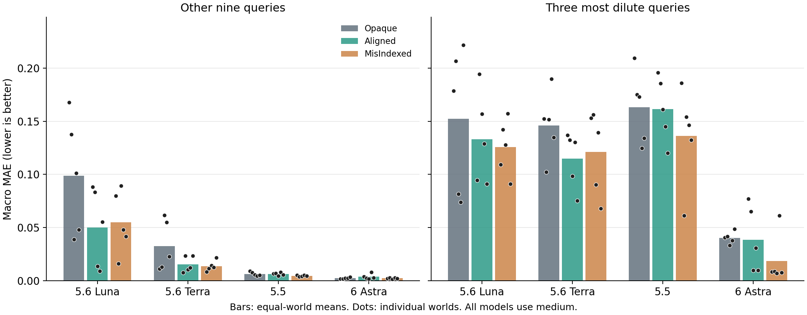

# 同一平衡研究矩阵中的 GPT-6 Astra medium

Astra 完成 15/15 场自主实验与 15/15 场有效预测，完整四阶段链条 15/15 场；180/180 批实验，60/60 个原会话封存阶段，540/540 个标量预测。
精确重放 15/15；操作尝试 1075 次，其中拒绝/回滚 0 次。

GPT-6 Astra、GPT-5.6 Luna、GPT-5.6 Terra 和 GPT-5.5 均使用 medium，相同五世界、Opaque/Aligned/MisIndexed 三臂、每场12批自主实验与原会话K1→Q→K2→EQS。medium 是共同请求设置，不代表实际计算量相等。

这些条件属于同一科学问题的跨模型矩阵。Astra 的15场全部新运行；其余45场保持不变，其中六场W01先导结果在补全先前矩阵前已知。共同参考为既有300个参考批次，不新增真值运行，不向研究者反馈参考值。
联合矩阵完成 60/60 场、720/720 批、240/240 个封存阶段；保留 85 次操作拒绝/回滚，以及 2 次已记录的基础设施中断。这些中断单独记录，不计作科学失败；有效阶段以恢复后的记录汇总。
Astra 的 W05/Opaque 最后一次 EQS 曾在提供商返回 HTTP 503 时中断。现已在原 Astra-medium 会话中用原提示续接成功；实验、K1、Q、K2、参考值及预测评分均保持不变，失败尝试原样保留。

## 五世界等权均值

| 模型 | 条件 | 有效Q/5 | 其余九题MAE | 最稀三题MAE | 最稀覆盖率 | 最稀区间评分 |
|---|---|---:|---:|---:|---:|---:|
| gpt-5.6-luna | Opaque | 5 | 0.09867 | 0.15240 | 48.4% | 0.76286 |
| gpt-5.6-luna | Aligned | 5 | 0.04997 | 0.13319 | 31.1% | 0.95830 |
| gpt-5.6-luna | MisIndexed | 5 | 0.05494 | 0.12556 | 44.4% | 0.76799 |
| gpt-5.6-terra | Opaque | 5 | 0.03268 | 0.14611 | 67.1% | 0.63495 |
| gpt-5.6-terra | Aligned | 5 | 0.01545 | 0.11466 | 26.2% | 0.76843 |
| gpt-5.6-terra | MisIndexed | 5 | 0.01369 | 0.12130 | 41.8% | 0.71607 |
| gpt-5.5 | Opaque | 5 | 0.00647 | 0.16325 | 6.7% | 1.38838 |
| gpt-5.5 | Aligned | 5 | 0.00638 | 0.16146 | 2.7% | 1.31276 |
| gpt-5.5 | MisIndexed | 5 | 0.00461 | 0.13604 | 13.3% | 1.19913 |
| gpt-6-astra | Opaque | 5 | 0.00244 | 0.04040 | 82.7% | 0.29182 |
| gpt-6-astra | Aligned | 5 | 0.00384 | 0.03853 | 82.7% | 0.22233 |
| gpt-6-astra | MisIndexed | 5 | 0.00234 | 0.01857 | 92.4% | 0.16108 |

MAE 对 pH/14、电离分数、沉淀信号等权汇总。最稀三题为预先固定的Q03/Q08/Q09，其余九题也包含边界及未探索条件。区间标称覆盖率80%；区间评分=宽度+10×区间外距离，越低越好；评分保留五次参考观测。

## Aligned相对Opaque的逐世界结果

| 模型 | 有效配对/5 | 九题改善 | 三题改善 | 九题改善、三题恶化 |
|---|---:|---:|---:|---:|
| gpt-5.6-luna | 5 | 4 | 3 | 2 |
| gpt-5.6-terra | 5 | 3 | 4 | 0 |
| gpt-5.5 | 5 | 3 | 3 | 1 |
| gpt-6-astra | 5 | 2 | 3 | 0 |

### Astra的全部逐世界对比

| 世界 | 对比 | 九题ΔMAE | 三题ΔMAE | 收益反转 |
|---|---|---:|---:|---|
| EQ-W01 | Aligned-Opaque | 0.00211 | 0.03622 | 否 |
| EQ-W01 | MisIndexed-Opaque | 0.00038 | -0.03238 | 否 |
| EQ-W02 | Aligned-Opaque | 0.00047 | 0.02354 | 否 |
| EQ-W02 | MisIndexed-Opaque | 0.00102 | -0.03299 | 否 |
| EQ-W03 | Aligned-Opaque | -0.00068 | -0.02333 | 否 |
| EQ-W03 | MisIndexed-Opaque | -0.00098 | -0.02617 | 否 |
| EQ-W04 | Aligned-Opaque | 0.00574 | -0.00701 | 否 |
| EQ-W04 | MisIndexed-Opaque | 0.00044 | 0.02332 | 否 |
| EQ-W05 | Aligned-Opaque | -0.00063 | -0.03878 | 否 |
| EQ-W05 | MisIndexed-Opaque | -0.00133 | -0.04095 | 否 |

### W02-W05敏感性分析

保留去掉已知先导世界W01后的比较；Astra的五个世界均未复用先导会话。

| 模型 | 九题平均ΔMAE | 三题平均ΔMAE |
|---|---:|---:|
| gpt-5.6-luna | -0.04105 | -0.00306 |
| gpt-5.6-terra | -0.02061 | -0.03544 |
| gpt-5.5 | 0.00054 | 0.00119 |
| gpt-6-astra | 0.00122 | -0.01140 |

## 实验路径与一个正面案例

以下为完成后的描述性轨迹分析，不是新增实验或预设主检验。比较各场包含正投料的已检测批次的最低名义浓度；零投料空白不计作稀溶液取证。

| 模型 | 各场最低浓度的中位数（M） | 曾测到≤1 mM的研究/15 |
|---|---:|---:|
| gpt-5.6-luna | 0.125 | 0 |
| gpt-5.6-terra | 0.125 | 0 |
| gpt-5.5 | 0.0185185 | 0 |
| gpt-6-astra | 0.001 | 11 |

### Astra / W03 / MisIndexed

该例从前几批的局部平台，进入低浓度响应区间，随后还执行分段稀释、追加投料和延长等待。下表来自实际操作与检测记录。

| 批次 | 名义终点浓度（μM） | 电离分数 |
|---|---:|---:|
| 1 | 55555.56 | 6.86% |
| 2 | 18518.52 | 7.41% |
| 3 | 55555.56 | 6.32% |
| 4 | 1851.85 | 11.19% |
| 5 | 18.52 | 53.78% |
| 9 | 185.19 | 24.53% |
| 10 | 1851.85 | 10.26% |
| 12 | 185.19 | 23.77% |

在实验结束、预测封存之前的K1报告中，研究者明确区分了低浓度响应与高浓度平台，并将所给档案pKa区间4.609–4.709修正为约5.02的有效关系。这段解释属于公开科学报告，不是每次实验选择时记录的同期思考。
随后，对13.3 μM条件下的电离分数给出 58.80% [54.20%, 63.40%]，共同参考均值为 57.97%。
该例连接了自主获得的边界证据、报告中表达的关系与后续准确预测。它不证明该研究者识别了唯一物理机制，也不能从跨模型差异单独分离采样策略与证据解释各自的因果贡献。MisIndexed总体更优也不等于错误先验本身更好。

## 完成情况与失败

- EQ-W01/Opaque: completed; 12/12批; 76次操作尝试; 0次拒绝/回滚; replay=True; source failure=None; posttest failures={}.
- EQ-W01/Aligned: completed; 12/12批; 76次操作尝试; 0次拒绝/回滚; replay=True; source failure=None; posttest failures={}.
- EQ-W01/MisIndexed: completed; 12/12批; 78次操作尝试; 0次拒绝/回滚; replay=True; source failure=None; posttest failures={}.
- EQ-W02/Opaque: completed; 12/12批; 63次操作尝试; 0次拒绝/回滚; replay=True; source failure=None; posttest failures={}.
- EQ-W02/Aligned: completed; 12/12批; 74次操作尝试; 0次拒绝/回滚; replay=True; source failure=None; posttest failures={}.
- EQ-W02/MisIndexed: completed; 12/12批; 75次操作尝试; 0次拒绝/回滚; replay=True; source failure=None; posttest failures={}.
- EQ-W03/Opaque: completed; 12/12批; 87次操作尝试; 0次拒绝/回滚; replay=True; source failure=None; posttest failures={}.
- EQ-W03/Aligned: completed; 12/12批; 78次操作尝试; 0次拒绝/回滚; replay=True; source failure=None; posttest failures={}.
- EQ-W03/MisIndexed: completed; 12/12批; 79次操作尝试; 0次拒绝/回滚; replay=True; source failure=None; posttest failures={}.
- EQ-W04/Opaque: completed; 12/12批; 62次操作尝试; 0次拒绝/回滚; replay=True; source failure=None; posttest failures={}.
- EQ-W04/Aligned: completed; 12/12批; 75次操作尝试; 0次拒绝/回滚; replay=True; source failure=None; posttest failures={}.
- EQ-W04/MisIndexed: completed; 12/12批; 63次操作尝试; 0次拒绝/回滚; replay=True; source failure=None; posttest failures={}.
- EQ-W05/Opaque: completed; 12/12批; 63次操作尝试; 0次拒绝/回滚; replay=True; source failure=None; posttest failures={}.
- EQ-W05/Aligned: completed; 12/12批; 62次操作尝试; 0次拒绝/回滚; replay=True; source failure=None; posttest failures={}.
- EQ-W05/MisIndexed: completed; 12/12批; 64次操作尝试; 0次拒绝/回滚; replay=True; source failure=None; posttest failures={}.

## 证据范围与文件

这是固定矩阵的开发性结果，每个模型—世界—信息条件仅一次研究。全部失败保留；有效Q与完整研究链分别计数。世界、查询、响应与参考重复不能当作独立模型重复。点误差、覆盖率和区间评分需分别解读。MisIndexed的结果完整报告，不从其优劣推断错误知识本身的因果价值。

[Astra机器汇总](summary.json) · [四模型共同汇总](joint_summary.json) · [全部60场](joint_cell_metrics.csv) · [逐世界对比](joint_paired_comparisons.csv)

[Astra逐批记录](source_batches.csv) · [逐项预测](predictions.csv) · [原会话公开解释](PUBLIC_ACCOUNTS.md) · [共同参考](reference_observations.json) · [矢量图](comparison.pdf)
