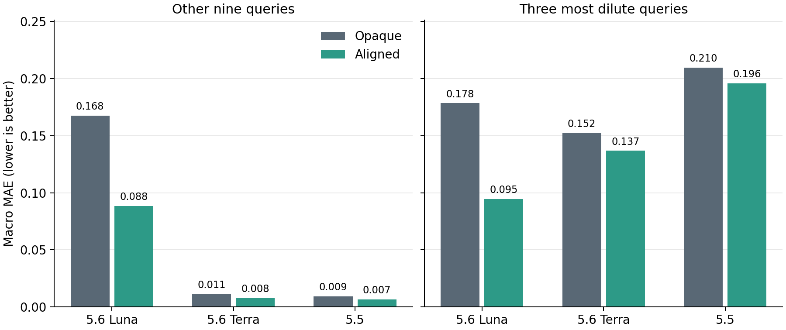

# 六会话跨模型平衡对照

2026-09-27，本地六进程并行完成。同一 EQ-W01 世界，三个模型均使用 medium，各自完成 Opaque/Aligned 自主研究。

完成 6/6 会话、72/72 来源批次、24/24 个原会话后续问答阶段。397 次实验操作全部提交，0 次回滚；六条来源轨迹均通过精确重放。六个科学会话均一次完成，无替换、重跑或追加模型。

**主要结果：三个模型的 Aligned 信息均降低了两组题目的宏平均误差，本次没有复现“其余九题获益、最稀三题受损”的先验收益反转（0/3 个模型配对）。与此同时，各模型处理极稀条件的方式明显不同，局部预测准确并不保证极稀条件下预测准确。**

## 固定设计和主结果

各会话自主完成 12 批实验，再由同一个原会话依次完成机制报告 K1、封存预测 Q、无参考反馈的反思 K2 和平衡专题问答 EQS。Opaque 不提供本实例的局部先验；Aligned 提供正确但有明确范围限制的有效 pKa 区间和局部稀释响应。Opaque 不等于模型没有预训练知识。

Q03、Q08、Q09 在执行前固定为最稀三题；另外九题也含未探索或边界条件，不能直接称为“训练域内九题”。每个响应的误差相对五次参考运行的均值计算，再对三种响应等权平均：pH/14、解离率、沉淀信号。参考运行共 60 批，在六个智能体全部结束后生成，无参考反馈进入智能体会话。

| 模型 | 信息条件 | 状态 | 其余九题 MAE | 最稀三题 MAE | 最稀三题覆盖率 |
|---|---|---|---:|---:|---:|
| gpt-5.6-luna | Opaque | completed | 0.16761 | 0.17847 | 22.2% |
| gpt-5.6-luna | Aligned | completed | 0.08829 | 0.09463 | 55.6% |
| gpt-5.6-terra | Opaque | completed | 0.01136 | 0.15220 | 66.7% |
| gpt-5.6-terra | Aligned | completed | 0.00765 | 0.13675 | 22.2% |
| gpt-5.5 | Opaque | completed | 0.00922 | 0.20953 | 0.0% |
| gpt-5.5 | Aligned | completed | 0.00658 | 0.19580 | 0.0% |

“覆盖率”针对原有名义 80% 预测区间；最稀组每场为 3 题 × 3 响应 × 5 参考重复 = 45 次覆盖判断。九题组为 135 次。它们不是独立的模型重复。

| 模型 | Aligned − Opaque：其余九题 MAE | Aligned − Opaque：最稀三题 MAE | 预定反转判据 |
|---|---:|---:|---|
| GPT-5.6 Luna | −0.07931 | −0.08384 | 未出现 |
| GPT-5.6 Terra | −0.00371 | −0.01544 | 未出现 |
| GPT-5.5 | −0.00264 | −0.01373 | 未出现 |

## 一个能看清模型差异的条件

Q08 使用 1 μmol 试剂和 75 mL 水，名义浓度为 13.3 μM。其参考解离率为 **71.60%**。下表为原会话直接给出的预测及名义 80% 区间：

| 模型 | Opaque：预测 [区间] | Aligned：预测 [区间] |
|---|---:|---:|
| GPT-5.6 Luna | 93.0% [76.0%, 99.0%] | 82.0% [60.0%, 94.0%] |
| GPT-5.6 Terra | 9.0% [2.5%, 30.0%] | 19.0% [11.0%, 30.0%] |
| GPT-5.5 | 6.6% [4.7%, 8.6%] | 11.6% [6.2%, 18.5%] |

Luna 明确采用随浓度降低而大幅提高解离率的外推，在这个最稀条件上更接近参考；但不能因此称其整体理解更好。Aligned Luna 在 Q01 将解离率预测为 28.0%，参考为 8.62%；在 Q04 预测 48.0%，参考为 14.47%。它把变化预测得过大，也使其余九题误差明显高于另外两个模型。

Terra 的公开理由将实验结果概括为局部平台，极稀条件下允许响应变化，但幅度不足。Aligned 虽降低点预测误差，最稀组三响应总覆盖率却从 66.7% 降到 22.2%；其中 pH/14 的平均区间宽度由 0.12167 缩至 0.03167，覆盖率由 100% 降至 0%。这里体现的是点预测改善与区间可靠性下降同时发生，不能写成主误差指标的先验收益反转。

GPT-5.5 对实验区间进行了明确拟合。Aligned 的公开报告提出 pH ≈ 3.510 − 0.053 log10(C)，并将解离率与有效 pKa 约 4.65 关联；其预测继续沿用这个很浅的浓度响应。它在其余九题得到最低的本次宏平均误差，却在最稀组三种响应的区间覆盖率都为 0%。模型也称极稀题是强外推、使用了更宽区间；实际区间仍不足以覆盖变化。

## 自主实验到底覆盖了哪里

以下浓度由每批已提交的试剂与溶剂加入量计算，是名义输入浓度，不是隐藏的溶解态测量。

| 模型 | 信息条件 | 最终名义浓度范围 / M | 实验末端解离率范围 | 操作数 | 中间 pH 测量数 |
|---|---|---:|---:|---:|---:|
| GPT-5.6 Luna | Opaque | 0.16667–0.50000 | 6.07%–7.97% | 60 | 12 |
| GPT-5.6 Luna | Aligned | 0.08333–0.50000 | 6.22%–8.26% | 49 | 1 |
| GPT-5.6 Terra | Opaque | 0.12500–0.75000 | 6.01%–7.94% | 60 | 12 |
| GPT-5.6 Terra | Aligned | 0.06250–2.00000 | 6.18%–8.20% | 60 | 12 |
| GPT-5.5 | Opaque | 0.06250–1.00000 | 6.34%–7.91% | 72 | 12 |
| GPT-5.5 | Aligned | 0.01852–0.74074 | 6.48%–9.23% | 96 | 12 |

所有会话都做了 12 次最终检测，均未直接探索 Q03/Q08/Q09 的极稀浓度。GPT-5.5 Aligned 从先验指定的 0.001 mol、18→54 mL 稀释条件起步，每批采用加料、加水、等待搅拌、中间 pH 测量、继续稀释、等待搅拌、终止、最终检测的八步流程。它确实让先验影响了实验选择，并将探索推进到六组中最低的浓度，但仍距离 Q08 约三个数量级。中间 pH 与最终检测来自不同仪器通道，其前后差异不能全部归因于稀释。

Luna Aligned 在第一批之后省略中间 pH 测量，而 Terra 使用较规则的加载量×体积网格。这些差异属于自主研究的实际结果；本设计比较先验对整个“采集证据—解释—预测”链条的总效果，没有单独识别证据获取与解释各自的贡献。

## 对论文的含义与边界

1. 本次不能支持“正确的局部先验在不同模型上都会导致极稀预测恶化”。原稿已有模型与条件中的反转结果应保留其原适用范围，不能用这六场扩大普遍性。
2. 本次支持更具体的跨模型现象：局部平台可被准确拟合，但向极稀区延伸时，模型会产生幅度过小或过大的响应预测；需要同时看误差、方向和区间，不能以一个总排名取代分析。
3. Luna 在最稀组三题的宏平均误差低于另外两模型，同时在其余九题明显更差；这不是单调的模型能力排序，也不构成“Luna 理解最好”的证据。
4. 每个模型/信息条件只有一次独立研究，仅使用一个固定世界。这是有完整自主历史的开发性跨模型演示，不是稳定模型排名或显著性检验。六场完成即收束，不因未复现反转而追加实验。

## 数据与复现

- [机器汇总](summary.json)：六场状态、分组/分响应误差与覆盖率、三组配对差值。
- [72 批逐实验表](source_batches.csv)：操作数、输入量、名义浓度和最终响应。
- [216 个标量预测](predictions.csv)：每题各响应预测、原始区间、参考均值与误差。
- [轨迹与资源汇总](trajectory_summary.json)：来源覆盖、资源消耗、来源阶段 token 计数和原评分器输出。
- [全部原会话公开回答](PUBLIC_ACCOUNTS.md)：六场的 K1/Q/K2/EQS；不包含内部推理或原始提供商传输数据。
- [比较图 PDF](comparison.pdf)。

同为 medium 不代表实际计算量相同。来源阶段输出 token 从 1,376 至 3,278 不等；这些计数不包括后续问答，不能当作完整成本。订阅用量没有可归因到单场的美元报价。

执行：`uv run --no-sync python scripts/run_work_ii_eq_six_model_comparison.py --output runs/development/eq-six-model-comparison-20260927`。后处理：`uv run --no-sync python scripts/analyze_work_ii_eq_six_model_comparison.py --input runs/development/eq-six-model-comparison-20260927`。已保留的运行目录不可覆盖；不要为复现同一个报告而重新执行模型会话。
