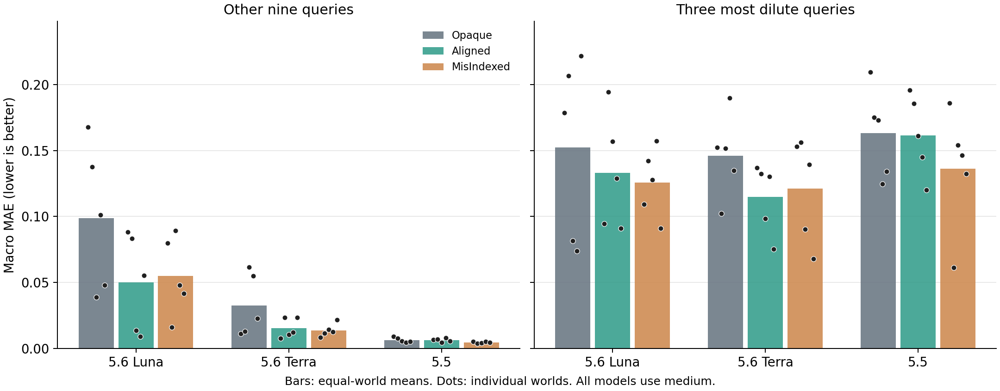

# 五世界三臂跨模型平衡实验

完成 45/45 会话、540/540 批实验、180/180 个问答阶段。有效预测 1620/1620。

三个模型均为 medium。保留已知结果的六场 W01 先导研究，新增 39 场；全部原会话继续 K1/Q/K2/EQS。
运行记录保留一次 Luna/W03/Aligned 的零操作网络中断，以及在原六路池内完成的隔离恢复；未替换任何已产生科学观测的结果。恢复记录见机器汇总。

本次固定矩阵为三个模型 × 五个世界 × 三臂，各单元一次独立研究，均为 12 批次。三臂为无实例局部先验的 Opaque、正确局部先验的 Aligned，以及按原协议固定错配先验的 MisIndexed。各场自主获得实验经历，工具、资源上限和后续问题保持一致；每场都由原研究会话继续回答。共同参考为每题五次运行，合计 300 个参考批次，其中 W01 的 60 批复用先导研究，其他 240 批在新会话全部终止后生成。

**主要发现：正确局部先验在五世界平均上降低了三个模型的两组 MAE，但这一平均掩盖了部分世界中的收益反转；与此同时，三个模型的极稀区间覆盖率均下降。错配先验也并不稳定排在最后。**

- Aligned 相对 Opaque 的“九题改善、三题恶化”出现于 3/15 个模型—世界配对：Luna 的 W03/W04 和 GPT-5.5 的 W02；Terra 没有出现该特定模式。不能将其写成三个模型一致复现的普遍反转。
- GPT-5.5 在其余九题的误差很低，但最稀三题的误差和区间失准仍大。Luna、Terra 的正确先验点预测收益较明显，也没有消除极稀外推问题。
- MisIndexed 的五世界均值在若干读出上优于 Aligned。现有设计识别的是先验条件对整个自主研究链的表现差异，不能仅凭这个均值推断“错误知识本身更有用”或某一种内部认知机制。

## 五世界等权平均

| 模型 | 信息条件 | 完整会话 / 有效 Q | 其余九题 MAE | 最稀三题 MAE | 最稀组覆盖率 |
|---|---|---:|---:|---:|---:|
| gpt-5.6-luna | Opaque | 5/5；5/5 | 0.09867 | 0.15240 | 48.4% |
| gpt-5.6-luna | Aligned | 5/5；5/5 | 0.04997 | 0.13319 | 31.1% |
| gpt-5.6-luna | MisIndexed | 5/5；5/5 | 0.05494 | 0.12556 | 44.4% |
| gpt-5.6-terra | Opaque | 5/5；5/5 | 0.03268 | 0.14611 | 67.1% |
| gpt-5.6-terra | Aligned | 5/5；5/5 | 0.01545 | 0.11466 | 26.2% |
| gpt-5.6-terra | MisIndexed | 5/5；5/5 | 0.01369 | 0.12130 | 41.8% |
| gpt-5.5 | Opaque | 5/5；5/5 | 0.00647 | 0.16325 | 6.7% |
| gpt-5.5 | Aligned | 5/5；5/5 | 0.00638 | 0.16146 | 2.7% |
| gpt-5.5 | MisIndexed | 5/5；5/5 | 0.00461 | 0.13604 | 13.3% |

MAE 为三个响应（pH/14、解离率、沉淀信号）的等权平均。最稀三题固定为 Q03/Q08/Q09；其余九题也包含边界及未探索条件。名义区间覆盖率为 80%。

柱为五世界等权均值，点为各世界结果；图中保留每一个世界点，不将查询或参考重复当作独立模型重复。

## 正确先验的逐世界一致性

| 模型 | 九题 MAE 改善 | 三题 MAE 改善 | 九题改善而三题恶化 |
|---|---:|---:|---:|
| GPT-5.6 Luna | 4/5 | 3/5 | 2/5 |
| GPT-5.6 Terra | 3/5 | 4/5 | 0/5 |
| GPT-5.5 | 3/5 | 3/5 | 1/5 |

Luna 的 W03 和 W04 分别为九题 ΔMAE −0.02525/−0.09214，三题 ΔMAE +0.07534/+0.05501；GPT-5.5 的 W02 为 −0.00082/+0.01047。负值表示相对 Opaque 改善，幅度需要与方向一起报告。

## 点预测与区间表现

最稀组的名义 80% 区间覆盖率，在 Opaque→Aligned 下分别为 Luna **48.4%→31.1%**、Terra **67.1%→26.2%**、GPT-5.5 **6.7%→2.7%**。这些是五世界平均变化，并非每个世界都同向。

为避免只靠扩宽区间提高覆盖率，同时检查原始 80% interval score（宽度加未覆盖惩罚，越低越好）：Luna 由 0.76286 升至 0.95830，Terra 由 0.63495 升至 0.76843；GPT-5.5 则由 1.38838 降至 1.31276。因此 Luna/Terra 的平均点误差改善伴随区间评分恶化，GPT-5.5 的区间表现需要分别描述覆盖率与评分，不能概括为所有不确定性指标都恶化。

在解离率这一单独响应上，Luna 的极稀平均区间宽度由 0.36933 缩至 0.19947，Terra 由 0.42493 缩至 0.14700。这与其覆盖率下降相一致；机制解释仍应由公开报告和实验路径支撑，不能由区间收缩单独确定。

## 去除已知 W01 先导结果的敏感性分析

下面只使用 W02–W05 的四个世界，仍以 Aligned − Opaque 定义差值。

| 模型 | 九题平均 ΔMAE | 三题平均 ΔMAE |
|---|---:|---:|
| GPT-5.6 Luna | −0.04105 | −0.00306 |
| GPT-5.6 Terra | −0.02061 | −0.03544 |
| GPT-5.5 | +0.00054 | +0.00119 |

Luna 在极稀条件上的平均收益明显缩小；GPT-5.5 的两个平均变化都很小，并变为轻微恶化。五世界平均不能代替这一先导数据已知性的说明。此次补全是用户在查看六场结果后授权的固定扩展，不能描述为从一开始就前瞻锁定了全部 45 场。

## 操作失败与恢复

45 条有效来源轨迹全部通过精确重放。2,932 次操作尝试中，2,847 次提交、85 次拒绝/回滚；全部保留。拒绝集中在 Luna 的 W02/Opaque（4 次）、W02/Aligned（43 次）、W04/MisIndexed（38 次），包括 18 次参数验证失败、65 次前置条件失败和 2 次资源拒绝。相关会话仍在原资源上限内完成 12 个批次，没有因操作失误而被替换。

| 事件 | 分类与影响 | 处置 | 验证 |
|---|---|---|---|
| Luna/W03/Aligned 启动后网络流断开 | 运行时丢失；0 操作、0 批、无科学观测 | 原尝试不改动，单独恢复一次；保留原六路并发上限和参考值隔离 | 恢复后 12 批、K1/Q/K2/EQS、精确重放全部通过 |

矩阵仍是 45 个科学单元，包含 46 次提供商研究启动尝试（六场先导、39 场新增及一次恢复）。失败尝试保留在机器汇总中，不从尝试记录中删除，也不以它构造额外模型重复。

## 逐世界配对差值

| 模型 | 世界 | 对比 | 九题 ΔMAE | 三题 ΔMAE | 收益反转 |
|---|---|---|---:|---:|---|
| gpt-5.6-luna | EQ-W01 | Aligned-Opaque | -0.07931 | -0.08384 | 否 |
| gpt-5.6-luna | EQ-W01 | MisIndexed-Opaque | -0.08768 | -0.06923 | 否 |
| gpt-5.6-luna | EQ-W02 | Aligned-Opaque | -0.05424 | -0.01197 | 否 |
| gpt-5.6-luna | EQ-W02 | MisIndexed-Opaque | -0.12146 | -0.06412 | 否 |
| gpt-5.6-luna | EQ-W03 | Aligned-Opaque | -0.02525 | +0.07534 | 是 |
| gpt-5.6-luna | EQ-W03 | MisIndexed-Opaque | +0.05022 | +0.04607 | 否 |
| gpt-5.6-luna | EQ-W04 | Aligned-Opaque | -0.09214 | +0.05501 | 是 |
| gpt-5.6-luna | EQ-W04 | MisIndexed-Opaque | -0.05347 | +0.08334 | 是 |
| gpt-5.6-luna | EQ-W05 | Aligned-Opaque | +0.00744 | -0.13061 | 否 |
| gpt-5.6-luna | EQ-W05 | MisIndexed-Opaque | -0.00626 | -0.13028 | 否 |
| gpt-5.6-terra | EQ-W01 | Aligned-Opaque | -0.00371 | -0.01544 | 否 |
| gpt-5.6-terra | EQ-W01 | MisIndexed-Opaque | -0.00288 | +0.00078 | 是 |
| gpt-5.6-terra | EQ-W02 | Aligned-Opaque | +0.01056 | +0.03004 | 否 |
| gpt-5.6-terra | EQ-W02 | MisIndexed-Opaque | -0.00146 | +0.05382 | 是 |
| gpt-5.6-terra | EQ-W03 | Aligned-Opaque | -0.05119 | -0.05293 | 否 |
| gpt-5.6-terra | EQ-W03 | MisIndexed-Opaque | -0.04716 | -0.06125 | 否 |
| gpt-5.6-terra | EQ-W04 | Aligned-Opaque | -0.04263 | -0.05943 | 否 |
| gpt-5.6-terra | EQ-W04 | MisIndexed-Opaque | -0.04225 | -0.05043 | 否 |
| gpt-5.6-terra | EQ-W05 | Aligned-Opaque | +0.00082 | -0.05944 | 否 |
| gpt-5.6-terra | EQ-W05 | MisIndexed-Opaque | -0.00120 | -0.06695 | 否 |
| gpt-5.5 | EQ-W01 | Aligned-Opaque | -0.00264 | -0.01373 | 否 |
| gpt-5.5 | EQ-W01 | MisIndexed-Opaque | -0.00394 | -0.02363 | 否 |
| gpt-5.5 | EQ-W02 | Aligned-Opaque | -0.00082 | +0.01047 | 是 |
| gpt-5.5 | EQ-W02 | MisIndexed-Opaque | -0.00379 | -0.11400 | 否 |
| gpt-5.5 | EQ-W03 | Aligned-Opaque | -0.00113 | -0.01191 | 否 |
| gpt-5.5 | EQ-W03 | MisIndexed-Opaque | -0.00151 | -0.01862 | 否 |
| gpt-5.5 | EQ-W04 | Aligned-Opaque | +0.00350 | +0.02022 | 否 |
| gpt-5.5 | EQ-W04 | MisIndexed-Opaque | +0.00056 | +0.02178 | 否 |
| gpt-5.5 | EQ-W05 | Aligned-Opaque | +0.00060 | -0.01400 | 否 |
| gpt-5.5 | EQ-W05 | MisIndexed-Opaque | -0.00064 | -0.00156 | 否 |

负差值表示相对 Opaque 改善；反转判据为九题差值 < 0 且三题差值 > 0。

完整分母、失败、W02–W05 敏感性分析和逐世界读出见 [机器汇总](summary.json)。
完整 45 格读出见 [cell_metrics.csv](cell_metrics.csv)，五次参考观测见 [reference_observations.json](reference_observations.json)，比较图可导出为 [PDF](comparison.pdf)。
逐批数据：[source_batches.csv](source_batches.csv)；逐题预测：[predictions.csv](predictions.csv)；原会话公开解释：[PUBLIC_ACCOUNTS.md](PUBLIC_ACCOUNTS.md)。

这是固定五世界的开发性扩展；每个模型/世界/信息条件只有一次会话。查询、响应和真值重复不作为独立模型重复。
