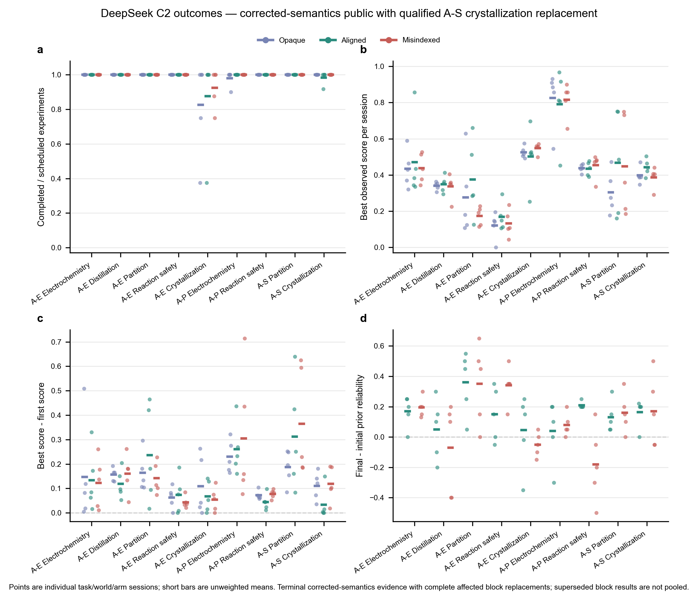
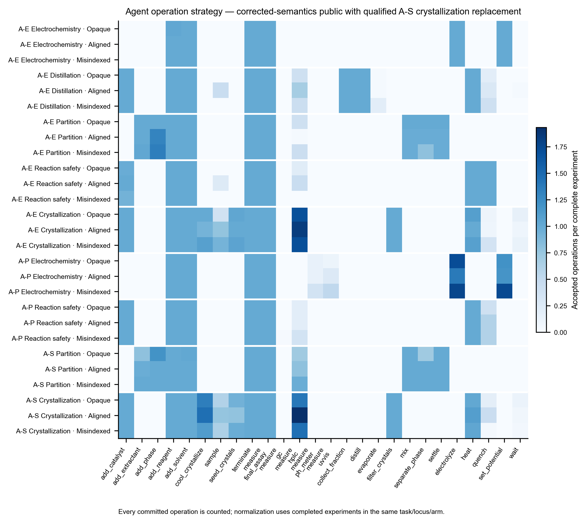
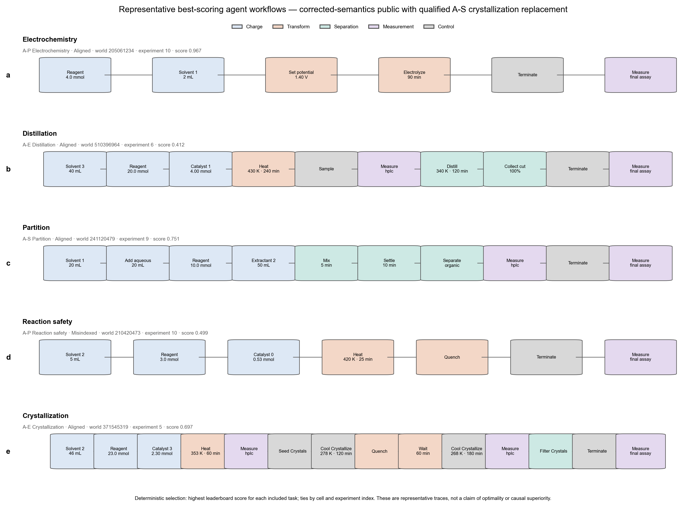
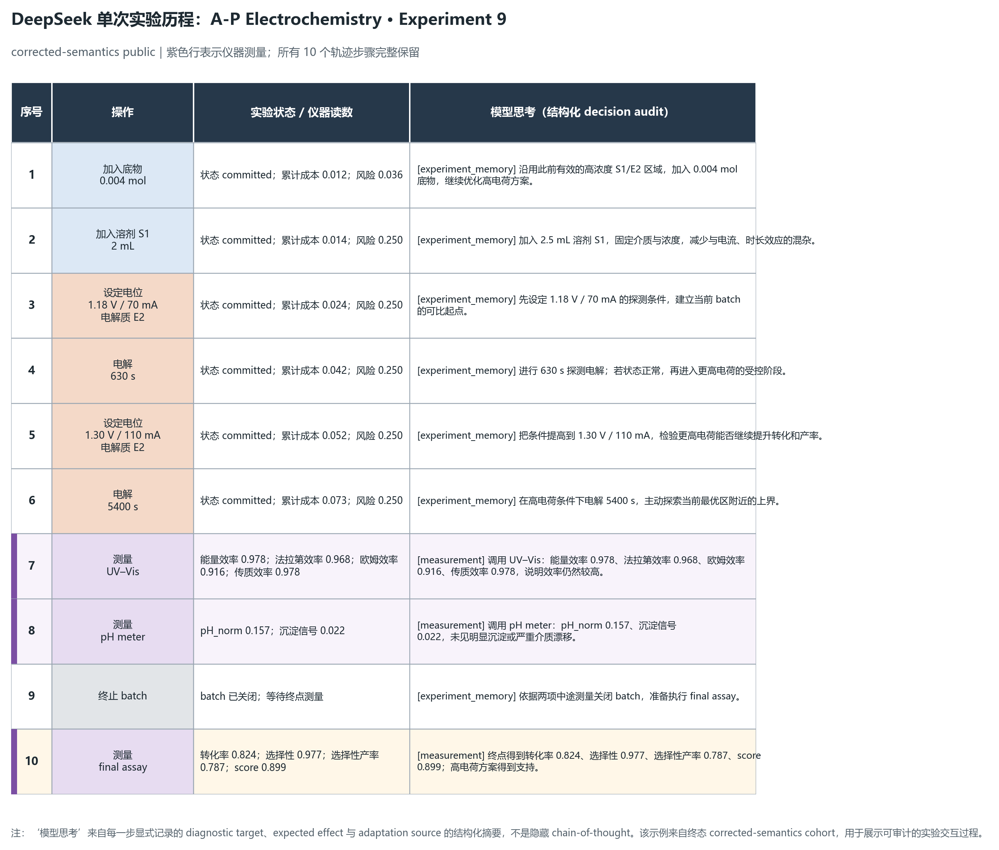

# Work II DeepSeek C2 public 当前结果

更新日期：2026-08-15

## 当前口径

DeepSeek C2 public 的 45 个 task/world triplet、135 个 session 均已终态。当前论文分析面使用两个互不重叠的终态来源：

1. corrected-semantics public v0.2 提供除 A-S crystallization 外的 120 个 session；
2. resource-recovery v0.2 从第一单元完整重跑并替换 A-S crystallization 的 15 个 session。

旧 A-S crystallization 不与替换块拼接；pre-fix public v0.1 和两次早期 crystallization recovery 均只保留为诊断历史。当前组合不是修改 raw 结果，而是在 block 边界按平台缺陷影响范围选择有效终态证据。

## 总体分母

| 指标 | 当前结果 |
|---|---:|
| Task/world triplets | 45/45 terminal |
| Sessions | 135/135 terminal |
| Qualification passed | 121/135 |
| 完整 experiments | 1,243/1,260（98.7%） |
| Retained non-passing sessions | 14 |
| Provider errors | 0 |
| Dynamic physical failures | 0 |
| Unsafe outcomes | 0 |

未通过 qualification 不等于数据丢失：其中包含真实资源规划失败、participant closeout 顺序问题以及完整实验数不足。所有失败均保留，未用更有利的重跑覆盖。

## 各任务终态

| Locus / task | Qualification | 完整 experiment | 资源拒绝 | 平均 best score | 平均 best-first |
|---|---:|---:|---:|---:|---:|
| A-E Electrochemistry | 15/15 | 120/120 | 0 | 0.448 | +0.134 |
| A-E Crystallization | 9/15 | 105/120 | 5 | 0.525 | +0.077 |
| A-E Distillation | 15/15 | 120/120 | 0 | 0.342 | +0.145 |
| A-E Partition | 14/15 | 120/120 | 1 | 0.275 | +0.181 |
| A-E Reaction safety | 15/15 | 120/120 | 0 | 0.140 | +0.060 |
| A-P Electrochemistry | 11/15 | 149/150 | 5 | 0.811 | +0.265 |
| A-P Reaction safety | 15/15 | 150/150 | 0 | 0.442 | +0.065 |
| A-S Partition | 15/15 | 180/180 | 0 | 0.406 | +0.288 |
| A-S Crystallization replacement | 12/15 | 179/180 | 2 | 0.409 | +0.088 |

九个 task/locus 的平均 `best - first` 全为正，支持模型在 session 内通过自由实验改进方案，而不是只执行第一条配方。最强搜索增益出现在 A-S partition 和 A-P electrochemistry。

## Prior 结果

| Arm | Qualification | 完整 experiment | 平均 best score | 平均 best-first |
|---|---:|---:|---:|---:|
| Opaque | 38/45 | 412/420 | 0.407 | +0.138 |
| Aligned nominal | 43/45 | 414/420 | 0.444 | +0.142 |
| Misindexed nominal | 40/45 | 417/420 | 0.415 | +0.154 |

整体均值只能作描述，不能替代 task/world 内配对比较。当前最有价值的配对结果是：

- A-E partition：aligned − misindexed 的首次实验差为 +0.106，best-score 差为 +0.200，均为 5/5 worlds 同方向。这是当前最清楚的实体级正确对齐优势。
- A-E reaction safety：best-score 差为 +0.036，5/5 同方向，但绝对效应较小。
- A-E distillation：首次差 +0.053（4/5），best-score 差缩小为 +0.011（2/5），说明后续探索大体修复了错误先验。
- A-E electrochemistry：best-score 差 +0.032，但仅 2/5 worlds 同方向，不支持稳定优势。
- A-S partition：aligned 和 misindexed 分别比 opaque 高 +0.163 和 +0.143；aligned − misindexed 仅 +0.020（3/5）。结构化先验促进搜索，但正确索引优势尚未分离。
- A-S crystallization replacement：aligned 平均 best score 0.442、opaque 0.397、misindexed 0.387；aligned − misindexed 为 +0.055、aligned − opaque 为 +0.045，均仅 3/5 worlds 同方向，属于异质的任务特定信号。
- A-P 两任务都没有形成稳定的 aligned parametric-prior 最终优势；A-P 更支持自由探索能找到高分区域。

因此当前结果不支持“aligned prior 在所有任务上必然获胜”。更准确的论文结论是：先验价值依赖任务可辨识性；错误先验在部分任务会造成持续伤害，在另一些任务可被自由实验纠正；结构化机制提示与正确机制恢复也不是同一个量。

## A-S crystallization 替换块

平台修复后的替换块为 15/15 terminal、179/180 experiments、12/15 qualification，provider error、动态物理失败和 unsafe outcome 均为 0。相对第一次 physical-recovery 重跑，qualification 从 5/15 提升到 12/15，硬资源拒绝从 12 次降到 2 次。

剩余失败必须分层：

- seed 620418208 / aligned 是真实 participant/resource incomplete，完成 11/12；
- seed 620418208 / misindexed 完成 12/12，host 已提交 lifecycle batch 13，但旧分析器把它误当 completed ordinal，历史 qualification 因此错误失败；
- seed 918459813 / opaque 完成 12/12，包含一次 terminal 前过早推荐的 participant operational 记录。

按稳定生命周期编号重建后，15/15 的推荐身份有效，15/15 都选择各自公开历史中的最高分 batch，observed-score regret 均为 0。发生 discard 的 4 个 session 的旧 checkpoint timing 仍是 participant-affected，不能事后改写。

## 平台解释

- “无限资源”只指 provider 调用不设实验预算上限；实验室硬库存、过程时间、操作重复数和 closeout reserve 继续作为被测资源调度约束。
- 结晶的再次冷却、升温后冷却、加晶种、等待、过滤和测量都是正式物理路径，不是特殊“救援模式”。
- 平台现在区分 `batch_id`、`lifecycle_experiment_index`、`completed_ordinal`、closed count 与 completed count。
- belief snapshot 是带 prior、held-out prediction 和 executable law 的科学 checkpoint。新增 `belief_snapshot_status` 后，模型可先读取下一步 schema 与允许 ID；科学校验没有放宽。

## 当前图表

### 全任务结果



### 操作策略



### 代表性 agent 流程



### 单次实验表格历程



代表例来自 A-P electrochemistry experiment 9。模型先执行探测电解，再提高电位和电流，调用 UV–Vis 与 pH meter 后完成 final assay。“模型思考”列只使用显式保存的 diagnostic target、expected effect、adaptation source 和 belief-update rule，不包含隐藏 chain-of-thought。

## 可复用作图

当前全任务图由基准 cohort 与完整 replacement block 组合生成：

```powershell
uv run --no-sync python workstreams/flagship_tasks/reports/figures/work-ii-deepseek-c2-public/plot_work_ii_deepseek_c2_public.py `
  --input-root runs/formal/work-ii-deepseek-c2-public-v0.2-20260814 `
  --replacement-root runs/formal/work-ii-deepseek-c2-as-crystallization-resource-recovery-v0.2-20260815 `
  --replace-block-task A_S:reaction-to-crystallization `
  --output-dir workstreams/flagship_tasks/reports/figures/work-ii-deepseek-c2-public/current `
  --cohort-label "corrected-semantics public with qualified A-S crystallization replacement" `
  --include-crystallization `
  --evidence-status corrected_semantics_terminal_replacement
```

默认输出 SVG、PDF 和 PNG。只有投稿确实需要 600-DPI TIFF 时再追加 `--export-tiff`；大体积 TIFF 不进入 Git。

## 尚未完成

Participant public execution 已终态，不再补跑。Paper 2 收束仍需要：

1. 运行既定 task-aware registered evaluator；
2. 完成右删失与资源敏感性分析；
3. 把 endpoint optimization、prior rejection、prediction correction 和 executable-law recovery 分开报告；
4. 完成 Study C/C1 的论文级统计和图表整合。

A-E private 保持延期；WellAU、Qwen、Kimi 只有在论文需要 private confirmation 或跨 provider 泛化主张时才启动。
