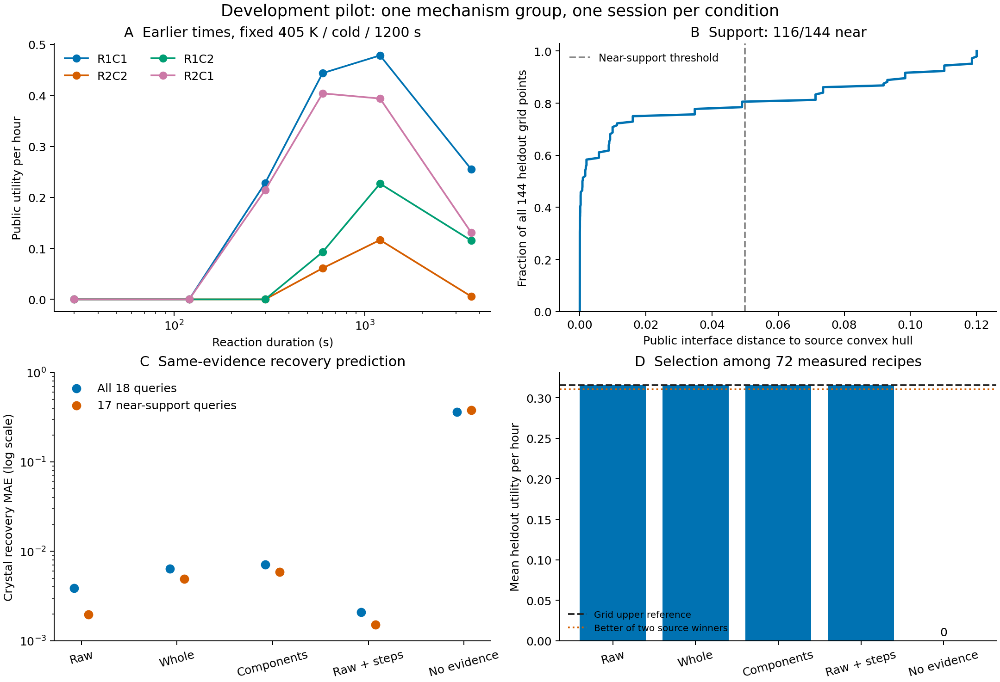

# Astra medium：充分取证后的同证据交付

未达到预定的摘要交付损失标准。四种有证据读出中，4/4在两个留出世界均选中网格最优配方。
单组单次结果不能证明普遍无损或系统性失效；应结合前块的弱行动区分度解释。

7/7计划模型会话完成，失败0，未启动0，重试0。
复用144条学习轨迹与288条网格评分轨迹；新增物理实验0。每个编码/读出条件均只运行一次。

固定18个留出预测查询，公开近支持17/18。

| 条件 | 反应MAE | 回收MAE | 纯度MAE | 近支持回收MAE | 留出选择平均效用 |
| --- | --- | --- | --- | --- | --- |
| raw | 0.0000 | 0.0039 | 0.0002 | 0.0020 | 0.315368 |
| whole | 0.0000 | 0.0064 | 0.0012 | 0.0049 | 0.315368 |
| component | 0.0000 | 0.0071 | 0.0023 | 0.0059 | 0.315368 |
| raw_scaffold | 0.0000 | 0.0021 | 0.0002 | 0.0015 | 0.315368 |
| task_only | 0.2796 | 0.3624 | 0.4817 | 0.3780 | 0.000000 |
| component_knn3 | 0.0000 | 0.0338 | 0.0016 | 0.0248 | — |
| same_C_recipe | 0.0000 | 0.0329 | 0.0013 | 0.0256 | — |

前块完整行动资格通过：False。选择结果受其限制，只对应72条已测候选的离散选择。
预定单块摘要损失提示：{'whole': False, 'component': False}。
该提示需近支持至少6条、固定组合参照与raw近支持回收MAE≤0.10、摘要劣化≥0.05；不能据单次读出声称系统性失效。
编码器看不到查询列表；5个读出使用同一合同与同一18项查询，均不访问留出答案。
公开近支持不等于完整隐状态支持，原始表是指定公开字段的数值表，不是全部观测日志。
明确组合步骤条件只增加程序提示；任何差异同时包含fresh会话波动。

实际数值工具轮次：18；token：{'cache_write_input_tokens': 0, 'cached_input_tokens': 449280, 'input_tokens': 621152, 'output_tokens': 14749, 'reasoning_output_tokens': 4940}。美元费用未估算。

所有预测、真值、误差、选择、失败及资源见同名JSON。

无证据会话的54个预测统一为0.5，四世界统一选择候选0；这是该次会话的实际输出，不代表最强无信息策略。provider最终消息与评分payload已保留，可核对。
