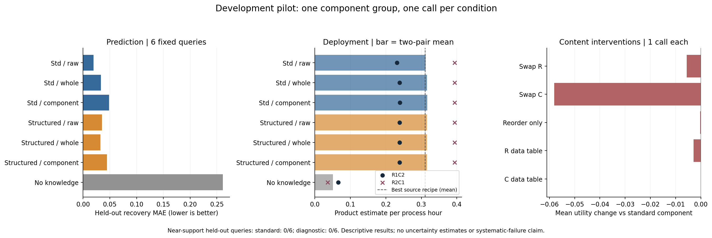

# Astra medium：修正合同后的单次开发实验

本轮采用两次必需HPLC、按公开实际温度解析的冷却配方，以及基于公开测量的产物效用。
一组反应—结晶四格世界，每条件一次；属于开发诊断，不是正式论文证据。

状态：development_completed。模型完成 20/20，零重试。
这里一次模型调用指一个预定fresh会话，允许预算内公共数值工具续轮；不等于一次HTTP请求。
当前块物理完成 164/164，失败 0，未执行 0；精确重放通过 164。
另保留前一工程块1条温度检查失败：其12步操作均提交、重放通过、零模型调用。
修正后沿用相同世界初始化，从首条检查重新验证。
完成范围：32条E0、48条取证、12条盲测、48条Agent部署、24条参考部署；4份知识包有效。

## 主要观察

- 有实验知识的六种基本条件留出平均效用约0.312–0.316，无知识条件约0.051。
- 整流程/组件表示没有带来明显的行动效用损失；反应与回收预测误差仍有差异。
- 直接复用历史最优配方约0.310，距离组件包约2%；当前实例的行动区分度不足。
- C身份置换平均效用约0.258，内容重排约0.316；这是人为内容干预的单次结果，不是自发遗忘。
- 三来源的留出查询近支持均为0/6，不能据本轮解释纯组合泛化或系统性信息损失。

## 预测与首次部署

学习和留出分别6条预定查询。MAE越低越好；效用为质量加权回收估计/过程小时，越高越好。
效用使用HPLC反应产率、扣种回收率、固体纯度和实际过程时间；不是精确摩尔产率。

| 条件 | 留出反应MAE | 留出回收MAE | 留出纯度MAE | R1C2效用/h | R2C1效用/h |
| --- | --- | --- | --- | --- | --- |
| standard_raw | 0.0050 | 0.0194 | 0.0016 | 0.2309 | 0.3938 |
| standard_whole | 0.0037 | 0.0335 | 0.0049 | 0.2386 | 0.3938 |
| standard_component | 0.0091 | 0.0486 | 0.0109 | 0.2392 | 0.3938 |
| diagnostic_raw | 0.0083 | 0.0352 | 0.0056 | 0.2386 | 0.3938 |
| diagnostic_whole | 0.0067 | 0.0326 | 0.0012 | 0.2386 | 0.3938 |
| diagnostic_component | 0.0066 | 0.0446 | 0.0076 | 0.2386 | 0.3938 |
| task_only | 0.1517 | 0.2610 | 0.0772 | 0.0660 | 0.0360 |
| standard_swap_R | 0.1204 | 0.0981 | 0.0081 | 0.2280 | 0.3938 |
| standard_swap_C | 0.0039 | 0.6192 | 0.0113 | 0.2269 | 0.2897 |
| standard_sham | 0.0053 | 0.0448 | 0.0056 | 0.2386 | 0.3938 |
| standard_repair_R | 0.0050 | 0.0383 | 0.0058 | 0.2334 | 0.3938 |
| standard_repair_C | 0.0039 | 0.0441 | 0.0059 | 0.2391 | 0.3938 |

## 同证据与内容干预

以下均为处理条件减去基准；预测误差差为负表示误差减小，效用差为正表示改善。
单次fresh调用存在采样波动；sham用于显示这一局限，不能凭单次置换差定位内部因果机制。

| 基准 → 处理 | 反应MAE差 | 回收MAE差 | 留出平均效用差 |
| --- | --- | --- | --- |
| standard_raw → standard_whole | -0.0013 | +0.0141 | +0.0038 |
| standard_raw → standard_component | +0.0041 | +0.0292 | +0.0041 |
| diagnostic_raw → diagnostic_whole | -0.0016 | -0.0026 | +0.0000 |
| diagnostic_raw → diagnostic_component | -0.0017 | +0.0094 | +0.0000 |
| standard_raw → diagnostic_raw | +0.0033 | +0.0158 | +0.0038 |
| standard_whole → diagnostic_whole | +0.0030 | -0.0009 | +0.0000 |
| standard_component → diagnostic_component | -0.0025 | -0.0040 | -0.0003 |
| standard_component → standard_swap_R | +0.1112 | +0.0495 | -0.0056 |
| standard_component → standard_swap_C | -0.0052 | +0.5706 | -0.0582 |
| standard_component → standard_sham | -0.0038 | -0.0038 | -0.0003 |
| standard_component → standard_repair_R | -0.0042 | -0.0103 | -0.0029 |
| standard_component → standard_repair_C | -0.0052 | -0.0045 | -0.0000 |

## 联合覆盖

基于公开yield/conversion、实际淬灭温度、实际冷却温度和log时长的5维凸包距离。
≤0.05为事前定义的近支持；这不是完整隐状态支持证明。所有事前查询均保留。

| 来源 | 学习查询近支持 | 留出查询近支持 |
| --- | --- | --- |
| standard | 0/6 | 0/6 |
| diagnostic | 0/6 | 0/6 |
| space_filling | 4/6 | 0/6 |

各条件在近支持/域外查询上的误差与确切分母见JSON的support_strata。
支持不足时，本轮留出结果混合了组合迁移与外推，不能概括为纯组合失效。

## 公开数据参考

固定岭回归只是小样本经验参考，尚未获得强系统辨识资格。

| 来源 | 参考 | 留出反应MAE | 留出回收MAE |
| --- | --- | --- | --- |
| diagnostic | component | 0.0211 | 0.1331 |
| diagnostic | whole | 0.0601 | 0.2610 |
| space_filling | component | 0.0071 | 0.0813 |
| space_filling | whole | 0.0596 | 0.2610 |
| standard | component | 0.0058 | 0.1230 |
| standard | whole | 0.0596 | 0.2610 |

| 来源 | 部署参考 | R1C2效用/h | R2C1效用/h |
| --- | --- | --- | --- |
| standard | component | 0.2269 | 0.3938 |
| standard | whole | 0.2269 | 0.3938 |
| standard | best_history | 0.2269 | 0.3938 |
| diagnostic | component | 0.2269 | 0.3938 |
| diagnostic | whole | 0.2269 | 0.3938 |
| diagnostic | best_history | 0.2269 | 0.3938 |

## 资源、失败与解释边界

模型报告token用量：`{"cache_write_input_tokens": 0, "cached_input_tokens": 972160, "input_tokens": 1444798, "output_tokens": 38328, "reasoning_output_tokens": 12841}`。订阅费用未估算美元数。
物理资源合计：`{"cost_units": 103.0706681216008, "measurement_cost_units": 52.48000000000004, "operation_count": 1968, "process_time_s": 921529.2890438341, "sample_consumed_L": 0.1148000000000004}`。包含E0和参考；逐批资源在JSON中。
知识包字符数、各次模型用量、全部物理参数/终态与失败均列于JSON；原始provider与私有初始化留在ignored目录。
实际温度由公共操作schema读取；执行器不按HPLC结果改配方，不能称完整自主闭环科学家。
