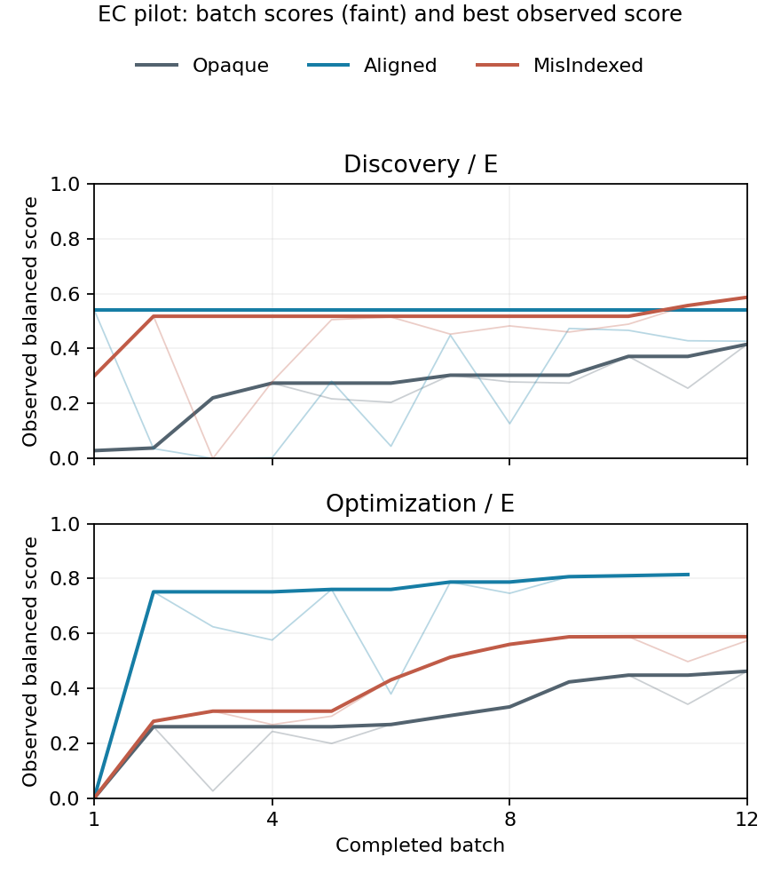
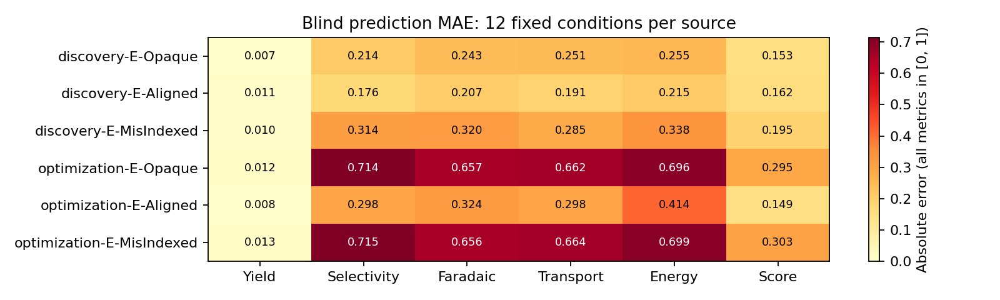

# EC 单世界：十二批自由研究、三臂与机理/预测后测

模型 GPT-5.6 Sol / medium；开发数据。原协议核心完整链 5/6，核心终检 71/72，核心中途测量 72/72。另保留补充完整链 2/2。

按用户明确指令收束为1世界 × 2目标 × E先验层 × 3臂，共6场核心来源。额外已启动的2场P层来源保留为补充，其余10场未启动，不计失败。原18场计划和范围调整记录保留。
每场12批；中途测量上限12，终检另计。
优化组以 EC 公开综合得分为主要目标；探索组以形成并检验机理解释为主要目标，综合得分只是辅助读出。两组资源相同、会话独立。
来源结束先封存操作建议，再回答 K1 自由机理报告、Q 固定条件盲预测、K2 复盘。无强制中途机制表或固定表达式。预测题预先固定、K1 后才展示；源实验可能偶然覆盖相同条件，不得把所有题自动视为远域外推。
[逐证据分析](ANALYSIS.md) · [实验说明与程序修订](../../WORK_II_EC_SOL_DUAL_GOAL_TRIAL_NOTE.md) · [机器摘要](summary.json)

当前设计及前瞻修正见[矩阵第9.8节](../../WORK_II_EXPERIMENT_MATRIX.md)。本报告保留历史实验口径；自主组批不是违规，单次低分、窄域小误差或未形成反证都不能单独证明系统性失效。

## 完成情况与资源

来源精确重放 8/8；来源回滚 2 次。K1/Q/K2 完整回答分别为 8/8/8（含补充，各计划8）。按来源资源修复后的建议复测完成 8/8。
实际来源共 8/8 场，终检 95/96 批，中途测量 96/96 次。
未完成来源及其原失败状态保留；optimization-E-Aligned 的后测沿原thread单独补齐，不算原协议全链成功。
有效块累计输入 4,974,853 tokens，其中缓存输入 3,944,704；输出 187,834。同 thread 的续接回执是累计值，已按阶段差分避免重复计数。这些数值不含历史接入失败/排除块的消耗，也不代表已核对金额账单。

## 核心结果

| 目标/层/臂（完整记录） | 链状态 | 终检 | 中途测量 | 最佳观察得分 | 建议复测得分 | 得分预测 MAE | 产率预测 MAE |
| --- | --- | --- | --- | --- | --- | --- | --- |
| [discovery-E-Opaque](discovery-E-Opaque.md) | completed | 12/12 | 12/12 | 0.4156 | 0.4225 | 0.1527 | 0.0071 |
| [discovery-E-Aligned](discovery-E-Aligned.md) | completed | 12/12 | 12/12 | 0.5412 | 0.5411 | 0.1615 | 0.0110 |
| [discovery-E-MisIndexed](discovery-E-MisIndexed.md) | completed | 12/12 | 12/12 | 0.5867 | 0.5936 | 0.1952 | 0.0102 |
| [optimization-E-Opaque](optimization-E-Opaque.md) | completed | 12/12 | 12/12 | 0.4623 | 0.4692 | 0.2946 | 0.0122 |
| [optimization-E-Aligned](optimization-E-Aligned.md) | failed（后测补齐） | 11/12 | 12/12 | 0.8144 | 0.8111 | 0.1489 | 0.0076 |
| [optimization-E-MisIndexed](optimization-E-MisIndexed.md) | completed | 12/12 | 12/12 | 0.5881 | 0.5816 | 0.3035 | 0.0129 |

## 保留的补充结果（不计核心三臂分母）

| 目标/层/臂（完整记录） | 链状态 | 终检 | 中途测量 | 最佳观察得分 | 建议复测得分 | 得分预测 MAE | 产率预测 MAE |
| --- | --- | --- | --- | --- | --- | --- | --- |
| [discovery-P-Opaque](discovery-P-Opaque.md) | completed | 12/12 | 12/12 | 0.7384 | 0.7382 | 0.1717 | 0.0090 |
| [discovery-P-Aligned](discovery-P-Aligned.md) | completed | 12/12 | 12/12 | 0.8616 | 0.8686 | 0.1924 | 0.0080 |

## 解释边界

这是一世界、每格一次的尝试性实验，不能估计普遍成功率或三臂总体因果效应。取证、机理、预测、优化分开报告；K2 的回忆不等于当时已公开的判断，后台真值不等于 Agent 已有证据。没有新增未经校准的 LLM 机理总分。80% 区间覆盖只是 12 题上的描述性核验。
预测参考是独立噪声条件下的终检读数，误差包含仪器噪声；不是对无噪声潜在状态的直接评分。
精确重放核验的是保留动作序列对应的物理轨迹，不表示再次调用模型会产生相同文本。
本轮固定预测题中 9/12 个参考产率低于0.02。产率 MAE 很低可能部分来自响应范围较窄，须结合选择性、各效率、得分与区间宽度解释，不能单凭产率误差认定掌握了世界规律。

启动接入故障及修复见实验说明；失败原始目录保留。原始 provider 数据不进入 Git，本目录仅导出公开实验记录、实际问题、回答和评价。

## 保留的接入故障与排除记录

v1–v3 共 11 次来源启动/中断记录；v4 共 8 个来源因输入泄漏整块排除，保留终检 87 批。
这些记录未覆盖、未伪装成新的科学样本；逐项信息见 summary.json 与实验说明。
