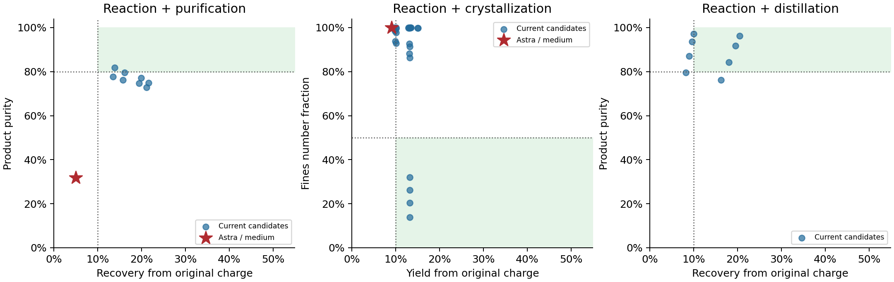

# 完整流程开发迭代收束

2026-09-14—15；GPT-6 Astra / medium。

本轮累计142个无模型候选，142次终检、0次执行失败；另外明确保留4个未真正触发溶解的无效退火干预，以及4个丢失母液晶种来源、可能高估产率的热循环。
当前合同下保留40个资格候选、8个联合质量见证。Astra启动3/3，完成终检2，带噪目标达标0，真值与带噪共同达标0；每任务一次，未补跑模型。
质量通过与执行完整性分别计数，provider中断不作为科学失败。

## 完成的合同修复

1. 液体读数与实际扣样对象一致，保存馏分不被其他相的测量消耗；回收率保留原始投料分母。结晶固液仍是明确声明的代表性浆料抽象。
2. 保存馏分可用零转移量合法重选；蒸馏开放底层已有的独立切出比例，解除时长与累计混入量的绑定，保留实际热负荷限制。
3. 粒径变为带噪、付费、非破坏性过程观测。结晶跨操作保留完整粒子群，取样/过滤同步扣减粒子数；复热实际触发溶解并同步粒径和热量。
4. 晶种来源跨固相/母液、取样、过滤和再析出守恒；过滤后继续操作也读取当前来源。相内均匀示踪是明确的模型近似，不声称解析核壳。旧合同继续可重放，发现的平台状态损失与物理产品损失单独记录，不计作Agent科学能力失败。
5. 溶解热同时进入热转移记录、累计能量和既有能耗费用公式，收费系数不变。

## 当前资格与单次Agent

资格要求原始投料回收/扣晶种产率≥10%、纯度≥80%；结晶另要求细粉≤50%。参考见证须同时通过取样前真值、带噪终检、事务、资源与重放检查。
Astra表为带噪终检；下方见证表和图使用取样前真值。

| 任务 | 当前资格见证/候选 | Astra状态 | 终检纯度 | 终检回收/产率 | 终检细粉 |
| --- | --- | --- | --- | --- | --- |
| 反应—萃取—纯化 | 1/8 | 完成，质量未达标 | 30.47% | 4.53% | — |
| 反应—路径依赖结晶 | 4/24 | 完成，质量未达标 | 97.37% | 8.42% | 100.00% |
| 反应—分段蒸馏 | 3/8 | 执行中断 | — | — | — |

下列参考配方只证明存在可行路径，未交给Astra；不是最优性主张。
资格使用固定观测噪声种子；靠近门槛的见证还不能保证独立噪声下稳定通过。

| 任务 | 保留的见证 | 真值纯度 | 真值原投料回收/产率 | 真值细粉 |
| --- | --- | --- | --- | --- |
| 反应—萃取—纯化 | P02 | 81.87% | 13.84% | — |
| 反应—路径依赖结晶 | C21 | 98.24% | 13.22% | 20.46% |
| 反应—路径依赖结晶 | C22 | 98.24% | 13.23% | 13.90% |
| 反应—路径依赖结晶 | C23 | 98.81% | 13.21% | 31.94% |
| 反应—路径依赖结晶 | C24 | 98.81% | 13.22% | 26.17% |
| 反应—分段蒸馏 | D06 | 84.32% | 17.98% | — |
| 反应—分段蒸馏 | D07 | 91.73% | 19.56% | — |
| 反应—分段蒸馏 | D08 | 96.21% | 20.51% | — |

纯化/蒸馏物理时间预算12小时；结晶100小时，结晶参考投料及既定晶种库存不变。Agent自主选择合法投料，下表另报实际用量。不能将不同预算、不同合同的结果当作模型提升比较。

图中显示取样前真值。结晶绿色区域还要求化学纯度≥80%，须结合表格和JSON检查。

## Astra轨迹与失败

### 反应—萃取—纯化

记录25次操作，成功提交25次；过程测量5次，失败事务0次。

第19至23步之间，Agent执行干燥、浓缩和再次洗涤。公开纯度读数从42.87%降至30.80%，原投料回收从12.59%降至4.27%。这是后处理区间的交付质量损失；多个动作合在一起，尚不能分离各动作效应。模型在终答中如实指出两项目标均未达标，没有把高转化率当作最终成功。

逐步动作、公开读数、原生真值和模型终答见本报告JSON。模型终答是自述，不能代替实际终检。

### 反应—路径依赖结晶

记录20次操作，成功提交20次；过程测量6次，失败事务0次。

模型先在三段各4小时冷却中降至250 K，第一次粒径读数为100%细粉；随后复热至290 K、加入10 mg晶种，再用4小时降至250 K，第二次粒径读数仍为100%。随后过滤并终检，共用17.71/100小时物理时间。模型识别了细粉问题并尝试修复，也如实报告最终未达标。这一轨迹提出的是修复策略与不可逆关闭时机问题；剩余时间多不等于同前缀仍可挽救，更不能据此声称它没有看到反馈或丢失了知识。

逐步动作、公开读数、原生真值和模型终答见本报告JSON。模型终答是自述，不能代替实际终检。

### 反应—分段蒸馏

记录13次操作，成功提交13次；过程测量4次，失败事务0次。

Agent使用了独立切段比例0.15、回流比10和3600秒蒸馏，随后GC纯度读数为95.63%，收集后出现provider错误。没有终检，不能把过程读数算作联合达标，也不能判为科学能力失败。回执仅给出未分类provider错误摘要，没有HTTP状态或具体服务原因；token用量缺失，不计为零。保留13步前缀，不补跑。

逐步动作、公开读数、原生真值和模型终答见本报告JSON。模型终答是自述，不能代替实际终检。

## 资源与执行完整性

| 任务 | 投料mol/晶种g | 物理时长/小时 | 非终检测量 | 消耗样品/mL | 输入/缓存/输出tokens | 精确重放 |
| --- | --- | --- | --- | --- | --- | --- |
| 反应—萃取—纯化 | 0.04/0 | 4.59 | 5 | 1.300 | 1156376/1076608/1520 | 通过 |
| 反应—路径依赖结晶 | 0.04/0.01 | 17.71 | 6 | 1.100 | 742634/682240/1431 | 通过 |
| 反应—分段蒸馏 | 0.03/0 | 6.50 | 4 | 0.750 | 缺失/缺失/缺失 | 通过 |

2/3会话token回传完整；蒸馏行只核算13步已记录前缀，模型用量缺失。后端模型响应次数未完整观测，三个会话不等于三次后端响应。订阅费用不能逐会话归因；缺失费用不记作零。

## 论文主线如何收束

本轮建立可执行、有代价且有质量门槛的过程任务。它仍不是系统性Agent失效的证据：单世界、单次轨迹不能支撑跨世界因果归因。
这里评估的是一个物理批次内的自主过程决策，尚未执行跨批发现、知识交付或接收者部署；即使出现质量失败，也不能直接称为科学发现中的摘要、记忆或知识损失。
联合可达见证从初始状态出发，不保证Agent已经到达的每个决策前缀仍可挽救；后续分支诊断须先核对同一前缀和剩余预算内是否确有有效替代动作。

下一阶段围绕同前缀、同证据、同预算的干预定位：先检验是否购买了必要的相/粒径信息，再比较完整过程记录与知识交付是否保留了决定下一步动作的状态，最后检验收到完整信息后是否仍选择失当。保存馏分与追加混合、单次冷却与复热后的再冷却是可操作的对照，先验证不同历史确实需要不同有效动作，再扩多机制组和留出组合。

| 待定位环节 | 下一块需要的干预 | 可支持的解释 |
| --- | --- | --- |
| 取证 | 同预算比较自主与参考测量，保留所有购买和未购买的观测 | 关键测量改变可恢复的行动信息；不把不可辨识性归责模型 |
| 交付 | 同一份公开过程记录分别以Raw和自然知识包交给同一接收者 | 来源已有的行动信息是否在交付中丢失 |
| 使用 | 相同物理前缀、相同公开信息和剩余预算，比较闭环行动；对知识包只补回来源中确实存在的遗漏字段 | 补回信息能否修复行动；完整信息仍失败则单列使用问题 |

正式核心仍应是多机制组的完整流程组合留出，配强配方复用和同信息闭环控制基线。上述单前缀干预服务于主结果解释，不另堆一组脱离实际流程的简单读表实验。所有模式都允许未出现，不能按Agent失败筛世界或持续加试直到出现显著结果。

旧固定流程和旧负结果留作开发与边界证据；不把观测映射修复、模拟器压缩错误、单纯物料流失包装成科学Agent的信息损失发现。正式实验与稿件重写仍需独立稳定设计。

全部块共2544条持久动作、145条轨迹/已记录前缀的精确重放。逐候选参数、全部失败、分母与资源见四个独立JSON/报告及本报告JSON。

## 证据入口

- [初始相分辨资格](work-ii-phase-resolved-process-20260914.md)
- [完整粒子群与独立切段](work-ii-process-continuity-20260914.md)
- [热连续性资格（历史）](work-ii-crystal-thermal-continuity-20260914.md)
- [晶种来源守恒复验](work-ii-crystal-seed-continuity-20260915.md)
